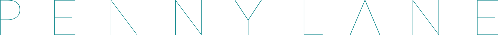

###################################

.. |CI| image:: https://img.shields.io/travis/com/XanaduAI/pennylane/master.svg?style=popout-square
    :alt: Travis
    :target: https://travis-ci.com/XanaduAI/pennylane/

.. |COV| image:: https://img.shields.io/codecov/c/github/xanaduai/pennylane/master.svg?style=popout-square
    :alt: Codecov coverage
    :target: https://codecov.io/gh/XanaduAI/pennylane

.. |PEP| image:: https://img.shields.io/codacy/grade/83940d926ef5444798a46378e528249d.svg?style=popout-square
    :alt: Codacy grade
    :target: https://app.codacy.com/app/XanaduAI/pennylane?utm_source=github.com&utm_medium=referral&utm_content=XanaduAI/pennylane&utm_campaign=badger

.. |DOC| image:: https://img.shields.io/readthedocs/pennylane.svg?style=popout-square
    :alt: Read the Docs
    :target: https://pennylane.readthedocs.io

.. |VERS| image:: https://img.shields.io/pypi/v/PennyLane.svg?style=popout-square
    :alt: PyPI
    :target: https://pypi.org/project/PennyLane

.. |PY| image:: https://img.shields.io/pypi/pyversions/PennyLane.svg?style=popout-square
    :alt: PyPI - Python Version
    :target: https://pypi.org/project/PennyLane

.. |FORUM| image:: https://img.shields.io/discourse/https/discuss.pennylane.ai/posts.svg?style=popout-square
    :alt: Discourse posts
    :target: https://discuss.pennylane.ai

.. |LIC| image:: https://img.shields.io/pypi/l/PennyLane.svg?style=popout-square
    :alt: PyPI - License
    :target: https://www.apache.org/licenses/LICENSE-2.0

|CI|  |COV| |PEP| |DOC| |VERS| |PY| |FORUM|

`PennyLane <https://pennylane.readthedocs.io>`_ is a cross-platform Python library for **differentiable quantum programming**. Train a quantum computer the same way as a neural network.
 
.. raw:: html

    

    
    

    
You can use PennyLane for quantum computing, quantum machine learning, quantum chemistry, and hybrid quantum-classical computations. Extensive examples, tutorials, and demos are available at https://pennylane.ai/qml.

Key Features
============

.. raw:: html

    

- **Device independent**.
  The same quantum circuit model can be **run on different backends**. Install
  `plugins <https://pennylane.ai/plugins.html>`__ to access even more
  devices, including **Strawberry Fields**, **IBM Q**, **Google Cirq**, **Rigetti Forest**, and
  **Microsoft QDK**.
  
- **Best of both worlds**.
  Support for **hybrid quantum and classical** models; connect quantum
  hardware with PyTorch, TensorFlow, and NumPy.

- **Follow the gradient**. Hardware-friendly **automatic differentiation** of quantum circuits.

- **Batteries included**. Built-in tools for **optimization, machine learning, and quantum chemistry**.

Available plugins
=================

* `PennyLane-SF <https://github.com/XanaduAI/pennylane-sf>`_: Supports integration with
  `Strawberry Fields <https://github.com/XanaduAI/strawberryfields>`__, a full-stack
  Python library for simulating continuous variable (CV) quantum optical circuits.

* `PennyLane-qiskit <https://github.com/XanaduAI/pennylane-qiskit>`_: Supports
  integration with `Qiskit <https://qiskit.org>`__, an open-source quantum
  computation framework by IBM. Provides device support for the Qiskit Aer quantum
  simulators, and IBM Q hardware devices.

* `PennyLane-cirq <https://github.com/XanaduAI/pennylane-cirq>`_: Supports
  integration with `Cirq <https://github.com/quantumlib/cirq>`__, an open-source quantum
  computation framework by Google.

* `PennyLane-Forest <https://github.com/rigetti/pennylane-forest>`_: Supports integration
  with `PyQuil <https://github.com/rigetti/pyquil>`__, the
  `Rigetti Forest SDK <https://www.rigetti.com/forest>`__, and the
  `Rigetti QCS <https://www.rigetti.com/qcs>`__, an open-source quantum computation
  framework by Rigetti. Provides device support for the the Quantum Virtual Machine
  (QVM) and Quantum Processing Units (QPUs) hardware devices.

* `PennyLane-Qsharp <https://github.com/XanaduAI/pennylane-qsharp>`_: Supports integration
  with the `Microsoft Quantum Development Kit <https://www.microsoft.com/en-us/quantum/development-kit>`__,
  a quantum computation framework that uses the Q# quantum programming language.

For a full list of PennyLane plugins, see `the PennyLane website <https://pennylane.ai/plugins.html>`__.

Installation
============

PennyLane requires Python version 3.5 and above. Installation of PennyLane, as well
as all dependencies, can be done using pip:

.. code-block:: bash

    $ python -m pip install pennylane

Getting started
===============

For getting started with PennyLane, check out some of the
`key concepts <https://pennylane.ai/qml/concepts.html>`_ behind quantum machine
learning, before moving on to some `introductory tutorials <https://pennylane.ai/qml/beginner.html>`_.

Then, take a deeper dive into quantum machine learning by
exploring cutting-edge algorithms using PennyLane and near-term quantum hardware,
with our collection of
`QML tutorials <https://pennylane.ai/qml/implementations.html>`_.

You can also check out our `documentation <https://pennylane.readthedocs.io>`_ for
more details on the quantum operations, and to explore the available optimization
tools provided by PennyLane, and detailed guides on
`how to write your own <https://pennylane.readthedocs.io/en/latest/development/plugins.html>`_
PennyLane-compatible quantum device.

Finally, play around with the numerous `devices and plugins <https://pennylane.ai/plugins.html>`_
available for running your hybrid optimizations — these include
IBM Q, provided by the PennyLane-Qiskit plugin, as well as the Rigetti Aspen-1 QPU.

Contributing to PennyLane
=========================

We welcome contributions — simply fork the PennyLane repository, and then make a
`pull request <https://help.github.com/articles/about-pull-requests/>`_ containing your contribution.
All contributers to PennyLane will be listed as authors on the releases. All users who contribute
significantly to the code (new plugins, new functionality, etc.) will be listed on the PennyLane arXiv paper.

We also encourage bug reports, suggestions for new features and enhancements, and even links to
cool projects or applications built on PennyLane.

See our `contributions page <https://github.com/XanaduAI/pennylane/blob/master/.github/CONTRIBUTING.md>`_
for more details.

Authors
=======

PennyLane is the work of `many contributors <https://github.com/XanaduAI/pennylane/graphs/contributors>`_.

If you are doing research using PennyLane, please cite `our paper <https://arxiv.org/abs/1811.04968>`_:

    Ville Bergholm, Josh Izaac, Maria Schuld, Christian Gogolin, M. Sohaib Alam, Shahnawaz Ahmed,
    Juan Miguel Arrazola, Carsten Blank, Alain Delgado, Soran Jahangiri, Keri McKiernan, Johannes Jakob Meyer,
    Zeyue Niu, Antal Száva, and Nathan Killoran.
    *PennyLane: Automatic differentiation of hybrid quantum-classical computations.* 2018. arXiv:1811.04968

Support
=======

- **Source Code:** https://github.com/XanaduAI/pennylane
- **Issue Tracker:** https://github.com/XanaduAI/pennylane/issues

If you are having issues, please let us know by posting the issue on our Github issue tracker.

We also have a `PennyLane discussion forum <https://discuss.pennylane.ai>`_ - come join
the discussion and chat with our PennyLane team.

License
=======

PennyLane is **free** and **open source**, released under the Apache License, Version 2.0.
