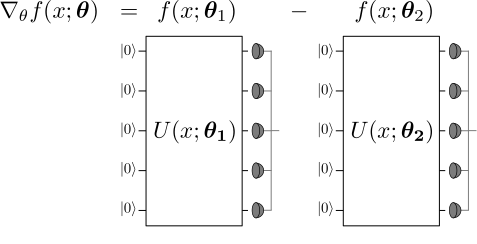

.. role:: html(raw)
   :format: html

.. _autograd_quantum:

Quantum gradients
=================

Automatic differentiation
-------------------------

Derivatives and gradients are ubiquitous throughout science and engineering. In recent years, automatic differentiation has become a key feature in many numerical software libraries, in particular for machine learning (e.g., Theano_, Autograd_, Tensorflow_, or Pytorch_). 

Generally speaking, automatic differentiation is the ability for a software library to compute the derivatives of arbitrary numerical code. If you write an algorithm to compute some function :math:`g(x)` (which may include mathematical expressions, but also control flow statements like :code:`if`, :code:`for`, etc.), then automatic differentiation provides an algorithm for :math:`\frac{d}{dx}g(x)` with the same degree of complexity as the original function.

*Automatic* differentiation should be distinguished from other forms of differentiation. *Manual differentiation*, where an expression is differentiated by hand (often on paper), is extremely time-consuming and error-prone. In *numerical differentiation*, such as the finite-difference method familiar from high-school calculus, the derivative of a function is approximated by numerically evaluating the function at two infinitesimaly separated points. However, this method can sometimes be imprecise due to the constraints of classical floating-point arithmetic.

Computing gradients of quantum functions
----------------------------------------

:ref:`qfuncs` are parameterized functions :math:`f(x;\bm{\theta})` which can be evaluated by measuring a quantum circuit. If we can compute gradients of a quantum function, we could use this information in an optimization or machine learning algorithm, tuning the quantum circuit to produce a desired output. While numerical differentiation is an option, OpenQML is the first software library to support **automatic differentiation of quantum circuits** [#]_.

How is this accomplished? It turns out that the gradient of a quantum function :math:`f(x;\bm{\theta})` can in many cases be expressed as a linear combination of other quantum functions. In fact, these other quantum functions typically use the same circuit, differing only in a shift of the argument. 

:html:` `

    Decomposing the gradient of a qfunc as a linear combination of qfuncs.

:html:` `

Making a rough analogy to classically computable functions, this is similar to how the derivative of the function :math:`f(x)=\sin(x)` is identical to :math:`\frac{1}{2}\sin(x+\frac{\pi}{2}) - \frac{1}{2}\sin(x-\frac{\pi}{2})`. So the same underlying algorithm can be reused to compute both :math:`\sin(x)` and its derivative (by evaluating at :math:`x\pm\frac{\pi}{2}`). This intuition holds for many quantum functions of interest: *the same circuit can be used to compute both the qfunc and gradients of the qfunc* [#]_.

A more technical explanation
----------------------------

Circuits in OpenQML are specified by a sequence of gates. The unitary transformation carried out by the circuit can thus be broken down into a product of unitaries:

.. math:: U(x; \bm{\theta}) = U_N(\theta_{N}) U_{N-1}(\theta_{N-1}) \cdots U_i(\theta_i) \cdots U_1(\theta_1) U_0(x).

Each of these gates is unitary, and therefore must have the form :math:`U_{j}(\gamma_j)=\exp{(i\gamma_j H_j)}` where :math:`H_j` is a Hermitian operator which generates the gate and :math:`\gamma_j` is the gate parameter. 
We have omitted which wire each unitary acts on, since it is not necessary for the following discussion.

.. todo:: Verify the edge-cases of two-parameter gates and complex arguments...

.. note:: In this example, we have used the input :math:`x` as the argument for gate :math:`U_0` and the parameters :math:`\bm{\theta}` for the remaining gates. This is not required. Inputs and parameters can be arbitrarily assigned to different gates. 

A single parameterized gate
~~~~~~~~~~~~~~~~~~~~~~~~~~~

Let us single out a single parameter :math:`\theta_i` and its associated gate :math:`U(\theta_i)`. For simplicity, we remove all gates except :math:`U_i(\theta_i)` and :math:`U_0(x)` for the moment. In this case, we have a simplified qfunc 

.. math:: f(x; \theta_i) = \langle 0 | U_0^\dagger(x)U_i^\dagger(\theta_i)\hat{B}U_i(\theta_i)U_0(x) | 0 \rangle = \langle x | U_i^\dagger(\theta_i)\hat{B}U_i(\theta_i) | x \rangle.

For convenience, we rewrite the unitary conjugation as a linear transformation :math:`\mathcal{M}_{\theta_i}` acting on the operator :math:`\hat{B}`:

.. math:: U_i^\dagger(\theta_i)\hat{B}U_i(\theta_i) = \mathcal{M}_{\theta_i}(\hat{B}).

The transformation :math:`\mathcal{M}_{\theta_i}` depends smoothly on the parameter :math:`\theta_i`, so this quantum function will have a well-defined gradient:

.. math:: \nabla_{\theta_i}f(x; \theta_i) = \langle x | \nabla_{\theta_i}\mathcal{M}_{\theta_i}(\hat{B}) | x \rangle \in \mathbb{R}.

The key insight is that we can, in many cases of interest, express this gradient as a linear combination of the same transformation :math:`\mathcal{M}`, but with different parameters. Namely,

.. math:: \nabla_{\theta_i}\mathcal{M}_{\theta_i}(\hat{B}) = c[\mathcal{M}_{\theta_i + \gamma}(\hat{B}) - \mathcal{M}_{\theta_i - \gamma}(\hat{B})],

where the multiplier :math:`c` and the shift :math:`\gamma` are determined completely by the type of transformation :math:`\mathcal{M}` and independent of the value of :math:`\theta_i`.

Multiple parameterized gates
~~~~~~~~~~~~~~~~~~~~~~~~~~~~

To complete the story, we now go back to the case where there are many gates in the circuit. Since the equations governing quantum mechanics are linear, we can pass the gradient through all the unitaries which don't use the parameter :math:`\theta_i`:

.. math:: \nabla_{\theta_i}U(x;\bm{\theta}) = U_N(\theta_{N}) U_{N-1}(\theta_{N-1}) \cdots \left[ \nabla_{\theta_i} U_i(\theta_i) \right] \cdots U_1(\theta_1) U_0(x).

We can absorb any gates applied before gate :math:`i` (with indices lower than :math:`i`) into the initial state: :math:`|\psi_{i-1}\rangle = U_{i-1}(\theta_{i-1}) \cdots U_{1}(\theta_{1})U_{0}(x)|0\rangle`. 
Similarly, any gates applied after gate :math:`i` are combined with the observable :math:`\hat{B}`:
:math:`\hat{B}_{i+1} = U_{N}^\dagger(\theta_{N}) \cdots U_{i+1}^\dagger(\theta_{i+1}) \hat{B} U_{i+1}(\theta_{i+1}) \cdots U_{N}(\theta_{N})`. 

With this simplification, the qfunc becomes

.. math:: f(x; \bm{\theta}) = \langle \psi_{i-1} | U_i(\theta_i) \hat{B}_{i+1} U_i^\dagger(\theta_i) | \psi_{i-1} \rangle = \langle \psi_{i-1} | \mathcal{M}_{\theta_i} (\hat{B}_{i+1}) | \psi_{i-1} \rangle,

and its gradient is

.. math:: \nabla_{\theta_i}f(x; \bm{\theta}) = \langle \psi_{i-1} | \nabla_{\theta_i}\mathcal{M}_{\theta_i} (\hat{B}_{i+1}) | \psi_{i-1} \rangle.

We can see that the gradient has the exact same form as the single-gate case, except we modify the state :math:`|x\rangle \rightarrow |\psi_{i-1}\rangle` and the measurement operator :math:`\hat{B}\rightarrow\hat{B}_{i+1}`. In terms of the circuit, this means we can leave all other gates as they are, and only modify gate :math:`U(\theta_i)` when we want to differentiate with respect to the parameter :math:`\theta_i`.

.. todo:: discuss fanout?

Pauli observable example
~~~~~~~~~~~~~~~~~~~~~~~~

.. todo:: fill this in

Acting on a single one-parameter gate, the gradient formula is straightforward:

.. math:: \nabla_{\gamma} U(\gamma) = \nabla_\gamma\exp{(i\gamma H)} = H\exp{(i\gamma H)} = HU(\gamma).

Gaussian observable example
~~~~~~~~~~~~~~~~~~~~~~~~~~~

.. todo:: fill this in

.. _Theano: https://github.com/Theano/Theano
.. _Autograd: https://github.com/HIPS/autograd
.. _Tensorflow: http://tensorflow.org/
.. _Pytorch: https://pytorch.org/

.. rubric:: Footnotes

.. [#] This should be contrasted with software which can perform automatic differentiation on classical simulations of quantum circuits, such as `Strawberry Fields <https://strawberryfields.readthedocs.io/en/latest/>`_. 

.. [#] In situations where no formula for automatic quantum gradients is known, OpenQML falls back to approximate gradient estimation using numerical methods.

