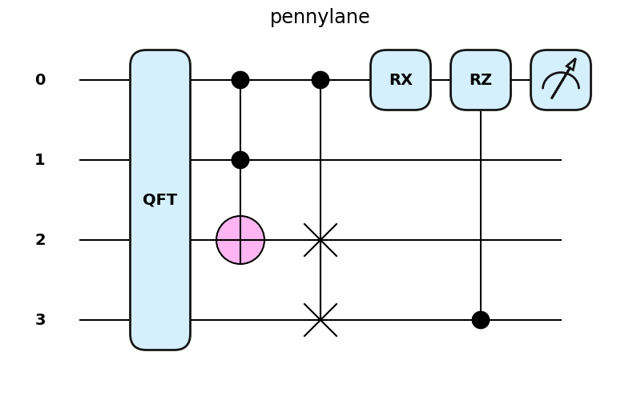
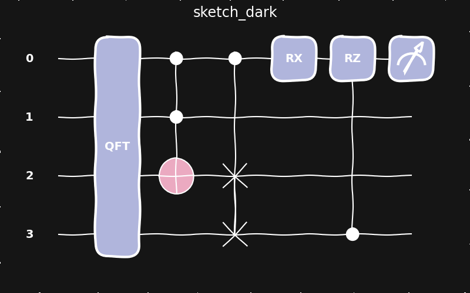

qml.drawer
==========

The ``drawer`` module contains the code for generating visuals
of circuits. 

.. currentmodule:: pennylane.drawer

.. automodapi:: pennylane.drawer
    :no-heading:
    :no-inherited-members:
    :skip: available_styles
    :skip: use_style

Styling Matplotlib Circuit Graphics
-----------------------------------

The ``drawer`` module provides two functions for modifying the style of matplotlib
graphics, such as those generated by ``qml.draw_mpl``. The ``qml.drawer.use_style``
function modifies the ``plt.rcParams`` global styling variable.  Any styling can
be reset with ``qml.drawer.use_style('black_white')``.

.. autosummary::
    :toctree: api

    available_styles
    use_style

The following images are generated via the code:

.. code-block:: python

    @qml.qnode(qml.device('lightning.qubit', wires=(0,1,2,3)))
    def circuit(x, z):
        qml.QFT(wires=(0,1,2,3))
        qml.Toffoli(wires=(0,1,2))
        qml.CSWAP(wires=(0,2,3))
        qml.RX(x, wires=0)
        qml.CRZ(z, wires=(3,0))
        return qml.expval(qml.PauliZ(0))

    qml.drawer.use_style(style)
    fig, ax = qml.draw_mpl(circuit)(1.2345, 1.2345)

Note that the shown ``pennylane`` style can be replicated exactly by having the
Quicksand Bold font installed and refreshing the Matplotlib font cache (by
deleting the ``fontlist`` file in the Matplotlib cache directory) — to find the
cache directory, run ``matplotlib.get_cachedir()``. If this font is not
available, the drawer will fall back on a default font.

Currently Available Styles
^^^^^^^^^^^^^^^^^^^^^^^^^^

.. |bwd| image:: ../_static/style/black_white_dark_style.png
    :width: 100%

+-----+-----+-----+
+|bws|+|bwd|+|sks|+
+-----+-----+-----+
+|pls|+|skd|+|sol|+
+-----+-----+-----+
+|sod|+|def|+     +
+-----+-----+-----+