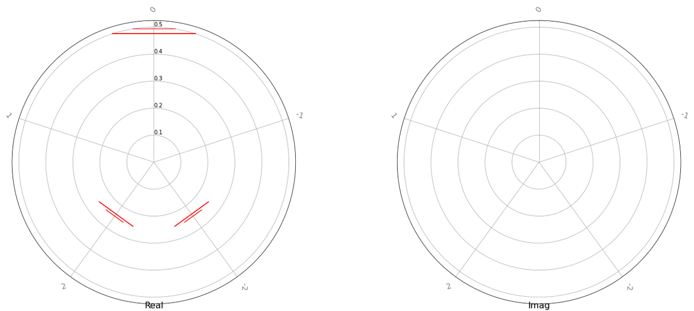
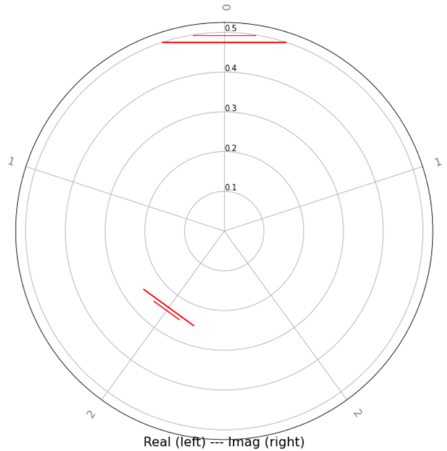
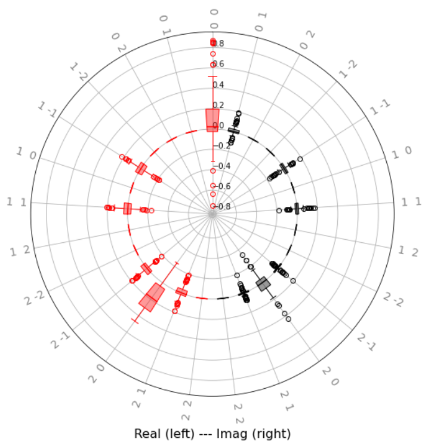

qml.fourier
===========

This module contains methods and visualization tools for computing Fourier
series representations of quantum circuits.

Fourier series of quantum circuits
----------------------------------

Consider a quantum circuit that depends on a parameter vector :math:`x` with
length :math:`N`. The circuit involves application of some unitary operations
:math:`U(x)`, and then measurement a particular expectation value
:math:`P`. Analytically the expectation value can be computed as

.. math::

   \langle P \rangle = \langle 0 | U^\dagger (x) P U(x) |0\rangle = \langle
   \psi(x) | P | \psi (x)\rangle.

This output is simply a function :math:`f(x) = \langle \psi(x) | P | \psi
(x)\rangle`. More specifically it is a periodic function of the parameters, and
it can thus be expressed as a multidimensional *Fourier series*:

.. math::

    f(x) = \sum \limits_{n_1\in \Omega_1} \dots \sum \limits_{n_N \in \Omega_N}
    c_{n_1,\dots, n_N} e^{-i x_1 n_1} \dots e^{-i x_N n_N},

where the :math:`n_i` are integer-valued frequencies, and the :math:`c_n` are
Fourier coefficients attached to each combination of frequencies.

As a simple example, consider ``simple_circuit`` below in terms of a single
parameter.

.. code::

    import pennylane as qml
    from pennylane import numpy as np

    dev = qml.device('default.qubit', wires=2)

    @qml.qnode(dev)
    def simple_circuit(x):
        qml.RX(x[0], wires=0)
        qml.RY(x[0], wires=1)
        qml.CNOT(wires=[1, 0])
        return qml.expval(qml.PauliZ(0))

We can mathematically evaluate the expectation value of this function to be
:math:`\langle Z \rangle = 0.5 + 0.5 \cos(2x)`. Thus, the Fourier coefficients
of this function are :math:`c_0 = 0.5`, :math:`c_1 = c^*_{-1} = 0`, and \
:math:`c_2 = c^*_{-2} = 0.25`.

The Fourier module enables calculation of two important aspects of the Fourier
series: the *spectrum*, i.e., the accessible frequencies where the Fourier
coefficients may be non-zero; and the values of the *coefficients* themselves.

The frequency spectra can be calculated using the :func:`~.pennylane.fourier.spectrum`
function. As one may be interested only in the spectra of a subset of the input
parameters, only the spectrum of differentiable parameters will be calculated.

.. code::

   >>> from pennylane.fourier import spectrum
   >>> x = np.array([0.5], requires_grad=True)
   >>> spectrum(simple_circuit)
   {tensor(0.5, requires_grad=True): [-2.0, -1.0, 0.0, 1.0, 2.0]}

The set of available frequencies above matches the result we obtained by hand of
:math:`-2, 0, 2`. Note that the :func:`~.pennylane.fourier.spectrum` function
returns the *maximum* possible spectra with respect to the given inputs.

Knowledge of the frequency spectra also enables us to compute the Fourier
coefficients themselves. This can be done using the
:func:`~.pennylane.fourier.fourier_coefficients` function:

.. code::

   >>> from pennylane.fourier import fourier_coefficients
   >>> coeffs = fourier_coefficients(simple_circuit, len(x), 2)
   >>> print(np.round(coeffs, decimals=4))
   [0.5 +0.j 0.  -0.j 0.25+0.j 0.25+0.j 0.  -0.j]

The input to the :func:`~.pennylane.fourier.fourier_coefficients` function are
the function in question, the length of the input vector, and the maximum
frequency for which to calculate the coefficients. (For a quantum function with
multiple inputs with varying order, it may be necessary to use a wrapper
function to ensure the Fourier coefficients are calculated with respect to the
correct input values.)

Internally, the coefficients are computed using numpy's `discrete Fourier
transform <https://numpy.org/doc/stable/reference/generated/numpy.fft.fftn.html>`__
function. The order of the coefficients in the output thus follows the standard
output ordering, i.e., :math:`[c_0, c_1, c_2, c_{-2}, c_{-1}]`, and similarly
for multiple dimensions.

.. note::

   If a frequency lower than the true maximum frequency is used to calculate the
   coefficients, it is possible that `aliasing
   <https://en.wikipedia.org/wiki/Aliasing>`__ will be present in the
   output. Thus, it is good practice to first estimate the maximum frequency of
   a quantum circuit using the :func:`~.pennylane.fourier.spectrum` function. In
   addition, the coefficient calculator also contains a simple anti-aliasing
   filter that will cut off frequencies higher than a given threshold. This can
   be configured by setting the ``lowpass_filter`` option to ``True``, and optionally
   specifying the ``frequency_threshold`` argument (if none is specified, 2 times
   the specified degree will be used as the threshold).

Fourier coefficient visualization
---------------------------------

A key application of the Fourier module is to analyze the *expressivity* of
classes of quantum circuit families. The set of accessible frequencies is a
measure of how expressive a given circuit is; more frequencies means a wider
range of functions and thus the potential for greater applicability in, e.g.,
quantum machine learning applications.

The `fourier` module contains methods to visualize the distribution of Fourier
coefficients for a single circuit, as well as many members of a circuit family
with different weights.

The function :func:`~.pennylane.fourier.radial_box_plots` display the real and
imaginary portions of the coefficients using circular box plot
distributions. For example, let's visualize the circuit from earlier:

.. code::

   >>> from pennylane.fourier import radial_box_plots
   >>> radial_box_plots(np.array([coeffs]), n_inputs=len(x), degree=2)

|

The left plot displays the real portion, and the right the imaginary
portion. The labels on the "spokes" of the wheels represent the particular
frequencies; we see that this matches the coefficients we found earlier.

Since the negative frequencies contain redundant information (they are simply
the complex conjugates of their positive partners), we can condense the
information and visualize both real and complex portions on a single plot:

.. code::

   >>> radial_box_plots(np.array([coeffs]), n_inputs=len(x), degree=2, merge_plots=True)

|

For each coefficient, its real and complex components occur as their "mirrors"
across the main diagonal.

As mentioned above, it is also possible to visualize the distribution of
coefficients for a family of circuits. For example, let's consider a set of
circuits with two types of parameters: weights ``w``, and some data inputs
``x``. Suppose the weights are chosen randomly (as they would be in, for
example, a variational algorithm), while the ``x`` are a fixed set of data
inputs. If we compute the Fourier coefficients with respect to the ``x``
parameters, how the ``x`` are used in the circuit will dictate the accessible
frequencies, while the ``w`` will modify the actual values of the
coefficients. Consider the circuit below:

.. code::

    @qml.qnode(dev)
    def circuit_with_weights(w, x):
        qml.RX(x[0], wires=0)
        qml.RY(x[1], wires=1)
        qml.CNOT(wires=[1, 0])

	qml.Rot(*w[0], wires=0)
	qml.Rot(*w[1], wires=1)
	qml.CNOT(wires=[1, 0])

	qml.RX(x[0], wires=0)
        qml.RY(x[1], wires=1)

	return qml.expval(qml.PauliZ(0))

    coeffs = []

    for _ in range(100):
        weights = np.random.normal(0, 1, size=(2, 3))
        c = fourier_coefficients(partial(circuit_with_weights, weights), 2, degree=2)
        coeffs.append(np.round(c, decimals=8))

    radial_box_plots(np.array(coeffs), 2, 2, merge_plots=True)

|

We observe here that this ansatz family never yields, e.g., the coefficients
:math:`c_{01}, c_{12}`, and a few others, while for the coefficients that do
appear, there are varying ranges of values.

.. currentmodule:: pennylane.fourier

.. automodapi:: pennylane.fourier
    :include-all-objects:
    :no-inheritance-diagram:

