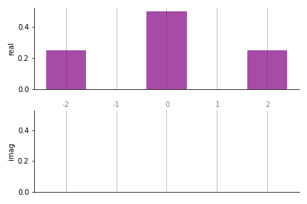
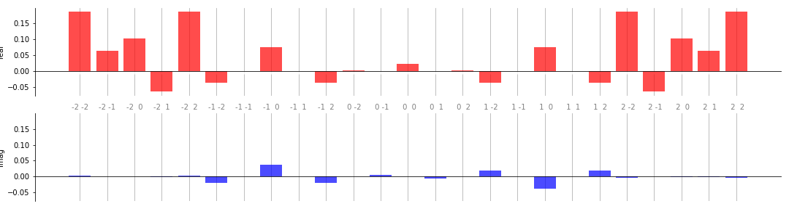
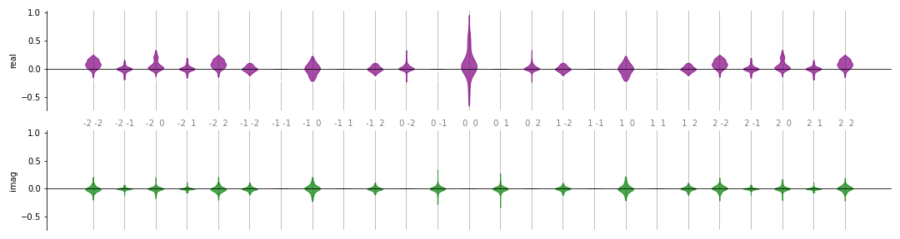

qml.fourier
===========

This module contains methods for computing Fourier series representations of
quantum circuits.

Fourier series of quantum circuits
----------------------------------

Consider a quantum circuit that depends on a parameter vector :math:`x` with
length :math:`N`. The circuit involves application of some unitary operations
:math:`U(x)`, and then measurement of a particular expectation value
:math:`P`. Analytically, the expectation value can be computed as

.. math::

   \langle P \rangle = \langle 0 | U^\dagger (x) P U(x) |0\rangle = \langle
   \psi(x) | P | \psi (x)\rangle.

This output is simply a function :math:`f(x) = \langle \psi(x) | P | \psi
(x)\rangle`. Notably, it is a periodic function of the parameters, and
it can thus be expressed as a multidimensional Fourier series: 

.. math::

    f(x) = \sum \limits_{n_1\in \Omega_1} \dots \sum \limits_{n_N \in \Omega_N}
    c_{n_1,\dots, n_N} e^{-i x_1 n_1} \dots e^{-i x_N n_N},

where :math:`n_i` are integer-valued frequencies, :math:`\Omega_i` are the set
of available values for the integer frequencies, and the
:math:`c_{n_1,\ldots,n_N}` are Fourier coefficients.

As a simple example, consider ``simple_circuit`` below, which is a function of a
single parameter.

.. code::

    import pennylane as qml
    from pennylane import numpy as np

    dev = qml.device('default.qubit', wires=2)

    @qml.qnode(dev)
    def simple_circuit(x):
        qml.RX(x[0], wires=0)
        qml.RY(x[0], wires=1)
        qml.CNOT(wires=[1, 0])
        return qml.expval(qml.PauliZ(0))

We can mathematically evaluate the expectation value of this function to be
:math:`\langle Z \rangle = 0.5 + 0.5 \cos(2x)`. Thus, the Fourier coefficients
of this function are :math:`c_0 = 0.5`, :math:`c_1 = c^*_{-1} = 0`, and \
:math:`c_2 = c^*_{-2} = 0.25`.

The PennyLane ``fourier`` module enables calculation of two important aspects of
the Fourier series: the *spectrum*, i.e., the accessible frequencies where the
Fourier coefficients may be non-zero; and the values of the *coefficients*
themselves. Knowledge of the coefficients and accessible spectra is important
for the study of expressivity of quantum circuits, as described in `Schuld,
Sweke and Meyer (2020) <https://arxiv.org/abs/2008.08605>`__ and `Vidal and
Theis, 2019 <https://arxiv.org/abs/1901.11434>`__ -- the more coefficients
available to a quantum model, the larger the class of functions that model can
represent, potentially leading to greater utility for quantum machine learning
applications.

Calculating the Fourier spectrum
^^^^^^^^^^^^^^^^^^^^^^^^^^^^^^^^

The frequency spectra can be calculated using the :func:`~.pennylane.fourier.spectrum`
function. As one may be interested only in the spectra of a subset of the input
parameters, **only the spectrum of differentiable parameters will be calculated**.

.. code::

   >>> from pennylane.fourier import spectrum
   >>> x = np.array([0.5], requires_grad=True)
   >>> spectrum(simple_circuit)
   {tensor(0.5, requires_grad=True): [-2.0, -1.0, 0.0, 1.0, 2.0]}

The set of available frequencies above matches the result we obtained by hand of
:math:`-2, 0, 2`. Note that the :func:`~.pennylane.fourier.spectrum` function
returns the *maximum* possible spectra with respect to the given inputs. It is
possible that certain Fourier coefficients will nevertheless be zero.

Calculating the Fourier coefficients
^^^^^^^^^^^^^^^^^^^^^^^^^^^^^^^^^^^^

Knowledge of the frequency spectra enables us to compute the Fourier
coefficients themselves. This can be done using the
:func:`~.pennylane.fourier.fourier_coefficients` function:

.. code::

   >>> from pennylane.fourier import fourier_coefficients
   >>> coeffs = fourier_coefficients(simple_circuit, len(x), 2)
   >>> print(np.round(coeffs, decimals=4))
   [0.5 +0.j 0.  -0.j 0.25+0.j 0.25+0.j 0.  -0.j]

The input to the :func:`~.pennylane.fourier.fourier_coefficients` function are
the function in question, the length of the input vector, and the maximum
frequency for which to calculate the coefficients (also known as the *degree*). (For a quantum function of
multiple inputs with varying order, it may be necessary to use a wrapper
function to ensure the Fourier coefficients are calculated with respect to the
correct input values.)

Internally, the coefficients are computed using numpy's `discrete Fourier
transform <https://numpy.org/doc/stable/reference/generated/numpy.fft.fftn.html>`__
function. The order of the coefficients in the output thus follows the standard
output ordering, i.e., :math:`[c_0, c_1, c_2, c_{-2}, c_{-1}]`, and similarly
for multiple dimensions.

.. note::

   If a frequency lower than the true maximum frequency is used to calculate the
   coefficients, it is possible that `aliasing
   <https://en.wikipedia.org/wiki/Aliasing>`__ will be present in the
   output. Thus, it is good practice to first estimate the maximum frequency of
   a quantum circuit using the :func:`~.pennylane.fourier.spectrum` function. In
   addition, the coefficient calculator also contains a simple anti-aliasing
   filter that will cut off frequencies higher than a given threshold. This can
   be configured by setting the ``lowpass_filter`` option to ``True``, and optionally
   specifying the ``frequency_threshold`` argument (if none is specified, 2 times
   the specified degree will be used as the threshold).

Fourier coefficient visualization
---------------------------------

A key application of the Fourier module is to analyze the *expressivity* of
classes of quantum circuit families. The set of frequencies in the Fourier representation
of a quantum circuit can be used to characterise the function 
class that a parametrized circuit gives rise to. For example, if an embedding 
leads to a Fourier representation with few and low-order frequencies, 
a quantum circuit using this embedding can only express rather simple periodic functions.

The Fourier module contains a number of methods to visualize the coefficients of the Fourier sum 
representation of a single circuit, as well as distributions over Fourier coefficients for a parametrized circuit family.

.. note::

   The visualization functions are structured to accept ``matplotlib`` axes as
   arguments so that additional configuration (such as adding titles, saving,
   etc.) can be done outside the functions. Many of the plots, however, require
   a specific number of subplots. The examples below demonstrate how the subplots
   should be created for each function.

Visualizing a single set of coefficients
^^^^^^^^^^^^^^^^^^^^^^^^^^^^^^^^^^^^^^^^

While all the functions available for visualizing multiple sets of Fourier coefficients
can be used for a single set, the primary tool for this purpose is the
``fourier_bar_plot`` function.

.. code::

   from functools import partial
   import matplotlib.pyplot as plt
   import pennylane as qml
   from pennylane.fourier import *

   dev = qml.device('default.qubit', wires=2)

   @qml.qnode(dev)
   def simple_circuit(x):
       qml.RY(x[0], wires=0)
       qml.CNOT(wires=[1, 0])
       qml.RX(x[0], wires=0)
       return qml.expval(qml.PauliZ(0))

   coeffs = fourier_coefficients(simple_circuit, 1, 2)

   >>> coeffs
   [0.5 +0.j 0.  +0.j 0.25+0.j 0.25+0.j 0.  +0.j]

   
   # Set up the axes
   fig, ax = plt.subplots(2, 1, sharex=True, sharey=True)
   fourier_bar_plot(coeffs, 1, ax)
   plt.suptitle("Simple circuit bar plot")

|
	     
In the bar plots, real coefficients are shown in the top panel, and complex in
the bottom. The labels along the x-axis represent the coefficient frequencies
(for large plots, it is sometimes convenient to remove these by passing
``show_freqs=False`` to the plotting function.

Below is a more complex example that demonstrates some of the additional
customization options available:

.. code::

   weights = np.array([[0.1, 0.2, 0.3], [0.4, 0.5, 0.6]])
   
   @qml.qnode(dev)
   def circuit_with_weights(w, x):
       qml.RX(x[0], wires=0)
       qml.RY(x[1], wires=1)
       qml.CNOT(wires=[1, 0])
   
       qml.Rot(*w[0], wires=0)
       qml.Rot(*w[1], wires=1)
       qml.CNOT(wires=[1, 0])
       
       qml.RX(x[0], wires=0)
       qml.RY(x[1], wires=1)
       qml.CNOT(wires=[1, 0])
       
       return qml.expval(qml.PauliZ(0))

   coeffs = fourier_coefficients(partial(circuit_with_weights, weights), 2, 2)

   # Number of inputs is now two; pass custom colours as well
   fig, ax = plt.subplots(2, 1, sharex=True, sharey=True, figsize=(15, 4))
   fourier_bar_plot(coeffs, 2, ax, colour_dict={"real" : "red", "imag" : "blue"});
   plt.suptitle("Circuit with weights bar plot", fontsize=14)

|
	     
Two convenience functions are also provided to visualize 1- and 2-dimensional
functions given a set of Fourier coefficients:
:func:`~.pennylane.fourier.fourier_reconstruct_function_1D_plot` and
:func:`~.pennylane.fourier.fourier_reconstruct_function_2D_plot`. For example,
``circuit_with_weights`` has two input parameters `x[0]` and `x[1]`, and so we can plot its output:

.. code::

   fourier_reconstruct_function_2D_plot(coeffs)
   plt.title("Expectation value for circuit with weights", fontsize=14)
   
.. image:: ../_static/fourier_vis_2D_func.png
    :align: center
    :width: 400px
    :target: javascript:void(0);

Visualizing multiple sets of coefficients
^^^^^^^^^^^^^^^^^^^^^^^^^^^^^^^^^^^^^^^^^

Suppose we do not want to visualize the Fourier coefficients for a fixed 
`weights` argument in `circuit_with_weights`, but the distribution over sets of Fourier coefficients 
when the weights are randomly sampled. For each `weights` sample we get a different set of coefficients:

.. code::

   coeffs = []

   for _ in range(100):
       weights = np.random.normal(0, 1, size=(2, 3))
       c = fourier_coefficients(partial(circuit_with_weights, weights), 2, degree=2)
       coeffs.append(np.round(c, decimals=8))
       
   coeffs = np.array(coeffs)

One option to plot the distribution is :func:`~.pennylane.fourier.fourier_violin_plot`:

.. code::

   fig, ax = plt.subplots(2, 1, sharey=True, figsize=(15, 4))
   fourier_violin_plot(coeffs, 2, ax, show_freqs=True);
   plt.suptitle("Distribution of coefficients for circuit with weights", fontsize=16)
      
   

|
	     
A similar option is the :func:`~.pennylane.fourier.fourier_box_plot`, which
produces a plot of the same format but using a box plot.
	    
A different view can obtained using the	     
:func:`~.pennylane.fourier.fourier_radial_box_plot` function. This "rolls up"
the coefficients onto a polar grid. Let us use it to visualize the same set of
coefficients as above:

.. code::

   # The subplot axes must be *polar* for the radial plots
   fig, ax = plt.subplots(
       1, 2, sharex=True, sharey=True,
       subplot_kw=dict(polar=True),
       figsize=(15, 8)
   )
   fourier_radial_box_plot(coeffs, 2, ax, show_freqs=True, show_fliers=False)
   plt.suptitle("Distribution of coefficients for circuit with weights", fontsize=16)
   plt.tight_layout()

   
.. image:: ../_static/fourier_vis_radial_box.png
    :align: center
    :width: 700px
    :target: javascript:void(0);

|

The left plot displays the real part, and the right the imaginary
part of the distribution over a parametrized quantum circuit's 
Fourier coefficients. The labels on the "spokes" of the wheels represent the particular
frequencies; we see that this matches the coefficients we found earlier. Note
how the coefficient :math:`c_0` appears in the top middle of each plot; the
negative frequencies extend counterclockwise from that point, and the positive
frequencies increase in the clockwise direction. Such plots allow for a more
compact representation of a large number of frequencies than the linear violin
and box plots discussed above. For a large number of frequencies, however, it is
recommended to disable the frequency labelling by setting ``show_freqs=False``,
and hiding box plot fliers as was done above.

Finally, for the special case of 1- or 2-dimensional functions, we can use the
:func:`~.pennylane.fourier.fourier_panel_plot` to plot the distributions of the
sampled sets of Fourier coefficients on the complex plane.

.. code::

   # Need a grid large enough to hold all coefficients up to frequency 2
   fig, ax = plt.subplots(5, 5, figsize=(12, 10), sharex=True, sharey=True)
   fourier_panel_plot(coeffs, 2, ax)
   plt.suptitle(
      "Fourier coefficients of circuit with weights in the complex plane",
      fontsize=16
   )
   plt.tight_layout()

.. image:: ../_static/fourier_vis_panel.png
    :align: center
    :width: 700px
    :target: javascript:void(0);

.. automodapi:: pennylane.fourier
    :include-all-objects:
    :no-inheritance-diagram:
