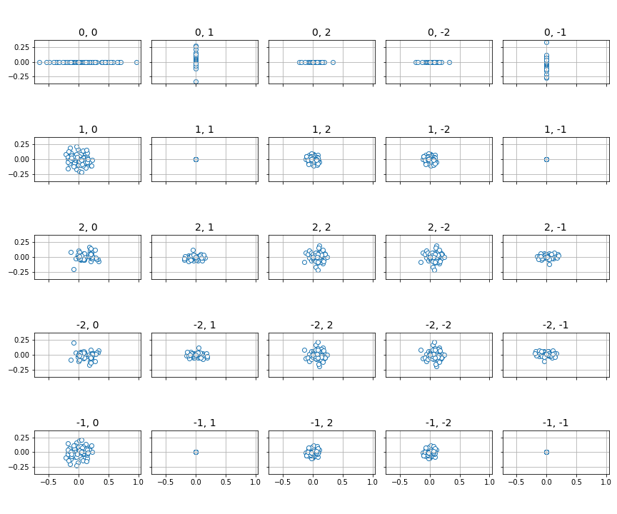

qml.fourier
===========

Overview
--------

.. automodapi:: pennylane.fourier
    :no-heading:
    :include-all-objects:
    :no-inheritance-diagram:
    :no-inherited-members:

Visualization
^^^^^^^^^^^^^

.. currentmodule:: pennylane.fourier.visualize

Tools to visualize the Fourier representations can be found in the :mod:`fourier.visualize`
submodule. This requires the ``matplotlib`` package to be installed.

.. autosummary::
    :toctree: api

    bar
    box
    panel
    radial_box
    violin

Fourier representation of quantum circuits
------------------------------------------

Consider a quantum circuit that depends on a parameter vector :math:`x` with
length :math:`N`. The circuit involves application of some unitary operations
:math:`U(x)`, and then measurement of an observable :math:`\hat{O}`.
Analytically, the expectation value is

.. math::

   \langle \hat{O} \rangle = \langle 0 \vert U^\dagger (x) \hat{O} U(x) \vert 0\rangle = \langle
   \psi(x) \vert \hat{O} \vert \psi (x)\rangle.

This output is simply a function :math:`f(x) = \langle \psi(x) \vert \hat{O} \vert \psi
(x)\rangle`. Notably, it is a periodic function of the parameters, and
it can thus be expressed as a multidimensional Fourier series:

.. math::

    f(x) = \sum \limits_{n_1\in \Omega_1} \dots \sum \limits_{n_N \in \Omega_N}
    c_{n_1,\dots, n_N} e^{-i x_1 n_1} \dots e^{-i x_N n_N},

where :math:`n_i` are integer-valued frequencies, :math:`\Omega_i` are the set
of available values for the integer frequencies, and the
:math:`c_{n_1,\ldots,n_N}` are Fourier coefficients.

As a simple example, consider ``simple_circuit`` below, which is a function of a
single parameter.

.. code::

    import pennylane as qml
    from pennylane import numpy as np

    dev = qml.device('default.qubit', wires=2)

    @qml.qnode(dev)
    def simple_circuit(x):
        qml.RX(x[0], wires=0)
        qml.RY(x[0], wires=1)
        qml.CNOT(wires=[1, 0])
        return qml.expval(qml.PauliZ(0))

We can mathematically evaluate the expectation value of this function to be
:math:`\langle Z \rangle = 0.5 + 0.5 \cos(2x)`. Thus, the Fourier coefficients
of this function are :math:`c_0 = 0.5`, :math:`c_1 = c^*_{-1} = 0`, and \
:math:`c_2 = c^*_{-2} = 0.25`.

The PennyLane ``fourier`` module enables calculation of
the values of the Fourier coefficients :math:`c_{n_1,\dots, n_N}`.
Knowledge of the coefficients, and thereby the spectrum of frequencies
where the coefficients are non-zero, is important
for the study of the expressivity of quantum circuits, as described in `Schuld,
Sweke and Meyer (2020) <https://arxiv.org/abs/2008.08605>`__ and `Vidal and
Theis, 2019 <https://arxiv.org/abs/1901.11434>`__ -- the more coefficients
available to a quantum model, the larger the class of functions that model can
represent, potentially leading to greater utility for quantum machine learning
applications.

Calculating the frequencies supported by a circuit
--------------------------------------------------

For certain circuits, information on the frequency spectra :math:`\Omega_j`
can be derived solely from the structure of the gates
that encode the corresponding inputs :math:`x_j` (see for example `Schuld,
Sweke, and Meyer (2020) <https://arxiv.org/abs/2008.08605>`__). More precisely, if
all input-encoding gates are of the form :math:`e^{-ix_j G}`, where :math:`G` is
a Hermitian operator that "generates" the operation, we can deduce a maximum set of frequencies
that can theoretically appear in :math:`\Omega_j`.  Depending on the non-input-encoding
gates in the circuit, some of these theoretically supported frequencies may end up
having vanishing Fourier coefficients, and :math:`\Omega_j` effectively turns out to be smaller.
However, estimates based on the input-encoding strategy can still be useful to understand
the potential expressivity of a type of ansatz.

The theoretically supported frequencies can be computed
using the :func:`~.pennylane.fourier.spectrum` function. To mark which gates encode
inputs (and, for example, which ones are only used for trainable parameters), we
have to give input-encoding gates an ``id``:

.. code::

    import pennylane as qml

    dev = qml.device('default.qubit', wires=2)

    @qml.qnode(dev)
    def simple_circuit_marked(x):
        qml.RX(x[0], wires=0, id="x")
        qml.RY(x[0], wires=1, id="x")
        qml.CNOT(wires=[1, 0])
        return qml.expval(qml.PauliZ(0))

We can then compute the frequencies supported by the input-encoding gates as:

.. code::

   >>> from pennylane.fourier import circuit_spectrum
   >>> freqs = circuit_spectrum(simple_circuit_marked)([0.1])
   >>> for k, v in freqs.items():
   >>>     print(k, ":", v)

   x : [-2.0, -1.0, 0.0, 1.0, 2.0]

.. note::

    Some encoding-gate types may give rise to non-integer-valued frequencies. In this case,
    the :func:`~.pennylane.fourier.spectrum` function computes the frequency sets :math:`\Omega_j`
    of the *Fourier sum* of the form

    .. math::

        f(x) = \sum \limits_{\omega_1\in \Omega_1} \dots \sum \limits_{\omega_N \in \Omega_N}
        c_{\omega_1,\dots, \omega_N} e^{-i x_1 \omega_1} \dots e^{-i x_N \omega_N},

    with :math:`\omega \in \mathbb{R}`. Just like any other function, such a sum can be turned into a
    proper Fourier series, but the mapping from non-integer-valued to integer-valued frequencies
    is not always trivial.

Calculating the Fourier coefficients
------------------------------------

To get a more accurate picture of the Fourier series representation of a quantum circuit,
we have to compute the Fourier coefficients :math:`c_{n_1,\ldots,n_N}`. This is done using numerical methods in the
:func:`~.pennylane.fourier.coefficients` function:

.. code::

   >>> from pennylane.fourier import coefficients
   >>> coeffs = coefficients(simple_circuit, 1, 2)
   >>> print(np.round(coeffs, decimals=4))
   [0.5 +0.j 0.  -0.j 0.25+0.j 0.25+0.j 0.  -0.j]

The inputs to the :func:`~.pennylane.fourier.coefficients` function are

- A function, or QNode containing the variational circuit for which to compute the Fourier coefficients,
- the length of the input vector, and
- the maximum frequency for which to calculate the coefficients (also known as
  the *degree*).

Internally, the coefficients are computed using NumPy's `discrete Fourier
transform <https://numpy.org/doc/stable/reference/generated/numpy.fft.fftn.html>`__
function. The order of the coefficients in the output thus follows the standard
output ordering, i.e., :math:`[c_0, c_1, c_2, c_{-2}, c_{-1}]`, and similarly
for multiple dimensions. The normalization convention used here corresponds to
the ``norm="forward"`` option in the NumPy transforms, i.e., the Fourier
transform over an array of size :math:`N` is rescaled by :math:`1/N`, while the
inverse Fourier transform is left as-is.

For more details and examples of coefficient calculation, please see the
documentation for :func:`~.pennylane.fourier.coefficients`.

Fourier coefficient visualization
^^^^^^^^^^^^^^^^^^^^^^^^^^^^^^^^^

A key application of the Fourier module is to analyze the *expressivity* of
classes of quantum circuit families. The set of frequencies in the Fourier
representation of a quantum circuit can be used to characterize the function
class that a parametrized circuit gives rise to. For example, if an embedding
leads to a Fourier representation with a few low-order frequencies, a quantum
circuit using this embedding can only express rather simple periodic functions.

The Fourier module contains a number of methods to visualize the coefficients of
the Fourier series representation of a single circuit, as well as distributions
over Fourier coefficients for a parametrized circuit family.

.. note::

   Visualization of the Fourier coefficients requires the ``matplotlib``
   library. As such, visualization functions are contained in the submodule
   ``pennylane.fourier.visualize``.  The visualization functions are structured
   to accept ``matplotlib`` axes as arguments so that additional configuration
   (such as adding titles, saving, etc.) can be done outside the functions. Many
   of the plots, however, require a specific number of subplots. The examples
   below demonstrate how the subplots should be created for each function.

Visualizing a single set of coefficients
^^^^^^^^^^^^^^^^^^^^^^^^^^^^^^^^^^^^^^^^

While all the functions available for visualizing multiple sets of Fourier
coefficients can be used for a single set, the primary tool for this purpose is
the :func:`~.pennylane.fourier.visualize.bar` function. Using the coefficients we obtained in the
earlier example,

>>> from pennylane.fourier.visualize import *
>>> import matplotlib.pyplot as plt

>>> fig, ax = plt.subplots(2, 1, sharex=True, sharey=True) # Set up the axes
>>> bar(coeffs, 1, ax)

.. image:: ../_static/fourier_vis_bar_plot.png
    :align: center
    :width: 500px
    :target: javascript:void(0);

|

In the bar plots, real coefficients are shown in the top panel, and complex in
the bottom. The labels along the x-axis represent the coefficient frequencies
(for large plots, it is sometimes convenient to remove these by passing
``show_freqs=False`` to the plotting function).

Below is a more complex example that demonstrates some of the additional
customization options available:

.. code::

   from functools import partial

   weights = np.array([[0.1, 0.2, 0.3], [0.4, 0.5, 0.6]])

   @qml.qnode(dev)
   def circuit_with_weights(w, x):
       qml.RX(x[0], wires=0)
       qml.RY(x[1], wires=1)
       qml.CNOT(wires=[1, 0])

       qml.Rot(*w[0], wires=0)
       qml.Rot(*w[1], wires=1)
       qml.CNOT(wires=[1, 0])

       qml.RX(x[0], wires=0)
       qml.RY(x[1], wires=1)
       qml.CNOT(wires=[1, 0])

       return qml.expval(qml.PauliZ(0))

   coeffs = coefficients(partial(circuit_with_weights, weights), 2, 2)

   # Number of inputs is now 2; pass custom colours as well
   fig, ax = plt.subplots(2, 1, sharex=True, sharey=True, figsize=(15, 4))
   bar(coeffs, 2, ax, colour_dict={"real" : "red", "imag" : "blue"})

.. image:: ../_static/fourier_vis_bar_plot_2.png
    :align: center
    :Width: 100%
    :target: javascript:void(0);

Visualizing multiple sets of coefficients
^^^^^^^^^^^^^^^^^^^^^^^^^^^^^^^^^^^^^^^^^

Suppose we do not want to visualize the Fourier coefficients for a fixed
``weights`` argument in ``circuit_with_weights``, but the distribution over sets
of Fourier coefficients when the weights are randomly sampled. For each
``weights`` sample we get a different set of coefficients:

.. code::

   coeffs = []

   for _ in range(100):
       weights = np.random.normal(0, 1, size=(2, 3))
       c = coefficients(partial(circuit_with_weights, weights), 2, degree=2)
       coeffs.append(np.round(c, decimals=8))

One option to plot the distribution is :func:`~.pennylane.fourier.visualize.violin`:

.. code::

   fig, ax = plt.subplots(2, 1, sharey=True, figsize=(15, 4))
   violin(coeffs, 2, ax, show_freqs=True)

.. image:: ../_static/fourier_vis_violin.png
    :width: 100%
    :target: javascript:void(0);

|

A similar option is :func:`~.pennylane.fourier.visualize.box`, which
produces a plot of the same format but using a box plot.

A different view can obtained using the
:func:`~.pennylane.fourier.visualize.radial_box` function. This "rolls up"
the coefficients onto a polar grid. Let us use it to visualize the same set of
coefficients as above:

.. code::

   # The subplot axes must be *polar* for the radial plots
   fig, ax = plt.subplots(
       1, 2, sharex=True, sharey=True,
       subplot_kw=dict(polar=True),
       figsize=(15, 8)
   )
   radial_box(coeffs, 2, ax, show_freqs=True, show_fliers=False)

.. image:: ../_static/fourier_vis_radial_box.png
    :align: center
    :width: 700px
    :target: javascript:void(0);

|

The left plot displays the real part, and the right the imaginary
part of the distribution over a parametrized quantum circuit's
Fourier coefficients. The labels on the "spokes" of the wheels represent the particular
frequencies; we see that this matches the coefficients we found earlier. Note
how the coefficient :math:`c_0` appears in the top middle of each plot; the
negative frequencies extend counterclockwise from that point, and the positive
frequencies increase in the clockwise direction. Such plots allow for a more
compact representation of a large number of frequencies than the linear violin
and box plots discussed above. For a large number of frequencies, however, it is
recommended to disable the frequency labelling by setting ``show_freqs=False``,
and hiding box plot fliers as was done above.

Finally, for the special case of 1- or 2-dimensional functions, we can use the
:func:`~.pennylane.fourier.visualize.panel` function to plot the distributions of the
sampled sets of Fourier coefficients on the complex plane.

.. code::

   # Need a grid large enough to hold all coefficients up to frequency 2
   fig, ax = plt.subplots(5, 5, figsize=(12, 10), sharex=True, sharey=True)
   panel(coeffs, 2, ax)

