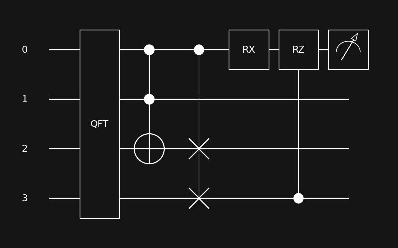

qml.style
=========

This module mimics the behavior of
`matplotlib's style module<https://matplotlib.org/stable/api/style_api.html>`__
with additional options designed specifically for PennyLane's circuit drawings.

.. currentmodule:: pennylane.circuit_drawer.style

.. automodapi:: pennylane.circuit_drawer.style
    :include-all-objects:
    :no-heading:
    :no-inheritance-diagram:
    :no-inherited-members:

Current Available Styles:
-------------------------

``'black_white``
^^^^^^^^^^^^^^^^^

.. figure:: ../_static/style/black_white_style.png
        :align: center
        :width: 60%
        :target: javascript:void(0);

``'black_white_dark'``
^^^^^^^^^^^^^^^^^^^^^^

