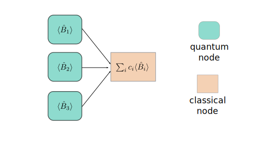
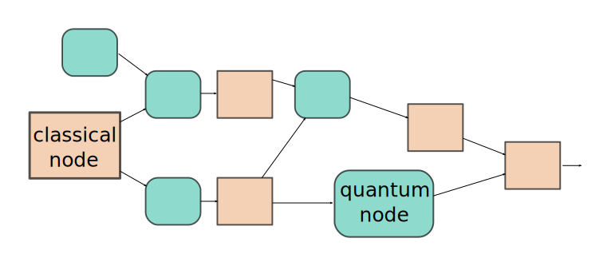

.. role:: html(raw)
   :format: html

.. _hybrid_computation:

Hybrid computation
==================
:html:` `

    An 'true hybrid' quantum-classical computational graph.

:html:` `

:html:` `

    An 'true hybrid' quantum-classical computational graph.

:html:` `

.. todo:: Discuss compatability of Qnode abstraction with ML techniques: we would also like this interface to be compatible with essential components of machine learning like the backpropagation algorithm. 

Backpropagation through hybrid computations
-------------------------------------------

.. todo:: Sell the idea that we can differentiate end-to-end through a hybrid computation

.. todo:: how does a gradient computation work in a hybrid quantum-classical computation?
