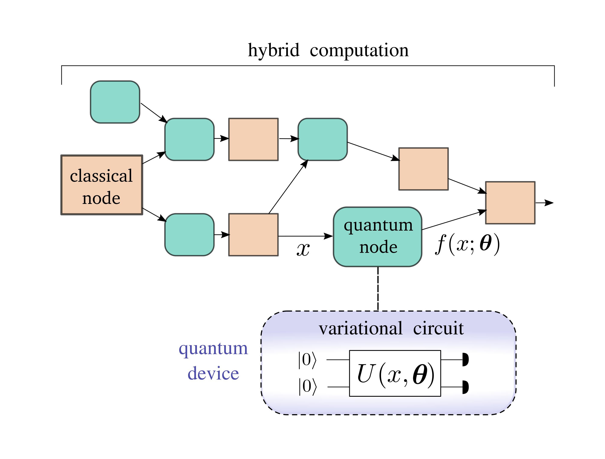
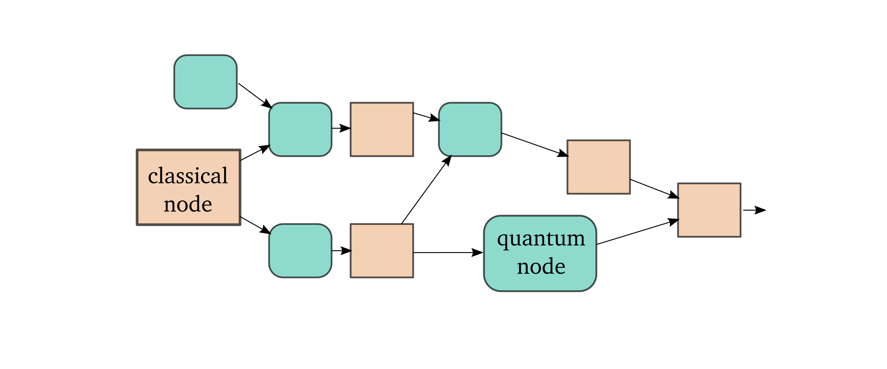
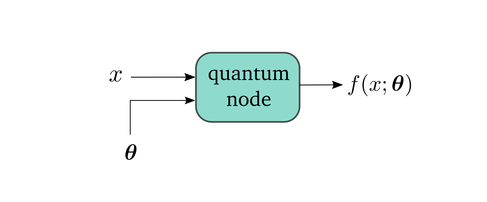
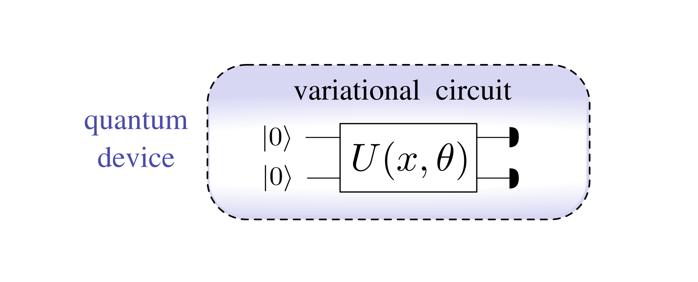
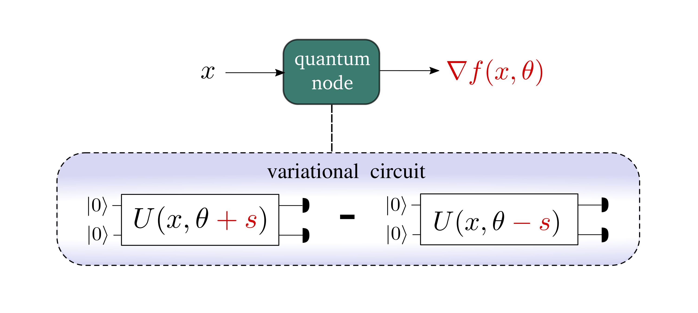

.. role:: html(raw)
   :format: html

.. _introduction:

Introduction
============

The main principle underlying PennyLane is to make the interface between the quantum and classical worlds seamless. A quantum computing device should not be viewed as a competitor to a classical computer, but rather as an *accelerator*. Integrating both types of information processing gives rise to **hybrid computation**.

:html:` `

:html:` `

In PennyLane both classical and quantum computers are used in the same basic way: as computational devices which we program to evaluate mathematical functions. We call such functions *nodes*, since they feed information into each other like a graph. **Quantum nodes** are abstract representations of quantum circuits which input and output classical information. 

Each quantum node executes a **variational circuit** - a parametrized quantum circuit - on a quantum device.

In optimization tasks, hybrid computations depend on variables, or trainable parameters. A central feature of PennyLane is the ability to compute the gradients of quantum nodes or **quantum gradients**.

These four concepts, **hybrid computation**, **quantum nodes**, **variational circuits**, and **quantum gradients** are central to PennyLane.

:html:`<h3>Hybrid computation</h3>`

.. rst-class:: admonition see

    See the main :ref:`hybrid_computation` page for more details.

:html:` `

:html:` `

*Hybrid quantum algorithms* are  algorithms that are not fully coherent. In other words, they do not fully run on quantum computers, but **integrate classical and quantum processing**. In many proposed hybrid algorithms, quantum devices are used to evaluate quantum subroutines, and a classical co-processor is used primarily to post-process circuit outputs. But in principle, hybrid computation can give to much more complex procedures.

In a **true hybrid** computational model, both the classical and the quantum devices are responsible for arbitrary parts of an overall computation, subject to the rules of quantum nodes. This allows quantum and classical devices to be used jointly, each forming an integral and inseparable part of a larger computation.

:html:`<h3>Quantum nodes</h3>`

.. rst-class:: admonition see

    See the main :ref:`quantum_nodes` page for more details.

:html:` `

:html:` `

Quantum information is fragile — especially in near-term devices. How can we integrate quantum devices seamlessly and scalably with classical computations?

This leads to the notion of a **quantum node**: a basic computational unit — programmed on a quantum circuit — which evaluates a block of quantum information processing. Only classical data can enter or exit a quantum node.

.. note:: For a function :math:`f(x; \bm{\theta})`, :math:`x` is considered to be the function's input and :math:`\bm{\theta}` are parameters which determine the exact form of :math:`f`.

To a classical device, a quantum node is a black box which can evaluate functions. A quantum device, however, resolves the finer details of the circuit.

:html:`<h3>Variational circuits</h3>`

.. rst-class:: admonition see

    See the main :ref:`varcirc` page for more details.

:html:` `

:html:` `

Variational circuits are quantum algorithms that depend on tunable parameters which we call **variables**. The circuits can therefore be **optimized**. In PennyLane, a variational circuit consists of three ingredients:

1. Preparation of a fixed **initial state** (e.g., the vacuum state or the zero state).

2. A quantum circuit, **parameterized** by both the input :math:`x` and the function parameters :math:`\boldsymbol\theta`.

3. **Measurement** of an observable :math:`\hat{B}` at the output. This observable may be made up from local observables for each wire in the circuit, or just a subset of wires.

The expectation is estimated by repeated quantum measurements (i.e. on hardware) or computed by simulating the quantum hardware on a classical computer. It is the output of the quantum node :math:`f(x; \bm{\theta})`.

.. note:: The primary motivation for building quantum computers is that they should be able to perform computations which are inefficient to run on classical computers. There are many proposals for - even short - quantum routines for which estimating the expectation is classically intractable. If the quantum system that processes the quantum information is sufficiently large, no classical computer can perform the same computation.

:html:`<h3>Quantum gradients</h3>`

.. rst-class:: admonition see

    See the main :ref:`autograd_quantum` page for more details.

:html:` `

:html:` `

A core element of modern machine learning libraries is the automatic computation of analytic gradients. PennyLane extends this key feature to quantum nodes.

Evaluating quantum nodes is inefficient on classical computers, so we might expect the gradients of qfuncs to be similarly intractable. Fortunately, we can often compute the gradient of a quantum node :math:`\nabla f(x;\bm{\theta})` exactly using a linear combination of two quantum nodes where one variable is shifted:

.. note::

    This reminds of the finite difference rule of computing derivatives, only that here, :math:`s` turns out not to be an infinitesemal shift.

We can thus **use the same quantum device** to compute both quantum nodes and also gradients of quantum nodes. This is accomplished with minor assistance of a classical coprocessor, which combines the terms. 

