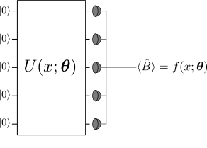

.. role:: html(raw)
   :format: html

.. _qfuncs:

Quantum functions
=================

A quantum function (*qfunc*) is any parameterized function :math:`f(x;\bm{\theta})` which can be evaluated on a quantum circuit using the `Born rule <https://en.wikipedia.org/wiki/Born_rule>`_.

.. math:: f(x; \bm{\theta}) = \langle \hat{B} \rangle = \langle 0 | U^\dagger(x;\bm{\theta})\hat{B}U(x;\bm{\theta}) | 0 \rangle.

The circuit formulation of a qfunc contains three ingredients:

1. Preparation of a fixed initial state (e.g., the vacuum state or the zero state).

2. A quantum circuit, parameterized by both the input :math:`x` and the function parameters :math:`\bm{\theta}`.

3. Measurement of an observable :math:`\hat{B}` at the output. This observable may be made up from local observables for each wire in the circuit, or just a subset of wires.

:html:` `

    *Quantum functions* are functions which can be evaluated from a quantum circuit using the Born rule. 

:html:` `

Building the circuit
--------------------

Both the input :math:`x` and the function parameters :math:`\bm{\theta}` enter the quantum circuit in the same way: as arguments for circuit's gates. This allows us to convert *classical information* (the values of :math:`x` and :math:`\bm{\theta}`) into *quantum information* (the quantum state :math:`U(x;\bm{\theta})|0\rangle`).
Quantum information is turned back into classical information by evaluating the expectation value of the observable :math:`\hat{B}`.

.. todo:: double check whether or not we support parameters in the observables

:html:` `

.. figure:: ../_static/circuit_embedding.svg
    :align: center
    :width: 70%
    :target: javascript:void(0);

    Example circuit showing how the argument :math:`x` and the function parameters :math:`\bm{\theta}` enter the quantum circuit. Circuits can also contain gates which have no free parameters (e.g., a CNOT).

:html:` `

Beyond the basic rule that the inputs and parameters :math:`(x;\bm{\theta})` are used as the arguments of gates, exactly how the circuit is constructed is arbitrary. The circuit can also include additional gates which have no free parameter associated with them. A number of general-purpose and special-purpose circuit ansatzes have been proposed in the quantum machine learning literature [schuld2018quantum]_ [killoran2018continuous]_. 

.. todo:: add more citations for ansaetze

Data-embedding example
~~~~~~~~~~~~~~~~~~~~~~

One straightforward embedding strategy is for the first few gates in the circuit to be responsible for embedding the input :math:`x` into a quantum state (which functions as a feature map [schuld2018quantum]_), while the subsequent gates have the parameters :math:`\bm{\theta}` as arguments. 

As an example, consider a photonic quantum computer (similar examples can be constructed for qubits). For simplicity, we temporarily omit the parameters :math:`\bm{\theta}`. We take the initial state to be the *vacuum* state and the measured observable :math:`\hat{B}` to be the position operator :math:`x`. The vacuum state has expectation value :math:`\langle\hat{x}\rangle = \langle 0 | \hat{x} | 0 \rangle = 0`. 

Suppose we have an input :math:`x`, which has :math:`N` dimensions. We can embed this into a quantum circuit with :math:`N` wires using the *displacement gate* :math:`D`. For every component :math:`x_i` of :math:`x`, we apply :math:`D(x_i)` to wire :math:`i`. 

Measurement of the position operator on each wire will then give the result 

.. math:: (\langle \hat{x_1} \rangle, \cdots, \langle \hat{x_N} \rangle ) = (x_1, \dots, x_N).

Thus, the displacement gate -- combined with vacuum input and position measurements -- can be used to directly encode data into a photonic quantum computer. 

Parameterized function example
~~~~~~~~~~~~~~~~~~~~~~~~~~~~~~

To complete our picture of a quantum function, we would like to further process the embedded data from the example above. As it stands, our example circuit currently represents the *identity qfunc* :math:`f(x)=x`, which has no free parameters. By introducing additional gates, with parameters :math:`\bm{\theta}`, we can start building up more complex functions.

For clarity, we restrict to a one-dimensional input :math:`x` and add in a single *rotation gate*, with free parameter :math:`\theta`. After applying this gate, the qfunc evaluated by our circuit becomes

.. math:: f(x;\theta) = x\cos(\theta).

Thus, with only two quantum gates (displacement and rotation), we can evaluate quantum functions with the above form. 

Extending to intractable quantum functions
------------------------------------------

The above examples were kept very simple to illustrate the principles behind embedding data and parameters into quantum circuits. Indeed, the qfunc evaluated in the example is tractable classically. However, by increasing the number of subsystems and the circuit depth, the corresponding qfuncs can become progressively harder to evaluate classically, and a quantum device must be used.
