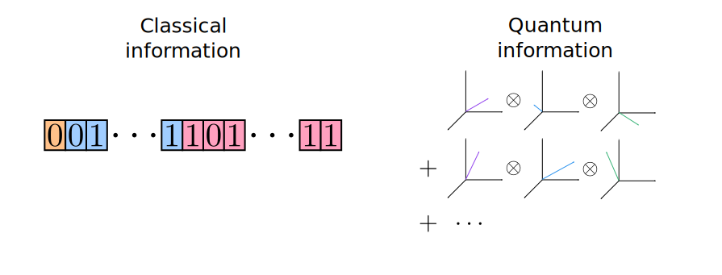

.. role:: html(raw)
   :format: html

.. _quantum_nodes:

Quantum nodes
-------------

Classical and quantum information
=================================

It is important to distinguish between classical and quantum forms of information. For our purposes, we will consider the value of a number stored within a conventional digital computer (say, a floating point binary representation of a real or complex number) as **classical information**. Many common functions — like addition, subtraction, multiplication, :math:`\sin,\cos,\exp,` etc. — can all be evaluated efficiently on a classical computer, e.g., using the NumPy library in Python. These functions map floating point numbers to floating point numbers. In other words, they are functions which process classical information.

On the other hand, **quantum information** will refer to the state of a complex-valued vector in a quantum Hilbert space. Gates in a quantum computer transform quantum states to quantum states, i.e., they process quantum information.

:html:` `

    Classical information refers to the state of binary numbers stored on a conventional digital computer. Quantum information refers to the state of a complex-valued vector in a quantum Hilbert space.

:html:` `

.. note:: Quantum information can be simulated on a classical computer, but in general this cannot be done efficiently.

Interfacing the classical and quantum worlds
============================================

There are many schemes for inputting classical information into quantum systems, but these can often get quite complex. To connect between the classical and quantum worlds, PennyLane uses two straightforward methods:

1. **Gate parameters**

   The gates used in a quantum circuit often have classical parameters associated with them. This classical information determines how a quantum state is transformed — e.g., what angle we should rotate the quantum state by. Thus, gate arguments provide us a way to imprint classical data onto quantum states, converting classical information to quantum information [#]_.

2. **Measurement of a quantum circuit**

   Measurements convert quantum information (the state of a quantum system) into classical information (the measurement value). Measurements often have a distribution of outcomes, with the pattern becoming clear only after a sufficient number of measurements are taken.

   In PennyLane, we work with expectation values (i.e., averages) of measurement outcomes as our primary mechanism for obtaining classical information from quantum devices [#]_.

The quantum node abstraction
============================

A quantum node is a computational encapsulation of a quantum function :math:`f(x;\bm{\theta})` which has different resolution for different computational devices.

- For a quantum computing device, a quantum node is a variational circuit whose gates are parameterized by :math:`x` and :math:`\bm{\theta}` and whose measurement outcomes are averaged to produce an expectation value.
- For a classical computing device, a quantum node is a callable function, taking the arguments :math:`(x,\bm{\theta})` and returning the value :math:`f(x;\bm{\theta})`. The classical device cannot "zoom in" and see any intermediate state of the quantum circuit.

:html:` `

    Quantum nodes are seen differently depending on the computational device. A classical device merely sees a callable function which transforms classical information. A quantum device sees a higher resolution version, with quantum gates and measurements.

:html:` `

.. note:: For a function :math:`f(x; \bm{\theta})`, :math:`x` is considered to be the function's input and :math:`\bm{\theta}` are parameters which determine the exact form of :math:`f`.

So long as we provide some mechanism for evaluating quantum nodes (i.e., a quantum computing device or simulator), a classical computing device can treat it as it would any other callable function which manipulates classical data. We can thus connect quantum nodes with classical transformations to build complex multistage :ref:`hybrid quantum-classical computations <hybrid_computation>`.

.. rubric:: Footnotes

.. [#] This strategy can be thought of as a *quantum embedding* or *quantum feature map* of classical information in a quantum Hilbert space :cite:`schuld2018quantum`.

.. [#] This averaging is also important to ensure that quantum functions are suitably well-defined, since single-shot measurements of the same circuit may not give the same value.
