.. role:: html(raw)
   :format: html

.. _varcirc:

Variational circuits
====================

A variational circuit consists of three ingredients:

1. Preparation of a fixed **initial state** (e.g., the vacuum state or the zero state).

2. A **quantum circuit** :math:`U(x; \bm{\theta})`, parameterized by both the input :math:`x` and the free parameters :math:`\bm{\theta}`.

3. **Measurement** of an observable :math:`\hat{B}` at the output. This observable may be made up from local observables for each wire in the circuit, or just a subset of wires.

The expectation values :math:`f(x;\bm{\theta})=\langle 0 | U^\dagger(x; \bm{\theta}) \hat{B} U(x; \bm{\theta}) | 0 \rangle` of one or more such circuits — possibly with some classical post-processing — define a scalar cost for a given task. The free parameters :math:`\bm{\theta}` of the circuit are tuned to optimize this cost function.

:html:` `

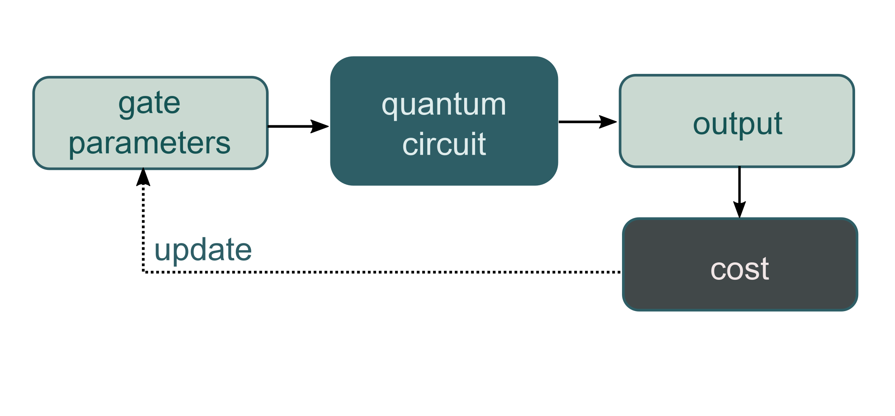

    The principle of a *variational circuit*.

:html:` `

Typically, variational circuits are trained by a classical optimization algorithm that makes queries to the quantum device. The optimization is an iterative scheme that searches out better candidates for the parameters :math:`\theta` with every step. Variational circuits have been proposed for various near-term applications, such as optimization, quantum chemistry, machine learning, data compression, linear algebra, and feature embeddings.

Variational circuits have become popular as a way to think about quantum algorithms for near-term quantum devices. Such devices can only run short gate sequences, and have a high error. Usually, a quantum algorithm is decomposed into a set of standard elementary operations, which are in turn implemented by the quantum hardware. The intriguing idea of variational circuit for near-term devices is to merge this two-step procedure into a single step by "learning" the circuit on the noisy device for a given task. This way, the "natural" tunable gates of a device can be used to formulate the algorithm, without the detour via a fixed elementary gate set. Furthermore, systematic errors can automatically be corrected during optmization.

Building the circuit
--------------------

:html:` `

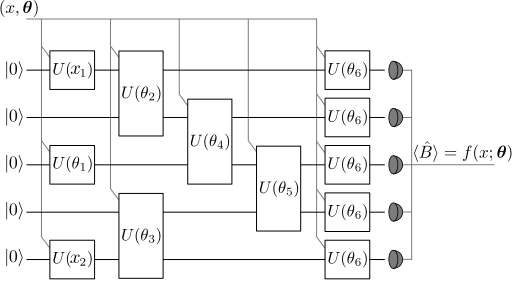

    Example circuit showing how the argument :math:`x` and the variational parameters :math:`\bm{\theta}` enter the quantum circuit. Circuits can also contain gates which have no free parameters (e.g., a CNOT).

:html:` `

Both the input :math:`x` and the variational parameters :math:`\bm{\theta}` enter the quantum circuit in the same way: as arguments for the circuit's gates. This allows us to convert *classical information* (the values of :math:`x` and :math:`\bm{\theta}`) into *quantum information* (the quantum state :math:`U(x;\bm{\theta})|0\rangle`).

Quantum information is turned *back into classical information* by evaluating the expectation value of the observable :math:`\hat{B}`,

.. math:: f(x; \bm{\theta}) = \langle \hat{B} \rangle = \langle 0 | U^\dagger(x;\bm{\theta})\hat{B}U(x;\bm{\theta}) | 0 \rangle.

Beyond the basic rule that the inputs and parameters :math:`(x;\bm{\theta})` are used as the arguments of gates, exactly how the gates are arranged, the *circuit architecture*, is essentially arbitrary.

.. note:: As shown in the figure above, the circuit can also include additional gates which have no free parameter associated with them.

Examples
--------

Data-embedding
~~~~~~~~~~~~~~

As explained in :ref:`concept_embeddings`, the first few gates in the circuit can be used to embed the input :math:`x` into a quantum state (which functions as a feature map :cite:`schuld2018quantum`), while the subsequent gates have parameters :math:`\bm{\theta}` as arguments.

As an example, consider a photonic quantum computer (similar examples can be constructed for qubits). For simplicity, we temporarily omit the parameters :math:`\bm{\theta}`. We take the initial state to be the *vacuum* state and the measured observable :math:`\hat{B}` to be the position operator :math:`x`. The vacuum state has expectation value :math:`\langle\hat{x}\rangle = \langle 0 | \hat{x} | 0 \rangle = 0`.

Suppose we have an input :math:`x`, which has :math:`N` dimensions. We can embed this into a quantum circuit with :math:`N` wires using the `displacement operator <https://en.wikipedia.org/wiki/Displacement_operator>`_. For every component :math:`x_i` of :math:`x`, we apply :math:`D(x_i)` to wire :math:`i`. This is called displacement embedding. 

Measurement of the expectation value of the :math:`\hat{x}` operator on each wire will then give the result

.. math:: (\langle \hat{x}_1 \rangle, \cdots, \langle \hat{x}_N \rangle ) = (x_1, \dots, x_N).

Thus, the displacement gate — combined with vacuum input and position measurements — can be used to directly encode data into a photonic quantum computer.

Data processing
~~~~~~~~~~~~~~~

Having embedded our data into a quantum state, we would now like to perform some processing. As it stands, our example circuit currently represents the *identity* :math:`f(x)=x`, which has no free parameters. By introducing additional gates, with parameters :math:`\bm{\theta}`, we can start building up more complex functions.

For clarity, we restrict to a one-dimensional input :math:`x` and add in a single rotation operator, with free parameter :math:`\theta`. After applying this gate, the quantum node evaluated by our circuit becomes

.. math:: f(x;\theta) = x\cos(\theta).

In summary, with only two quantum gates (displacement and rotation), we can evaluate functions of the above form using quantum circuits.

The above examples were kept very simple to illustrate the principles behind embedding data and parameters into quantum circuits. Indeed, the function evaluated in the example is tractable classically. However, by increasing the number of subsystems and the circuit depth, the corresponding functions can become progressively harder to evaluate classically, and a quantum device must be used.

Architectures
-------------

Many variational circuit architectures have been proposed by the quantum computing community [#]_. The strength of an architecture varies depending on the desired use-case, and it is not always clear what makes a good ansatz. Investigations of the expressive power of different approaches are also ongoing :cite:`du2018expressive`. One goal of PennyLane is to facilitate such studies across various architectures and hardware platforms.

To give a rough summary, we distinguish three different types of architectures, namely **layered gate architectures**, **alternating operator architectures** and **tensor network architectures**.

Layered gate architectures
~~~~~~~~~~~~~~~~~~~~~~~~~~

A layer is a sequence of gates that is repeated in the variational circuit. The number of repetitions of a layer forms a hyperparameter of the variational circuit.

We can often decompose a layer further into two overall unitaries :math:`A` and :math:`B`.

:html:` `

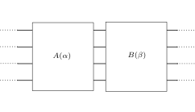

:html:` `

Block :math:`A` contains single-system gates applied to every subsystem. Block :math:`B` consists of both single-subsystem gates as well as entangling gates.

:html:` `

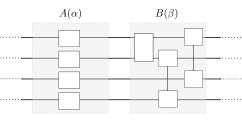

:html:` `

Layered gate architectures can differ in three regards:

* Whether only :math:`A`, only :math:`B`, or both :math:`A` and :math:`B` are parametrized
* Which types of gates are used in :math:`A` and :math:`B`
* Whether the gates in Block :math:`B` are arranged randomly, fixed, or determined by a hyperparameter

Such layered architectures appear in both discrete and continuous-variable quantum computing models.

A parametrized, B fixed
***********************

In the simplest case of qubit-based devices, we can use general SU(2) gates (i.e., rotations) :math:`R` in Block :math:`A` and let :math:`B` be fixed.

:html:` `

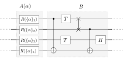

:html:` `

A parametrized, B parametrized
******************************

We can also have both :math:`A` and :math:`B` parametrized and the arrangements of the two-qubit gates depends on a hyperparameter defining the range of two-qubit gates (see also :cite:`romero2017quantum`, :cite:`schuld2018circuit`).

:html:` `

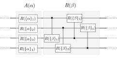

:html:` `

A fully parametrized architecture specific to continuous-variable systems has been proposed in :cite:`schuld2018quantum`.

:html:` `

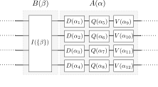

:html:` `

The entangling layer :math:`B` contains an interferometer, a passive optical circuit made up of individual beamsplitters and phase shifters. Block :math:`A` consists of single-mode gates with consecutively higher order for the quadrature operator :math:`\hat{x}` which generates the gate: the displacement gate :math:`D` is order-1, the quadratic phase gate :math:`Q` is order-2, and the cubic phase gate :math:`V` is order-3.

A fixed, B parametrized
***********************

An example where the single-qubit gates are fixed is a so-called *Instantaneous Quantum Polynomial (IQP)* circuit, where :math:`A` consists of Hadamard gates and :math:`B` is made up of parametrized diagonal one- and two-qubit gates :cite:`shepherd2009temporally`:cite:`havlicek2018supervised`.

:html:` `

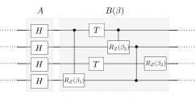

:html:` `

Analogous circuits can also be considered for continuous-variable systems :cite:`arrazola2017quantum`.

:html:` `

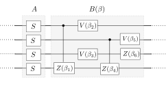

:html:` `

IQP circuits are structured so that all gates in the :math:`B` block are diagonal in the computational basis.

Other structures
****************

Generalizing the simple two-block structure allows to build more complex layers, such as this layer of a photonic neural network which emulates how information is processed in classical neural nets :cite:`killoran2018continuous` :cite:`steinbrecher2018quantum`.

:html:` `

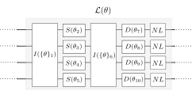

:html:` `

Alternating operator architectures
~~~~~~~~~~~~~~~~~~~~~~~~~~~~~~~~~~

The alternating operator architecture was first introduced in Farhi and Goldstone's *Quantum Approximate Optimization Algorithm* (QAOA) :cite:`farhi2014quantum` and later used for machine learning :cite:`verdon2017quantum` and other domain-specific applications :cite:`fingerhuth2018quantum`.

Again, we use layers of two blocks. The difference is that this time the unitaries representing these blocks are defined via Hamiltonians :math:`A` and :math:`B` which are evolved for a short time :math:`\Delta t`.

:html:` `

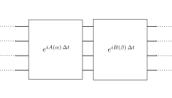

:html:` `

The idea of this ansatz is based on analogies to adiabatic quantum computing, in which the system starts in the ground state of :math:`A` and adiabatically evolves to the ground state of  :math:`B`. Quickly alternating (i.e., *stroboscopic*) applications of  :math:`A` and  :math:`B` for very short times :math:`\Delta t` can be used as a heuristic to approximate this evolution.

Tensor network architectures
~~~~~~~~~~~~~~~~~~~~~~~~~~~~

Amongst the architectures that do not consist of layers, but a single fixed structure, are gate sequences inspired by tensor networks :cite:`huggins2018towards` :cite:`du2018expressive`. The simplest one is a tree architecture that consecutively entangles subsets of qubits.

:html:` `

.. figure:: ../_static/vc_tree.svg
    :align: center
    :width: 40%
    :target: javascript:void(0);

:html:` `

Another tensor network is based on *matrix product states*. The circuit unitaries can be decomposed in different ways, and their size corresponds to the "bond dimension" of the matrix product state — the higher the bond dimension, the more complex the circuit ansatz.

:html:` `

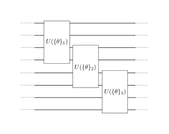

:html:` `

.. note:: Tensor networks such as matrix product states were invented to simulate certain quantum systems efficiently (though not universally) on classical computers. Hence, tensor network architectures do not necessarily give rise to classically intractable quantum nodes, but have found use as machine learning models :cite:`miles2016supervised`.

.. rubric:: Footnotes

.. [#] For example, see the following non-exhaustive list: :cite:`shepherd2009temporally` :cite:`farhi2014quantum` :cite:`miles2016supervised` :cite:`romero2017quantum` :cite:`arrazola2017quantum` :cite:`farhi2017quantum` :cite:`benedetti2018generative` :cite:`huggins2018towards` :cite:`schuld2018quantum` :cite:`havlicek2018supervised` :cite:`schuld2018circuit` :cite:`dallaire2018quantum` :cite:`killoran2018continuous` :cite:`steinbrecher2018quantum`.
