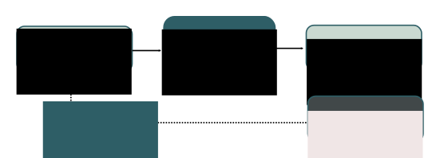
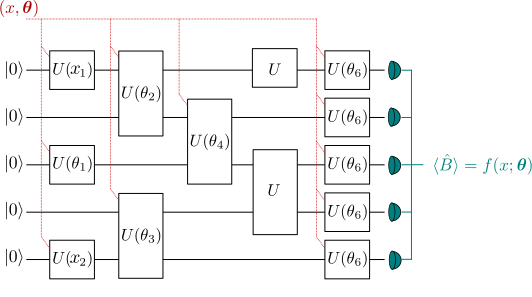
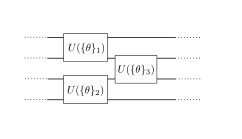

.. role:: html(raw)
   :format: html

.. _varcirc:

Variational circuits
====================

A variational circuit is a parameterized quantum circuit :math:`U(\bm{\gamma})` together with an observable :math:`\hat{O}` that is measured after applying the circuit to an initial state such as the ground or vacuum state :math:`| 0 \rangle`. 

The expectations :math:`\langle 0 | U(\gamma)^{\dagger} \hat{O} U(\gamma) | 0 \rangle` of one or more such circuits - possibly with some classical post-processing - defines a scalar cost for a given task. The parametrized circuit is optimised with respect to the objective (see Figure \ref{var_principle}).

:html:` `

    The principle of a *variational circuit*. 

:html:` `

Typically, variational circuits are trained by a classical optimization algorithm that makes queries to the quantum device. The optimization is an iterative scheme that searches better candidates for the parameters :math:`\gamma` with every step.

Variational circuits have become popular as a way to think about quantum algorithms for near-term quantum devices. Such devices can only run short gate sequences, and have a high error. Usually, a quantum algorithm is decomposed into a set of standard elementary operations, which are in turn implemented by the quantum hardware. The intriguing idea of variational circuit for near-term devices is to merge this two-step procedure into a single step by "learning" the circuit on the noisy device for a given task. This way, the "natural" tunable gates of a device can be used to formulate the algorithm, without the detour via a fixed elementary gate set. Furthermore, systematic errors can automatically be corrected during optmization.

Variational circuits have been proposed for various near-term applications, such as

* optimization [Ref Farhi], 
* quantum chemistry [...], 
* variational autoencoders [Ref Jonny], 
* variational classifiers [REF Schuld 2018], and
* feature embeddings [REF]

Interpreting a variational circuit as a quantum function
--------------------------------------------------------

A quantum function (*qfunc*) is any parameterized function :math:`f(x;\bm{\theta})` which can be evaluated on a quantum circuit using the `Born rule <https://en.wikipedia.org/wiki/Born_rule>`_.

.. math:: f(x; \bm{\theta}) = \langle \hat{B} \rangle = \langle 0 | U^\dagger(x;\bm{\theta})\hat{B}U(x;\bm{\theta}) | 0 \rangle.

The circuit formulation of a qfunc contains three ingredients:

1. Preparation of a fixed initial state (e.g., the vacuum state or the zero state).

2. A quantum circuit, parameterized by both the input :math:`x` and the function parameters :math:`\bm{\theta}`.

3. Measurement of an observable :math:`\hat{B}` at the output. This observable may be made up from local observables for each wire in the circuit, or just a subset of wires.

:html:` `

.. figure:: ../_static/quantum_function.svg
    :align: center
    :width: 70%
    :target: javascript:void(0);

    *Quantum functions* are functions which can be evaluated from a quantum circuit using the Born rule. 

:html:` `

Building the circuit
--------------------

Both the input :math:`x` and the function parameters :math:`\bm{\theta}` enter the quantum circuit in the same way: as arguments for the circuit's gates. This allows us to convert *classical information* (the values of :math:`x` and :math:`\bm{\theta}`) into *quantum information* (the quantum state :math:`U(x;\bm{\theta})|0\rangle`).
Quantum information is turned back into classical information by evaluating the expectation value of the observable :math:`\hat{B}`.

:html:` `

    Example circuit showing how the argument :math:`x` and the function parameters :math:`\bm{\theta}` enter the quantum circuit. Circuits can also contain gates which have no free parameters (e.g., a CNOT).

:html:` `

Beyond the basic rule that the inputs and parameters :math:`(x;\bm{\theta})` are used as the arguments of gates, exactly how the gates are arranged is essentially arbitrary. The circuit can also include additional gates which have no free parameter associated with them. A number of general-purpose and special-purpose circuit ansatzes have been proposed in the quantum optimization and quantum machine learning literature [#]_.

Data-embedding example
~~~~~~~~~~~~~~~~~~~~~~

One straightforward embedding strategy is for the first few gates in the circuit to be responsible for embedding the input :math:`x` into a quantum state (which functions as a feature map [schuld2018quantum]_), while the subsequent gates have the parameters :math:`\bm{\theta}` as arguments. 

As an example, consider a photonic quantum computer (similar examples can be constructed for qubits). For simplicity, we temporarily omit the parameters :math:`\bm{\theta}`. We take the initial state to be the *vacuum* state and the measured observable :math:`\hat{B}` to be the position operator :math:`x`. The vacuum state has expectation value :math:`\langle\hat{x}\rangle = \langle 0 | \hat{x} | 0 \rangle = 0`. 

Suppose we have an input :math:`x`, which has :math:`N` dimensions. We can embed this into a quantum circuit with :math:`N` wires using the :class:`Displacement gate <pennylane.ops.cv.Displacement>`. For every component :math:`x_i` of :math:`x`, we apply :math:`D(x_i)` to wire :math:`i`. 

Measurement of the :class:`position expectation value <pennylane.expval.cv.X>` on each wire will then give the result 

.. math:: (\langle \hat{x_1} \rangle, \cdots, \langle \hat{x_N} \rangle ) = (x_1, \dots, x_N).

Thus, the displacement gate — combined with vacuum input and position measurements — can be used to directly encode data into a photonic quantum computer.

Parameterized function example
~~~~~~~~~~~~~~~~~~~~~~~~~~~~~~

To complete our picture of a quantum function, we would like to further process the embedded data from the example above. As it stands, our example circuit currently represents the *identity qfunc* :math:`f(x)=x`, which has no free parameters. By introducing additional gates, with parameters :math:`\bm{\theta}`, we can start building up more complex functions.

For clarity, we restrict to a one-dimensional input :math:`x` and add in a single :class:`Rotation gate <pennylane.ops.cv.Rotation>`, with free parameter :math:`\theta`. After applying this gate, the qfunc evaluated by our circuit becomes

.. math:: f(x;\theta) = x\cos(\theta).

Thus, with only two quantum gates (Displacement and Rotation), we can evaluate quantum functions with the above form. 

The above examples were kept very simple to illustrate the principles behind embedding data and parameters into quantum circuits. Indeed, the qfunc evaluated in the example is tractable classically. However, by increasing the number of subsystems and the circuit depth, the corresponding qfuncs can become progressively harder to evaluate classically, and a quantum device must be used.

Architectures
-------------
The core of a variational circuit is the \textit{architecture} or the fixed gate sequence that is the skeleton of the algorithm. The favourable properties of an architecture certainly vary from task to task, and -- for example in machine learning, where there is a trade-off of flexibily and regularization -- it is not always clear what makes a good ansatz. Investigations of the expressive power of different approaches have begun [REF new paper]. One goal of Penny Lane is to facilitate such studies across  platforms.

To give a rough summary of variational architectures that have been proposed in the literature, let us distinguish three different types of architectures, *gate*, *alternating operator* and *tensor net-based architectures*.

Gate-based architectures
~~~~~~~~~~~~~~~~~~~~~~~~

Gate-based architectures define a layer architecture. The number of repetitions of a layer forms a hyperparameter of the variational circuit. 

For qubit gates, we can often decompose a layer further into two blocks :math:`A` and :math:`B`. 

:html:` `

.. figure:: ../_static/vc_general.svg
    :align: center
    :width: 40%
    :target: javascript:void(0);

    TEXT. 

:html:` `

Block :math:`A` contains single-qubit gates applied to every qubit. Block :math:`B` also consists of entangling two-qubit gates. 

:html:` `

.. figure:: ../_static/vc_gatearchitecture.svg
    :align: center
    :width: 40%
    :target: javascript:void(0);

    TEXT. 

:html:` `

The architectures differ in two regards:

* Whether only :math:`A`, only :math:`B`, or both :math:`A` and :math:`B` are parametrized
* Whether the gates in Block :math:`B` are arranged randomly, fixed, or structured by a hyperparameter

A parametrized, B fixed
***********************

In the simplest case we can use SU(2) gates in Block :math:`A` and let :math:`B` be fixed,

:html:` `

    TEXT. 

:html:` `

A parametrized, B parametrized
******************************

In [Jonny Autoencoder arxiv1612.02806, SCHULD CC] we have both :math:`A` and :math:`B` parametrized and the arrangements of the two-qubit gates depends on a hyperparameter defining the range of two-qubit gates.

:html:` `

    TEXT. 

:html:` `

An architecture specific to continuous-variable systems has been proposed in [Schuld Killoran]. The entangling layer is represented by an interferometer, a passive optical element made up of individual beam splitters and phase shifters. Block :math:`A` consists of single-mode gates which consecutively increase the order of the quadrature operator in the generator: While the displacement is an order-1 operator, the quadratic phase gate is order-2 and the cubic phase gate order-3. [Explain BETTER] 

:html:` `

.. figure:: ../_static/vc_cvkernels.svg
    :align: center
    :width: 40%
    :target: javascript:void(0);

    TEXT. 

:html:` `

A fixed, B parametrized
***********************

[HAVELIC] use an IQP circuit where :math:`A` consists of Hadamards and :math:`B` is made up of parametrized diagonal one- and two-qubit gates. 

:html:` `

.. figure:: ../_static/vc_iqp.svg
    :align: center
    :width: 40%
    :target: javascript:void(0);

    TEXT. 

:html:` `

IQP circuits can also be constructed for continuous-variable systems.

:html:` `

    TEXT. 

:html:` `

Other structures
****************

Transcending the simple two-block structure allows to build more complex layers, such as this layer of a photonic neural network which emulates how information is processed in classical neural nets [REF]. 

:html:` `

    TEXT. 

:html:` `

Alternating operator architectures
~~~~~~~~~~~~~~~~~~~~~~~~~~~~~~~~~~

The alternating operator structure was first introduced in Farhi and Goldstone's Quantum Approximate Optimization Algorithm (QAOA) [REF] and later used for machine learning [GUILLAUME PAPER] and optimization [MARK PAPER, others?]. The idea is based on adiabatic quantum computing, in which the sytem starts in a Hamiltonian :math:`A` and is slowly transformed to a target Hamiltonian :math:`B`. The system starts in the ground state of :math:`A` and adiabatically evolves to the ground state of  :math:`B`. Streptoscopic, or quickly alternating applications of  :math:`A` and  :math:`B` for very short times  :math:`\Delta t` can be used as a heuristic to approximate this evolution.

:html:` `

    TEXT. 

:html:` `

Fixed architectures
~~~~~~~~~~~~~~~~~~~

Amongst the architectures that do not consist of layers, but a single fixed structure are gate sequences inspired by tensor networks. The simplest one is a tree architectures that consecutively entangle subsets of qubits:

:html:` `

    TEXT. 

:html:` `

.. rubric:: Footnotes

.. [#] For example, see the following non-exhaustive list: [farhi2014quantum]_ [romero2017quantum]_ [farhi2017quantum]_ [benedetti2018generative]_ [schuld2018quantum]_ [schuld2018circuit]_ [dallaire2018quantum]_ [killoran2018continuous]_ [steinbrecher2018quantum]_. 

