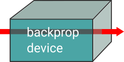

.. role:: html(raw)
   :format: html

Architectural overview
======================

PennyLane's core feature is the ability to compute gradients of variational
quantum circuits in a way that is compatible with classical techniques such as
backpropagation. PennyLane thus extends the automatic differentiation
algorithms common in optimization and machine learning to include quantum and
:doc:`hybrid computations <glossary/hybrid_computation>`.
A plugin system makes the framework compatible with many quantum
simulators or hardware devices, remote or local.

This architectural overview introduces the basic building blocks and terminology
used by PennyLane.

Components
##########

The central object in PennyLane is a **QNode**, which represents a
"node" performing a quantum computation. Several quantum nodes may be
part of a larger hybrid quantum-classical computation.

QNodes run **quantum circuits** on **devices**.
The devices may be simulators built into PennyLane, or external devices
provided by plugins.

The quantum circuit is specified by defining a **quantum function**,
which is a Python function that contains quantum operations and measurements
represented by the :class:`~.Operator` and :class:`~.MeasurementProcess` classes,
respectively.

Internally, the quantum function is used to construct one or more
**quantum tapes**. A quantum tape is a context manager that records a queue of
instructions required to run a quantum circuit.

|

.. figure:: pl_overview.png
    :align: center
    :width: 750px

|

The power of a QNode lies in the fact that it can be run in a "forward" fashion to
execute the quantum circuit, or in a "backward" fashion in which it provides
gradients (or, more precisely, *jacobian-vector products*).

Let's go through these components one-by-one, this time from the "inside out" of the
schematic drawing above.

Operator
********

Quantum operators are represented by the :class:`~.Operator` class.

Operators are uniquely defined by their **name**, their (trainable) **parameters**,
their (non-trainable) **hyperparameters**, and the **wires** they act on. Note that the
trainable parameters can be tensors of any supported autodifferentiation framework.

These four defining properties are accessible for all :class:`~.Operator` instances:

>>> from jax import numpy as jnp
>>> op = qml.Rot(jnp.array(0.1), jnp.array(0.2), jnp.array(0.3), wires=["a"])

>>> op.name
Rot
>>> op.parameters
[DeviceArray(0.1, dtype=float32, weak_type=True),
 DeviceArray(0.2, dtype=float32, weak_type=True),
 DeviceArray(0.3, dtype=float32, weak_type=True)]
>>> op.hyperparameters
{}
>>> op.wires
<Wires = ['a']>

Operators can optionally define the transformation they implement via
symbolic or numerical representations. Here are two examples, and you find more
details in the documentation on :doc:`adding operations </development/adding_operators>`:

* Representation as a product of operators

  >>> op = qml.Rot(0.1, 0.2, 0.3, wires=["a"])
  >>> op.decomposition()
  [RZ(0.1, wires=['a']), RY(0.2, wires=['a']), RZ(0.3, wires=['a'])]

* Representation as a matrix

  >>> op = qml.PauliRot(0.2, "X", wires=["b"])
  >>> op.matrix()
  [[9.95004177e-01-2.25761781e-18j 2.72169462e-17-9.98334214e-02j]
   [2.72169462e-17-9.98334214e-02j 9.95004177e-01-2.25761781e-18j]]

Devices query operators for their properties and representations to
gain information on how to implement the operator.

MeasurementProcess
******************

While the :class:`~.Operator` class describes a physical system and its dynamics,
the :class:`pennylane.measure.MeasurementProcess` class describes how we extract information from the quantum system.
The measurement functions such as :func:`~.expval` create an instance of this class.

>>> m = qml.expval(qml.PauliZ("a"))
>>> type(m)
<class 'pennylane.measure.MeasurementProcess'>

An instance of the :class:`~.MeasurementProcess` class specifies the measured observables,
which are themselves operators.

>>> m.obs
PauliZ(wires=['a'])

Furthermore, it specifies a "return type" which defines the kind of measurement performed,
such as expectation, variance, probability, state, or sample.

>>> m.return_type
ObservableReturnTypes.Expectation

For more information, check out the documentation on :doc:`measurements </introduction/measurements>`

QuantumTape
***********

Quantum operators and measurement processes can be used to build a quantum circuit.
The user defines the circuit by constructing a quantum function, such as:

.. code-block:: python

    def qfunc(params):
        qml.RX(params[0], wires='b')
        qml.CNOT(wires=['a', 'b'])
        qml.RY(params[1], wires='a')
        return qml.expval(qml.PauliZ(wires='b'))

Internally, a quantum function is translated to a quantum tape, which is
the central representation of a quantum circuit. The tape is a context manager that stores lists
of :class:`~.Operator` and :class:`~.MeasurementProcesses` instances.

If we call the quantum function in a tape context, the
gates are stored in the tape's ``operation`` property, while the
measurement functions such as :func:`~.expval` are responsible for adding measurement processes
to the tape's ``measurement`` property.

>>> with qml.tape.QuantumTape() as tape:
...	    qfunc(params)

>>> tape.operations
[RX(DeviceArray(0.5, dtype=float32), wires=['b']),
 CNOT(wires=['a', 'b']),
 RY(DeviceArray(0.2, dtype=float32), wires=['a'])]

>>> tape.measurements
[expval(PauliZ(wires=['b']))]

These two "queues" are used by devices to get information on the circuit they
have to run.

.. note::

    Tapes can represent parts of quantum circuits and do not necessarily need to define a measurement.
    They can also be nested.

Devices
*******

In PennyLane, the abstraction of a quantum computation device is encompassed
within the :class:`~.Device` class. The main job of devices is to
interpret and execute tapes. The most important method is ``batch_execute``,
which executes a list of tapes, such as a list of the single tape created above:

>>> device = qml.device("default.qubit", wires=['a', 'b'], shots=None)
>>> device.batch_execute([tape])
[array([0.87758256])]

There are also device subclasses available, containing shared logic for
particular types of devices.  For example, qubit-based devices can inherit from
the :class:`~.QubitDevice` class, easing development.

To register a new device with PennyLane, a device subclass has to be created and registered
as an `entry point <https://packaging.python.org/specifications/entry-points/>`__ under the ``pennylane.plugins``
namespace using Setuptools. Once registered, the device can be instantiated using the :func:`~.device`
loader function, using the device's name.

A Python package that registers one or more PennyLane devices is known as a *plugin*. For more details
on plugins and devices, see :doc:`/development/plugins`.

QNodes
******

This is where it all comes together: A **QNode** is an encapsulation of a function
:math:`f(x;\theta)=R^m\rightarrow R^n` that is executed using quantum
information processing on a quantum device. It is created by a quantum function and a device.

>>> import jax
>>> from jax import numpy as jnp
>>> params = jnp.array([0.5, 0.2])

>>> qnode = qml.QNode(qfunc, device, interface='jax')
>>> qnode(params)
0.8776

>>> qnode_drawer = qml.transforms.draw(qnode)
>>> qnode_drawer(params)
a: ───────────╭C──RY(0.2)──┤
b: ──RX(0.5)──╰X───────────┤ ⟨Z⟩

.. note::

    Users don't typically instantiate QNodes directly---instead, the :func:`~pennylane.qnode` decorator or
    :func:`~pennylane.QNode` constructor function automates the process of creating a QNode from a provided
    quantum function and device.

Internally, the QNode translates the quantum function into one or more quantum tapes
and classical processing routines that, taken together, execute the quantum computation.

The crucial property of a QNode is that it is differentiable by classical autodifferentiation
frameworks such as autograd, jax, TensorFlow and PyTorch.

>>> jax.grad(qnode)
[-0.4794  0.]

Workflow
########

Autodifferentiation frameworks may run QNodes in "forward mode"
to compute the result of a quantum circuit, or in "backward mode" to compute
the gradient of a qnode with respect to some trainable parameters.

The internal workflow in the QNode is surprisingly similar in both cases, and
consists of three steps: to construct one or more tapes using the quantum function,
to run the tapes on the device, and to post-process the results. The classical processing of this pipeline
maintains differentiability, so that we can not only compute the result, but the gradient of the result
with respect to the trainable parameters.

|

|

The fact that multiple tapes can be constructed from one quantum function may be
surprising at first, but there are many situations in which the evaluation of a quantum circuit
practically requires many circuits to be evaluated, for example:

* When the observable is a Hamiltonian represented as a linear combination of Pauli words, the device may
  instruct the QNode to create one circuit for each Pauli word, and to compute their linear combination
  during post-processing.
* When a gradient of the QNode is requested, and parameter-shift rules have to be used, the QNode
  constructs tapes in which parameters are shifted, and recombines the result to return a gradient.

Interfaces
**********

The construction of tapes, as well as post-processing the results from executing tapes,
are classical computations, and they are "tracked" by the autodifferentiation framework.
In other words, these steps can invoke differentiable classical computations, such as:

* Computing gate parameters of a compiled circuit, which are functions of the original gate parameters.
* Computing linear combinations of expectations, for example when evaluating Hamiltonians term-by-term.

There are some devices where the execution of the quantum circuit is also tracked by the
autodifferentiation framework. This is possible if the device is a simulator that is
coded entiely in the framework's language (such as a TensorFlow quantum simulator).

|

|

Most devices, however, are blackboxes with regards to the autodifferentiation framework.
This means that when the execution on the device begins, autograd, jax, PyTorch and TensorFlow
tensors need to be converted to formats that the device understands - which is in most cases
a representation as Numpy arrays. Likewise, the results of the execution have to be translated
back to differentiable tensors. These two conversions happen at what PennyLane calls the
"interface", and you can specify this interface in the QNode with the ``interface`` keyword argument.
