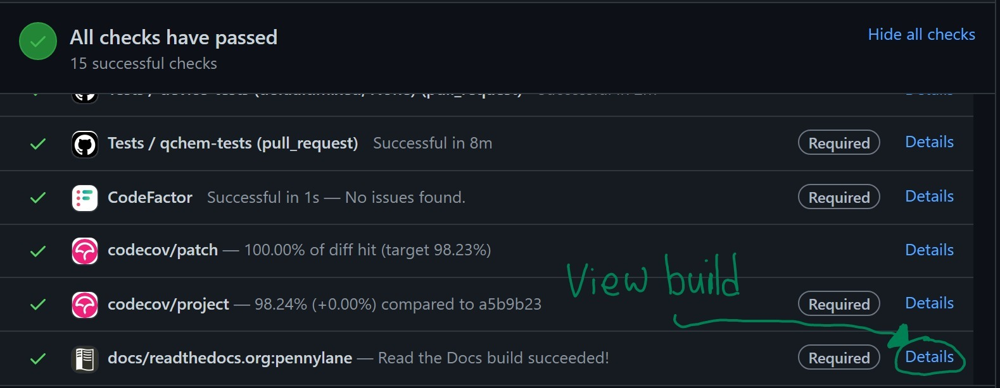

Submitting a pull request
=========================

Creating a Pull Request
-----------------------

When you are ready, go ahead and click on "New Pull Request" on the `pull request page <https://github.com/PennyLaneAI/pennylane/pulls>`_.  On the next page, you need to select your fork and branch to merge into our master branch.

On the next page, you need to specify the name of the PR and write an
introductory description. We have a PR template with a checklist that can help
you determine what to say. Please be as detailed as possible, and assume the reader does not have extensive background knowledge of the issue at hand.

If the PR is in response to an Issue, please `link the issue <https://docs.github.com/en/issues/tracking-your-work-with-issues/linking-a-pull-request-to-an-issue>`_ with the relevant keywords.

Once you create the PR, you can also view the status of the *Continuous Integration* (CI) checks for things like tests, code quality, and documentation rendering.

Continuous Integration Checks
-----------------------------

Once a PR is opened on the repository, GitHub runs a series of checks on the
branch.  All tests need to pass (green check) for the PR to get approved and
merged. Sometimes, a check can be troublesome, especially test coverage,
in which case designated core developers can override and merge anyway.

* **Formatting check**: This check makes sure `black` (described above) would not change any code.

* **Code factor**:  `Code factor <https://www.codefactor.io/>`_ checks several common code quality characteristics.

* **Tests**: Github Actions runs the core tests and device tests for a series of different Python versions and interface installations.

* **Code Coverage**: `codecov <https://app.codecov.io/gh/PennyLaneAI/pennylane/>`_ determines if all lines are executed during the automated testing and tells you which ones are not. We want all lines to be covered, but that is insufficient to determine if the testing is complete enough. That takes thought and thinking through the test design, to ensure that all edge cases are being tested.

* **Documentation**: The "Documentation check" determines if there are any issues with the build, but you also need to inspect the relevant pages in the website build visually. You can access the temporary website by clicking on ``Details`` for ``docs/readthedocs.org:pennylane``, as shown in the following image.

Ready for review?
-----------------

A review-ready pull request (PR) includes the following:

* **All new code is clearly commented and documented.**  See our :doc:`documentation guidelines <documentation>` for more details.

* **All changes must include tests.** If you fix a bug, write a test that would fail before the bugfix. See :doc:`Tests <tests>` for more information.

* **Code conforms to PEP8 standards.** We format both source files and testing files. You can autoformat your code with `Black <https://github.com/psf/black>`_ set with a maximum line length of 100:

.. code-block:: bash

    black -l 100 path/to/file.py

* **Write a changelog entry for all Pull Requests.** The changelog entry should include a link back to the PR. More significant user-facing changes should include a code example. In addition to the changelog entry itself, add your name to the alphabetical contributors' list at the bottom of each release's section.

Stuck? You can make a "Work in Progress" PR with ``[WIP]`` in the title or with the "WIP" label.  That way, we can see your work and give feedback early.

Please note that our review process can take some time and require a bit of back and forth, but hopefully, we all learn something along the way.
