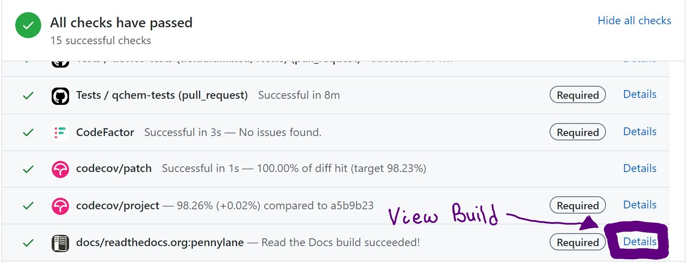

Submitting a pull request
=========================

Creating a Pull Request
-----------------------

When you are ready, go ahead and click on "New Pull Request" on the
`pull request page <https://github.com/PennyLaneAI/pennylane/pulls>`_.  On the next page, you need
to select your fork and branch to merge into the PennyLane `master` branch.

On the page for creating a new pull request, you need to specify the name of the PR and write an
introductory description. We have a PR template with a checklist that can help
you determine what to say. Please be as detailed as possible, and assume the reader does not have extensive background knowledge of the issue at hand.

If the PR is in response to an Issue, please
`link the issue <https://docs.github.com/en/issues/tracking-your-work-with-issues/linking-a-pull-request-to-an-issue>`_ 
with the relevant keywords. One simple way is adding a related sentence to the PR description, e.g.
"Closes #ABCD" where ABCD is the number of the PR.

You can make a "Work in Progress" PR with ``[WIP]`` in the title or with the "WIP" label. 
That way, we can see your work and give feedback early.

Once you create the PR, you can also view the status of the *Continuous Integration* (CI) checks
for things like tests, code quality, and documentation rendering.

Continuous Integration Checks
-----------------------------

Once a PR is opened on the repository, GitHub runs a series of checks on the
branch.  All tests need to pass (green check) for the PR to get approved and
merged.

* **Formatting check**: We use `black <https://black.readthedocs.io/en/stable/>`_ to autoformat our
  code to `PEP8 <https://www.python.org/dev/peps/pep-0008/>`_ standards. You should run ``black``
  locally on changed files, as the CI check determines whether ``black`` would change
  anything. Black installs with ``pip``. We run black on both the source folder ``pennylane`` and
  the ``tests`` folder. We format with a line length of 100. From the PennyLane's root folder, you
  can run:

  .. code-block:: bash

      black -l 100 pennylane tests

* **Code factor**:  `Code factor <https://www.codefactor.io/>`_ checks several common code quality
  characteristics. 

To make sure that the formatting and the quality of the new piece of code is up
to `PEP8 <https://www.python.org/dev/peps/pep-0008/>`_ dedicated tools
(``black`` and ``pylint``) should be run locally.

The PennyLane repository provides top-level files (``.pre-commit-config.yaml``
and a ``pyproject.toml``) for configuring `pre-commit
<https://pre-commit.com/>`_ to run ``black`` and ``pylint`` as a ``git``
pre-commit hook. Once configured, issuing ``git commit`` will run the tools
automatically. If any of the checks fail, committing fails too. A failed
``black`` check will reformat the required files. Running the pre-commit hook
mechanisms can be disabled for a commit by passing the ``-n/--no-verify``
option.

The ``pre-commit`` package can be installed e.g., via ``pip``:

.. code-block:: bash

    pip install pre-commit

Then, it can be installed for a specific repository by running

.. code-block:: bash

    pre-commit install

in the folder where the ``.pre-commit-config.yaml`` file exists (the top-level
folder for PennyLane).

.. note::

    The ``.pre-commit-config.yaml`` file pins ``black`` to a specific version.
    As new versions of ``black`` are released, developers will have to run
    ``pre-commit autoupdate`` to update the package versions used by
    ``pre-commit``.

* **Tests**: Github Actions runs the core tests and device tests for a series of different Python
  versions and interface installations.

* **Code Coverage**: `codecov <https://app.codecov.io/gh/PennyLaneAI/pennylane/>`_ determines if
  all lines are executed during the automated testing and tells you which ones are not. We want all
  lines to be covered, but that is insufficient to determine if the testing is complete enough.
  That takes thought and thinking through the test design to ensure that all edge cases are being
  tested.

* **Documentation**: The "Documentation check" determines if there are any issues with the build,
  but you also need to inspect the relevant pages in the website build visually. You can access the
  temporary website by clicking on ``Details`` for ``docs/readthedocs.org:pennylane``, as shown in
  the following image.

    
Using the "Search" toolbar on the top left of the generated website can help with navigating to new
or updated pages. New functions or classes that are available for users should appear as
search results.

Note that including ``skip ci`` (or a similar string) will mark a ``git commit``
such that `CI checks are being skipped
<https://docs.github.com/en/actions/managing-workflow-runs/skipping-workflow-runs>`_.

Ready for review?
-----------------

A review-ready pull request (PR) includes the following:

* **All new code is clearly commented and documented.**  See our :doc:`documentation guidelines
  <documentation>` for more details.

* **All changes must include tests.** If you fix a bug, write a test that would fail before the
  bugfix. See :doc:`Tests <tests>` for more information.

* **Code conforms to PEP8 standards.** As mentioned in the section above, all code needs to be
  formatted via `Black <https://black.readthedocs.io/en/stable/>`_ with a line length of 100.

* **Write a changelog entry for all Pull Requests.** The changelog entry should include a link back
  to the PR. More significant user-facing changes should include a code example. In addition to the changelog entry itself, add your name to the alphabetical contributors' list at the bottom of
  each release's section. The changelog is located at `doc/releases/changelog-dev.md`.

Please note that our review process can take some time and require a bit of back and forth. We try
to enforce a high level of detail in reviews to reduce future bugs and prevent technical debt from
accruing.  You can speed the review process by keeping pull requests small and fully explaining
decisions in the pull request introduction.
