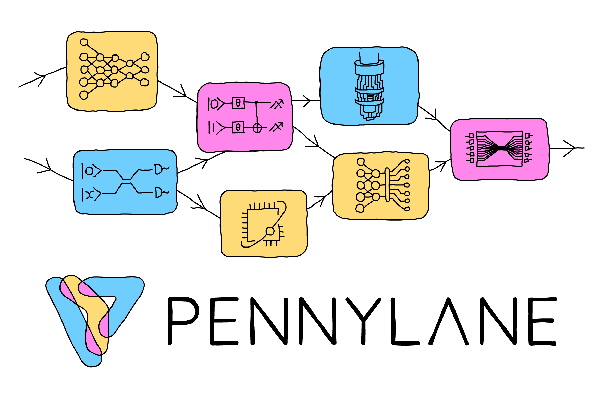

PennyLane Documentation
=======================

.. rst-class:: lead grey-text ml-2

:Release: |release|

.. raw:: html

    
    

        

            PennyLane is a cross-platform Python library for differentiable programming of quantum computers.
            Train a quantum computer the same way as a neural network.
        

        

            

                <a href="introduction/pennylane.html">
                    

                        

                            

                                <h3 class="card-title pl-3 mt-4">
                                Using PennyLane
                                </h3>
                                

                                    A guided tour of the core features of PennyLane <i class="fas fa-angle-double-right"></i>
                                

                            

                        

                    

                </a>
            

            

                <a href="development/guide.html">
                

                    

                        

                            <h3 class="card-title pl-3 mt-4">
                            Developing
                            </h3>
                            
How you can contribute to the development of PennyLane <i class="fas fa-angle-double-right"></i>

                        

                    

                

            </a>
            

            

                <a href="code/qml.html">
                

                    

                        

                            <h3 class="card-title pl-3 mt-4">
                            API
                            </h3>
                            
Explore the PennyLane API <i class="fas fa-angle-double-right"></i>

                        

                    

                

            </a>
            

        

    

Features
--------

- *Follow the gradient*.
  Built-in **automatic differentiation** of quantum circuits.

..

- *Best of both worlds*.
  Support for **hybrid quantum and classical** models; connect quantum
  hardware with PyTorch, TensorFlow, and NumPy.

..

- *Batteries included*.
  Provides **optimization and machine learning** tools.

..

- *Device independent*.
  The same quantum circuit model can be **run on different backends**. Install
  `plugins <https://pennylane.ai/plugins.html>`_ to access even more
  devices, including **Strawberry Fields**, **Amazon Braket**, **IBM Q**, **Google Cirq**, **Rigetti Forest**,
  **Microsoft QDK**, and **ProjectQ**.

Getting started
---------------

For an introduction to quantum machine learning, we have several guides and resources available
on our `QML website <https://pennylane.ai/qml/>`_, including
`What is QML? <https://pennylane.ai/qml/whatisqml.html>`_,
`frequently asked questions <https://pennylane.ai/faq.html>`_,
a `glossary of key concepts <https://pennylane.ai/qml/glossary.html>`_, and a curated selection
of `QML videos <https://pennylane.ai/qml/videos.html>`_.

Then, take a deeper dive into quantum machine learning by
exploring cutting-edge algorithms using PennyLane and near-term quantum hardware,
with our collection of
`QML demonstrations <https://pennylane.ai/qml/demonstrations.html>`_.

You can also check out the :doc:`Using PennyLane <introduction/pennylane>` section for
more details on the :doc:`quantum operations <introduction/operations>`, and to explore
the available :doc:`optimization tools <introduction/optimizers>` provided by PennyLane.
We also have a detailed guide on :doc:`how to write your own <development/plugins>`
PennyLane-compatible quantum device.

Finally, play around with the numerous `devices and plugins <https://pennylane.ai/plugins.html>`_
available for running your hybrid optimizations—these include
IBM Q, provided by the `PennyLane-Qiskit <https://pennylaneqiskit.rtfd.io>`__ plugin,
as well as the Rigetti Aspen QPU provided by `PennyLane-Forest <https://pennylane-forest.rtfd.io>`__.

How to cite
-----------

If you are doing research using PennyLane, please cite

.. rst-class:: admonition warning

    Ville Bergholm, Josh Izaac, Maria Schuld, Christian Gogolin, M. Sohaib Alam, Shahnawaz Ahmed,
    Juan Miguel Arrazola, Carsten Blank, Alain Delgado, Soran Jahangiri, Keri McKiernan, Johannes Jakob Meyer,
    Zeyue Niu, Antal Száva, and Nathan Killoran.
    *PennyLane: Automatic differentiation of hybrid quantum-classical computations.* 2018.
    `arXiv:1811.04968 <https://arxiv.org/abs/1811.04968>`_

Support and contribution
------------------------

- **Source Code:** https://github.com/PennyLaneAI/pennylane
- **Issue Tracker:** https://github.com/PennyLaneAI/pennylane/issues

If you are having issues, please let us know by posting the issue on our GitHub issue tracker.

We encourage contributions — simply fork the PennyLane repository, and then make a
`pull request <https://help.github.com/articles/about-pull-requests/>`_ containing
your contribution. All contributers to PennyLane will be listed as authors on the releases.

To chat directly with the team designing and building PennyLane, as well as members of
our community — ranging from quantum machine learning researchers, to students, to those
just interested in being a part of a rapidly growing industry — you can join our
`discussion forum <https://discuss.pennylane.ai>`_.

License
-------

PennyLane is **free** and **open source**, released under the Apache License, Version 2.0.

.. toctree::
   :maxdepth: 1
   :caption: Using PennyLane
   :hidden:

   introduction/pennylane
   introduction/circuits
   introduction/interfaces
   introduction/operations
   introduction/measurements
   introduction/templates
   introduction/optimizers
   introduction/chemistry
   introduction/configuration

.. toctree::
   :maxdepth: 1
   :caption: Development
   :hidden:

   development/guide
   development/plugins
   development/adding_operators
   development/release_notes.md

.. toctree::
   :maxdepth: 1
   :caption: API
   :hidden:

   code/qml
   code/qml_interfaces
   code/qml_operation
   code/qml_devices
   code/qml_fourier
   code/qml_gradients
   code/qml_grouping
   code/qml_kernels
   code/qml_math
   code/qml_numpy
   code/qml_qaoa
   code/qml_hf
   code/qml_qchem
   code/qml_qnn
   code/qml_tape
   code/qml_transforms
   code/qml_drawer
   code/qml_utils
   code/qml_wires
   code/qml_beta
