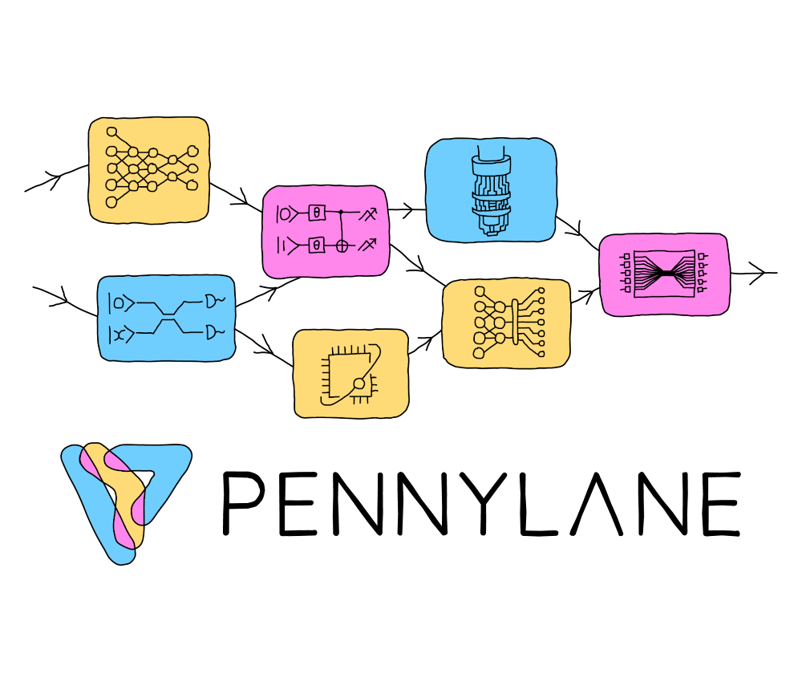

:og:description: Accelerate your adoption of PennyLane! Find clear, concise, accessible, and current information that will help you understand, use, and troubleshoot issues.

PennyLane Documentation
=======================

.. rst-class:: lead grey-text ml-2

:Release: |release|

.. raw:: html

    

    

        

          PennyLane is a cross-platform Python library for quantum computing,
          quantum machine learning, and quantum chemistry.
          Train a quantum computer the same way as a neural network.
        

        

.. index-card::
    :name: Using PennyLane
    :link: introduction/pennylane.html
    :description: A guided tour of the core features of PennyLane

.. index-card::
    :name: Developing
    :link: development/guide.html
    :description: How you can contribute to the development of PennyLane

.. index-card::
    :name: API
    :link: code/qml.html
    :description: Explore the PennyLane API

.. raw:: html

        

    

Features
--------

- *Follow the gradient*.
  Built-in **automatic differentiation** of quantum circuits.

..

- *Best of both worlds*.
  Support for **hybrid quantum and classical** models; connect quantum
  hardware with PyTorch, JAX and NumPy.

..

- *Just in time compilation*. Compile your **entire hybrid workflow**, with support for
  adaptive circuits, real-time measurement feedback, unbounded loops, and more. See
  `Catalyst <https://github.com/pennylaneai/catalyst>`__ for more details.

..

- *Batteries included*.
  Provides **optimization and machine learning** tools.

..

- *Device-independent*.
  The same quantum circuit model can be **run on different backends**. Install
  `plugins <https://pennylane.ai/plugins>`_ to access even more
  devices, including **Strawberry Fields**, **Amazon Braket**, **IBM Q**, **Google Cirq**, **Rigetti Forest**,
  **Microsoft QDK**, and **ProjectQ**.

Getting started
---------------

For an introduction to quantum machine learning, we have several guides and resources available
on our `QML website <https://pennylane.ai/qml/>`_, including
`What is QML? <https://pennylane.ai/qml/whatisqml>`_,
`frequently asked questions <https://pennylane.ai/faq>`_,
a `glossary of key concepts <https://pennylane.ai/qml/glossary>`_, and a curated selection
of `QML videos <https://pennylane.ai/qml/videos>`_.

Then, take a deeper dive into quantum machine learning by
exploring cutting-edge algorithms using PennyLane and near-term quantum hardware,
with our collection of
`QML demonstrations <https://pennylane.ai/qml/demonstrations>`_.

You can also check out the :doc:`Using PennyLane <introduction/pennylane>` section for
more details on the :doc:`quantum operations <introduction/operations>`, and to explore
the available :doc:`optimization tools <introduction/interfaces>` provided by PennyLane.
We also have a detailed guide on :doc:`how to write your own <development/plugins>`
PennyLane-compatible quantum device.

Finally, play around with the numerous `devices and plugins <https://pennylane.ai/plugins>`_
available for running your hybrid optimizations—these include
IBM Q, provided by the `PennyLane-Qiskit <https://docs.pennylane.ai/projects/qiskit/en/stable/>`__
plugin, as well as the Rigetti Aspen QPU provided by `PennyLane-Rigetti
<https://docs.pennylane.ai/projects/rigetti/en/stable/>`__.

How to cite
-----------

If you are doing research using PennyLane, please cite

.. rst-class:: admonition warning

    Ville Bergholm et al. *PennyLane: Automatic differentiation of hybrid
    quantum-classical computations.* 2018. `arXiv:1811.04968
    <https://arxiv.org/abs/1811.04968>`_

Support and contribution
------------------------

- **Source Code:** https://github.com/PennyLaneAI/pennylane
- **Issue Tracker:** https://github.com/PennyLaneAI/pennylane/issues

If you are having issues, please let us know by posting the issue on our GitHub issue tracker.

We encourage contributions — simply fork the PennyLane repository, and then make a
`pull request <https://help.github.com/articles/about-pull-requests/>`_ containing
your contribution. All contributors to PennyLane will be listed as authors on the releases.

To chat directly with the team designing and building PennyLane, as well as members of
our community — ranging from quantum machine learning researchers, to students, to those
just interested in being a part of a rapidly growing industry — you can join our
`discussion forum <https://discuss.pennylane.ai>`_.

License
-------

PennyLane is **free** and **open source**, released under the Apache License, Version 2.0.

.. toctree::
   :maxdepth: 1
   :caption: Using PennyLane
   :hidden:

   introduction/pennylane
   introduction/circuits
   introduction/interfaces
   introduction/operations
   introduction/measurements
   introduction/dynamic_quantum_circuits
   introduction/templates
   introduction/inspecting_circuits
   introduction/compiling_circuits
   introduction/compiling_workflows
   introduction/importing_workflows
   introduction/chemistry
   introduction/data
   introduction/logging

.. toctree::
   :maxdepth: 1
   :caption: Release news
   :hidden:

   development/release_notes.md
   development/deprecations
   news/new_opmath
   news/program_capture_sharp_bits

.. toctree::
   :maxdepth: 1
   :caption: Development
   :hidden:

   development/guide
   development/plugins
   development/adding_operators

.. toctree::
   :maxdepth: 1
   :caption: API
   :hidden:

   code/qml
   code/qml_bose
   code/qml_compiler
   code/qml_data
   code/qml_decomposition
   code/qml_debugging
   code/qml_drawer
   code/qml_estimator
   code/qml_fermi
   code/qml_fourier
   code/qml_gradients
   code/qml_io
   code/qml_kernels
   code/qml_labs
   code/qml_liealg
   code/qml_logging
   code/qml_math
   code/qml_noise
   code/qml_numpy
   code/qml_ops_op_math
   code/qml_pauli
   code/qml_pulse
   code/qml_qaoa
   code/qml_qchem
   code/qml_qcut
   code/qml_qnn
   code/qml_resource
   code/qml_shadows
   code/qml_spin
   code/qml_transforms
   
.. toctree::
   :maxdepth: 1
   :caption: Internals
   :hidden:

   code/qml_capture
   code/qml_concurrency
   code/qml_devices
   code/qml_exceptions
   code/qml_ftqc
   code/qml_measurements
   code/qml_pytrees
   code/qml_operation
   code/qml_queuing
   code/qml_tape
   code/qml_wires
   code/qml_workflow
