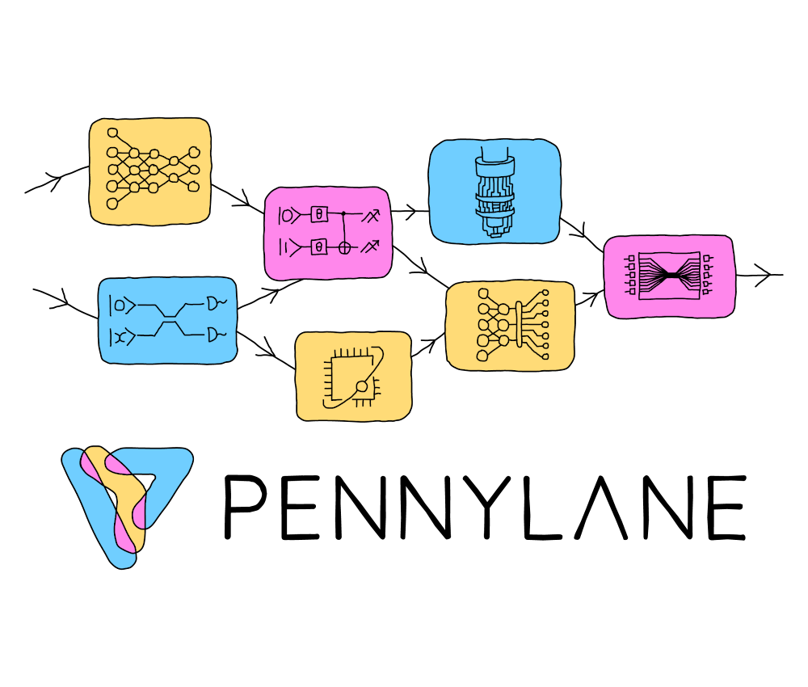

:og:description: Accelerate your adoption of PennyLane! Find clear, concise, accessible, and current information that will help you understand, use, and troubleshoot issues.

PennyLane Documentation
=======================

.. rst-class:: lead grey-text ml-2

:Release: |release|

.. raw:: html

    

    

        

          PennyLane is an open-source quantum software platform
          for quantum computing, quantum machine learning, and quantum chemistry. 
          
          Create meaningful quantum algorithms, from inspiration to implementation. 
        

        

.. index-card::
    :name: Using PennyLane
    :link: introduction/pennylane.html
    :description: A guided tour of the core features of PennyLane

.. index-card::
    :name: Developing
    :link: development/guide.html
    :description: How you can contribute to the development of PennyLane

.. index-card::
    :name: API
    :link: code/qp.html
    :description: Explore the PennyLane API

.. raw:: html

        

    

Key Features
-----------------------

- **Inspiration to implementation, quickly.**
  Quantum computing can be complex — PennyLane makes it natural. 
  Leverage the world’s largest library of `research demos <https://pennylane.ai/qml/demonstrations>`__, `interactive tutorials <https://pennylane.ai/codebook/>`__,
  and state-of-the-art components to build algorithms in `quantum chemistry <https://docs.pennylane.ai/en/stable/introduction/chemistry.html>`__, quantum information,
  `optimization <https://pennylane.ai/qml/demos/tutorial_dqi>`__, and `quantum machine learning <https://pennylane.ai/topics/quantum-machine-learning>`__.

..

- **Fast where it matters. Scalable where it counts.**
  Whether executing, compiling, or analyzing, PennyLane is fast. 
  Unlock production-grade performance with `industrial resource estimation <https://pennylane.ai/qml/demos/re_how_to_use_pennylane_for_resource_estimation>`__
  and the `Catalyst compiler <https://github.com/PennyLaneAI/Catalyst>`__. Scale up your workflows with the
  `high-performance Lightning simulators <https://pennylane.ai/performance>`__ on GPUs, supercomputers, and the cloud.

..

- **Hardware agnostic, hardware ready.** 
  PennyLane integrates with a wide range of `quantum hardware devices <https://pennylane.ai/devices>`__.
  Whether superconducting qubits, trapped ion systems, neutral atoms, or photonics, PennyLane provides
  the tools to `estimate resources <https://pennylane.ai/qml/demos/re_how_to_use_pennylane_for_resource_estimation>`__
  and `compile circuits <https://pennylane.ai/topics/quantum-compilation>`__ specifically for the `hardware devices <https://pennylane.ai/topics/quantum-hardware>`__
  of today—and tomorrow!

..

- **Participate, collaborate, innovate.**
  PennyLane is the world’s most `active quantum community <https://pennylane.ai/get-involved>`__.
  You're part of a global network of `researchers <https://pennylane.ai/research>`__,
  `developers <https://pennylane.ai/features>`__, and `educators <https://pennylane.ai/education>`__
  actively defining the frontier of quantum computing. Whether quantum is your day job or you’re
  getting your first taste at a `hackathon <https://pennylane.ai/challenges>`__, you’re backed by
  the `most responsive community <https://discuss.pennylane.ai>`__ in the field.

For more details and additional features, please see the `PennyLane website <https://pennylane.ai/features/>`__
and our most recent `release notes <https://docs.pennylane.ai/en/stable/development/release_notes.html>`__.

Installation
-----------------------

PennyLane requires Python version 3.11 and above. Installation of PennyLane, as well as all
dependencies, can be done using pip:

.. code-block:: bash

    python -m pip install pennylane

Docker support
-----------------------

Docker images are found on the `PennyLane Docker Hub page <https://hub.docker.com/u/pennylaneai>`__, 
where there is also a detailed description about PennyLane Docker support. 
`See description here <https://docs.pennylane.ai/projects/lightning/en/stable/dev/docker.html>`__ 
for more information.

Getting started
-----------------------

Get up and running quickly with PennyLane by following our `interactive tutorials <https://pennylane.ai/codebook/pennylane-fundamentals>`__
and `quickstart guide <https://docs.pennylane.ai/en/stable/introduction/pennylane.html>`__,
designed to introduce key features and help you start building quantum circuits right away.

Whether you're exploring quantum machine learning, quantum computing, or quantum chemistry, 
PennyLane offers a wide range of tools and resources to support your research.

.. image:: https://raw.githubusercontent.com/PennyLaneAI/pennylane/main/doc/_static/readme/research.png
    :align: right
    :width: 350px
    :target: javascript:void(0);

Key Resources
-----------------------

* `Library of research demos <https://pennylane.ai/qml/demonstrations>`__
* `Learn Quantum Programming <https://pennylane.ai/qml/>`__ with the `Codebook <https://pennylane.ai/codebook/>`__ and `Coding Challenges <https://pennylane.ai/challenges/>`__
* `PennyLane Discussion Forum <https://discuss.pennylane.ai>`__

You can also check out our `documentation <https://pennylane.readthedocs.io>`__, and detailed `developer guides <https://docs.pennylane.ai/en/stable/development/guide.html>`__.

Demos
------------------------

Take a deeper dive into quantum computing by exploring quantum computing research with 
the `PennyLane Demos <https://pennylane.ai/qml/demonstrations>`__—covering fundamental
quantum concepts alongside the latest quantum algorithm research results.

If you would like to contribute your own demo, see our `demo submission
guide <https://pennylane.ai/qml/demos_submission>`__.

.. image:: https://raw.githubusercontent.com/PennyLaneAI/pennylane/main/doc/_static/readme/demos.png
    :align: right
    :width: 900px
    :target: https://pennylane.ai/qml/demonstrations;

Contributing to PennyLane
------------------------

We welcome contributions—simply fork the PennyLane repository, and then make a `pull
request <https://help.github.com/articles/about-pull-requests/>`__ containing your contribution. All
contributors to PennyLane will be listed as authors on the releases.

We also encourage bug reports, suggestions for new features and enhancements, and even links to cool
projects or applications built on PennyLane.

See our `contributions
page <https://github.com/PennyLaneAI/pennylane/blob/main/.github/CONTRIBUTING.md>`__ and our
`Development guide <https://pennylane.readthedocs.io/en/stable/development/guide.html>`__ for more
details.

Support
------------------------

- **Source Code:** https://github.com/PennyLaneAI/pennylane
- **Issue Tracker:** https://github.com/PennyLaneAI/pennylane/issues

If you are having issues, please let us know by posting the issue on our GitHub issue tracker.

Join the `PennyLane Discussion Forum <https://discuss.pennylane.ai/>`__ to connect with the quantum community, get support, and engage directly with our team. It’s the perfect place to share ideas, ask questions, and collaborate with fellow researchers and developers!

Note that we are committed to providing a friendly, safe, and welcoming environment for all.
Please read and respect the `Code of Conduct <https://github.com/PennyLaneAI/pennylane/blob/main/.github/CODE_OF_CONDUCT.md>`__.

Authors
-----------------------

PennyLane is the work of `many contributors <https://github.com/PennyLaneAI/pennylane/graphs/contributors>`__.

If you are doing research using PennyLane, please cite `our paper <https://arxiv.org/abs/1811.04968>`__:

.. rst-class:: admonition warning

    Ville Bergholm et al. *PennyLane: Automatic differentiation of hybrid
    quantum-classical computations.* 2018. `arXiv:1811.04968
    <https://arxiv.org/abs/1811.04968>`_

License
-----------------------

PennyLane is **free** and **open source**, released under the Apache License, Version 2.0.

.. toctree::
   :maxdepth: 1
   :caption: Using PennyLane
   :hidden:

   introduction/pennylane
   introduction/circuits
   introduction/interfaces
   introduction/operations
   introduction/measurements
   introduction/dynamic_quantum_circuits
   introduction/templates
   introduction/inspecting_circuits
   introduction/compiling_circuits
   introduction/compiling_workflows
   introduction/importing_workflows
   introduction/chemistry
   introduction/data
   introduction/logging

.. toctree::
   :maxdepth: 1
   :caption: Release news
   :hidden:

   development/release_notes.md
   development/deprecations
   news/new_opmath
   news/program_capture_sharp_bits

.. toctree::
   :maxdepth: 1
   :caption: Development
   :hidden:

   development/guide
   development/plugins
   development/adding_operators

.. toctree::
   :maxdepth: 1
   :caption: API
   :hidden:

   code/qp
   code/qp_bose
   code/qp_compiler
   code/qp_data
   code/qp_decomposition
   code/qp_debugging
   code/qp_drawer
   code/qp_estimator
   code/qp_fermi
   code/qp_fourier
   code/qp_gradients
   code/qp_io
   code/qp_kernels
   code/qp_labs
   code/qp_liealg
   code/qp_logging
   code/qp_math
   code/qp_noise
   code/qp_numpy
   code/qp_ops_op_math
   code/qp_pauli
   code/qp_pulse
   code/qp_qaoa
   code/qp_qchem
   code/qp_qcut
   code/qp_qnn
   code/qp_resource
   code/qp_shadows
   code/qp_spin
   code/qp_transforms
   
.. toctree::
   :maxdepth: 1
   :caption: Internals
   :hidden:

   code/qp_capture
   code/qp_concurrency
   code/qp_core_operator
   code/qp_devices
   code/qp_exceptions
   code/qp_ftqc
   code/qp_gate_sets
   code/qp_measurements
   code/qp_pytrees
   code/qp_queuing
   code/qp_tape
   code/qp_templates_core
   code/qp_wires
   code/qp_workflow
