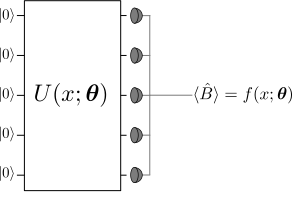
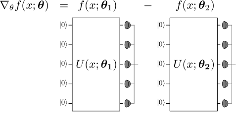
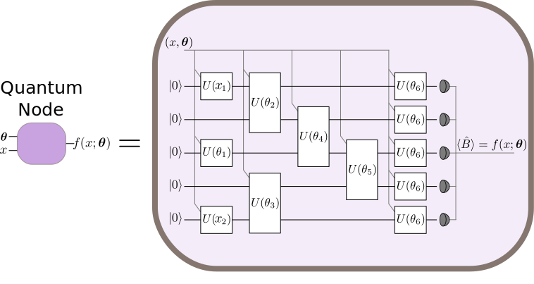
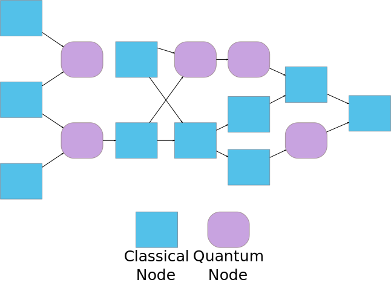

.. role:: html(raw)
   :format: html

.. _introduction:

Introduction
============

The main principle underlying OpenQML is to make the interface between the quantum and classical worlds seamless. Wherever possible, the quantum and classical components of a hybrid machine learning model should coexist on the same conceptual level, as computational **devices** which we program to evaluate mathematical functions. 

The core of OpenQML is designed around four main concepts:

1. **Quantum functions**: a class of functions that are naturally evaluated using quantum computer circuits

2. **Quantum gradients**: the gradients of quantum functions, these are themselves built from quantum functions

3. **Quantum nodes**: an abstract representation of quantum circuits which input/output classical information

4. **Hybrid computation**: a computing model which seamlessly integrates both classical and quantum nodes

:ref:`qfuncs`
-------------

:html:` `

    A quantum function is a function which is evaluated by measurements of a programmable quantum computer circuit.

:html:` `

The primary motivation for building quantum computers is that they should be able to perform computations which would be inefficient to run on a classical computer. For machine learning, we usually consider parameterized functions :math:`f(x;\bm{\theta})`, where :math:`x` is the function's input and :math:`\bm{\theta}` is a collection of free parameters. A parameterized function :math:`f(x;\bm{\theta})` is called a quantum function (or **qfunc**) if it can be evaluated using a quantum circuit. 

:ref:`autograd_quantum`
-----------------------

In many modern machine learning applications, the ability to automatically compute analytic gradients has shown tremendous practical value. OpenQML extends this key machine learning to quantum functions.

Since qfuncs may be intractable to compute on classical computers, we might expect that the gradients of qfuncs to be similarly complex. Fortunately, for a given qfunc :math:`f(x;\bm{\theta})`, we can often write the gradient :math:`\nabla_{\bm{\theta}}f(x;\bm{\theta})` as a linear combination of qfuncs, but with shifted parameters: 

:html:` `

    Decomposing the gradient of a qfunc as a linear combination of qfuncs.

:html:` `

In other words, we can use the same quantum computation device to compute quantum functions and also **gradients of quantum functions**. This is accomplished with minor assistance of a classical coprocessor, which combines the terms in the linear combination. 

:ref:`quantum_nodes`
--------------------

How do we interface classical and quantum computing devices to perform more complex calculations? Because of the inbuilt barriers between the quantum and the classical worlds, we need effective methods for inserting and extracting classical data from the quantum device. As well, we would like this interface to be compatible with essential components of machine learning like the backpropagation algorithm. 

:html:` `

    A quantum node contains a quantum circuit. Classical information is input to a quantum node via the gate parameters and extracted via expectation values of measurements.

:html:` `

This leads us to the idea of a quantum node: a basic computational unit -- performed by a quantum circuit -- which evaluates a qfunc. Classical data is input to the quantum circuit through the gate parameters of the circuit; classical data is extracted by evaluating expectation values of measurement results. **Quantum information never enters or exits a quantum node**.

:ref:`hybrid_computation`
--------------------------

:html:` `

    An 'true hybrid' quantum-classical computational graph.

:html:` `

In most proposed hybrid algorithms, quantum circuits are used to evaluate quantum functions, and a classical co-processor is used primarily to post-process circuit outputs. But why should the division of labour be so regimented? In a **true hybrid** computational model, both the classical and the quantum devices are responsible for arbitrary parts of an overall computation, subject to the rules of quantum nodes. This allows quantum and classical devices to be used jointly, each forming an integral and inseparable part of the computation.
