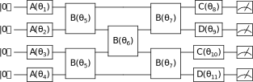

.. role:: html(raw)
   :format: html

.. _introduction:

Introduction
============

OpenQML is a Python library for building and training machine learning models which use quantum circuits.

Main features of OpenQML:

- *Follow the gradient*: **automatic differentiation** of quantum circuits
- *Best of both worlds*: support for **hybrid quantum & classical** models
- *Batteries included*: built-in **optimization and machine learning** tools
- *Device independent*: the same quantum circuit model can be **run on different backends**

Key ideas
=============

The core of OpenQML is based around four key concepts:

1. **Quantum functions**: a class of functions that are naturally evaluated using quantum computer circuits

2. **Quantum gradients**: the gradients of quantum functions, these are themselves built from quantum functions

3. **Quantum nodes**: a circuit representation of quantum functions with basic input/output rules for classical information

4. **Hybrid computational graphs**: a computational model which incorporates both classical and quantum computational nodes

Quantum functions
-----------------

The primary motivation for building quantum computers is that they should be able to perform computations which would be inefficient to run on a classical computer. For machine learning, we usually consider parameterized functions :math:`f(x;\bm{\theta})`, where :math:`x` is the function's input and :math:`\bm{\theta}` is a collection of free parameters. A parameterized function :math:`f(x;\bm{\theta})` will be called a **quantum function** if it can be evaluated using a quantum circuit. More specifically, if we write a quanum circuit as a parameterized unitary operation :math:`U(x;\bm{\theta})` -- which depends on both the input :math:`x` and the parameters :math:`\bm{\theta}`, then quantum functions have the form

.. math:: f(x; \bm{\theta}) = \langle 0 | U^\dagger(x;\bm{\theta})\hat{B}U(x;\bm{\theta}) | 0 \rangle

where :math:`\hat{B}` is an observable measured at the output of the quantum circuit.

Quantum gradients
-----------------

In many modern machine learning applications, the ability to automatically compute analytic gradients has shown tremendous practical value. Can we have this same built-in functionality for **quantum functions**? 

Since quantum functions may be intractable to compute on classical computers, we might expect that the gradients of quantum functions to be similarly complex. Fortunately, for a given quantum function :math:`f(x;\bm{\theta})`, we can often write :math:`\nabla_{\bm{\theta}}f(x;\bm{\theta})` as a simple sum of quantum functions, but with shifted parameters: 

.. math:: \nabla_{\bm{\theta}}f(x; \bm{\theta}) = \sum_k f(x; \bm{\theta}_k)

In other words, we can use the same quantum computation device to compute quantum functions and also **gradients of quantum functions**. This is accomplished with minor assistance of a classical coprocessor, which performs the summation.

Quantum nodes
-------------

:html:` `

.. figure:: ./_static/quantum_node.svg
    :align: center
    :width: 70%
    :target: javascript:void(0);

    A quantum node contains a quantum circuit. Quantum nodes interface with classical information via gate parameters :math:`\bm{\theta}` and expectation values :math:`\langle \hat{B} \rangle`.

:html:` `

To perform a computation that includes both classical and quantum computing devices, how do we interface them? Because of the inbuilt barriers between the quantum and the classical worlds, we need effective methods for inserting and extracting classical data from a quantum computing device. As well, we would like this interface to be compatible with essential components of machine learning like the backpropagation algorithm. This leads us to the idea of a quantum node: a basic computational unit -- performed by a quantum circuit -- which evaluates a quantum function. Classical data is input to the quantum circuit through the gate parameters of the circuit; classical data is extracted by evaluating expectation values of measurement results.

Hybrid computational graphs
---------------------------

:html:` `

.. figure:: ./_static/hybrid_graph.svg
    :align: center
    :width: 70%
    :target: javascript:void(0);

    An 'true hybrid' quantum-classical computational graph.

:html:` `

In other hybrid quantum-classical methods, quantum circuits are used to evaluate classically intractable parameterized functions, and a classical co-processor is used primarily to post-process circuit outputs. But why should the division of labour be so regimented? In a **true hybrid** computational model, both the classical and the quantum devices are responsible for arbitrary parts of an overall computation, subject to the rules of quantum nodes. This allows quantum and classical devices to be used jointly, each forming an integral and inseparable part of the computation.

<=================================>

Old stuff
==========

<=================================>

Quantum circuits
--------------------

The key building block in OpenQML is the *variational quantum circuit*.

These quantum circuits are made up of quantum gates, some (or all) of which are parameterizable.
The user specifies the circuit, fixing the gates and the order which they appear, but may leave any number of the gate parameters :math:`\theta_i` unfixed.
The same parameter may appear in several gates.
The gates may be followed by a sequence of single-subsystem measurements represented by Hermitian observables :math:`O_j`.

:html:` `

    A simple example variational circuit built with the parameterizable gates :math:`\{A,B,C,D\}`.

:html:` `

The quantum circuit performs a unitary transformation :math:`U(\bm{\theta})`.

The gate parameters can be used to input classical data :math:`\bx` into a quantum circuit (by setting the parameters :math:`\theta_i` of some subset of gates based on the components of :math:`\bx`), and also to enact a transformation on this data.
The output of the circuit is given by the expectation values of the hermitian observables :math:`O_j`.
Altogether, the circuit computes the function :math:`f: \R^m \to \R^n`.
If there is only a single observable, this function can be expressed as

.. math:: f(\theta(\bx)) = \langle O_j \rangle_{\bx,\theta} = \mathrm{Tr}\big(O_j \: U(x, \theta)\ketbra{0}{0}U^\dagger(\bx, \theta)\big).

Machine learning with variational circuits
--------------------------------------------------

How can we build machine learning models using programmable quantum circuits?

Quantum circuit gradients
-------------------------

What is the *gradient of a quantum circuit*?

At the highest level, we picture a quantum circuit as a hardware device that can evaluate functions of the form :math:`f_{\theta}(\bx)`. In machine learning, we want to find the parameter values which make the function :math:`f` optimal for some problem of interest. One way to do this is to perform *gradient descent*: we compute the gradients :math:`\nabla_\theta f(\bx)` and update the parameters to new values based on this gradient information, :math:`\theta\mapsto\theta + \eta\nabla_\theta f(\bx)`. For this, we need a method to evaluate the gradients of the function :math:`f` defined by our quantum circuit.
