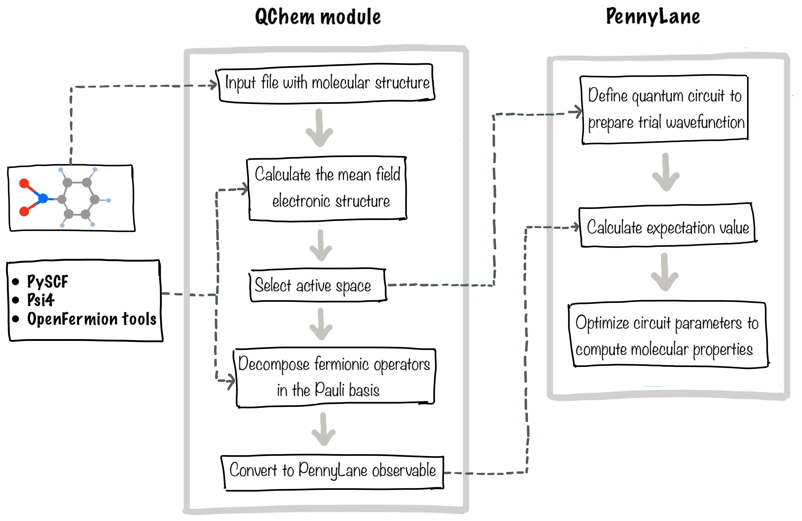

Quantum Chemistry
=================

PennyLane provides a quantum chemistry module ``qchem`` to perform quantum simulations
of the electronic structure of molecules. ``qchem`` contains tools to construct the
electronic Hamiltonian of molecules, and uses PennyLane to implement the Variational Quantum
Eigensolver (VQE) algorithm.

.. note::

    To access the ``qchem`` module, the ``PennyLane-QChem`` plugin must be installed separately:

    .. code-block::

        pip install pennylane-qchem

Building the electronic Hamiltonian
-----------------------------------

The ``qchem`` module provides access to a driver function :func:`~.generate_hamiltonian`
to generate the electronic Hamiltonian in a single call. For example,

.. code-block:: python

    h, nr_qubits = qml.qchem.generate_hamiltonian(
        name='h2',
        geo_file='h2.xyz',
        charge=0,
        multiplicity=1,
        basis_set='sto-3g',
        n_active_electrons=2,
        n_active_orbitals=2
    )

where:

* ``h`` is the qubit Hamiltonian of the molecule represented as a PennyLane Hamiltonian, and

* ``nr_qubits`` is the number of qubits operators needed to represent it.

Internally, :func:`~.generate_hamiltonian` calls the following functions in order
to generate the qubit Hamiltonian:

.. currentmodule:: pennylane_qchem.qchem

.. autosummary::

    read_structure
    meanfield_data
    active_space
    decompose_hamiltonian

For more fine-grained control, these functions may be
called independently as required.

Importing molecular structure data
^^^^^^^^^^^^^^^^^^^^^^^^^^^^^^^^^^

The atomic structure of a molecule can be imported from an external file using the
:func:`~.read_structure` function:

.. code-block:: python

    >>> geometry = qml.qchem.read_structure('h2o.SDF')
    >>> print(geometry)
    [['H', (-0.0211, -0.002, 0.0)], ['O', (0.8345, 0.4519, 0.0)], ['H', (1.4769, -0.273, 0.0)]]

The geometry of the molecule is returned as a list containing the symbol and the Cartesian
coordinates of each atomic species.

.. note::

    The `xyz <https://en.wikipedia.org/wiki/XYZ_file_format>`_ format is supported
    out of the box. Additionally, if `Open Babel <https://openbabel.org/>`_ is
    installed, `any format recognized by Open Babel
    <https://openbabel.org/wiki/Category:Formats>`_ is also supported.

    See the :func:`~.read_structure` function for more details.

Solving the Hartree-Fock equations
^^^^^^^^^^^^^^^^^^^^^^^^^^^^^^^^^^

The :func:`~.meanfield_data` function uses the `OpenFermion-PySCF <https://github
.com/quantumlib/OpenFermion-PySCF>`_ and `OpenFermion-Psi4 <https://github
.com/quantumlib/OpenFermion-Psi4>`_ plugins to solve the Hartree-Fock equations for the molecule
using the electronic structure packages `PySCF <https://github.com/sunqm/pyscf>`_ and `Psi4
<http://psicode.org/>`_, respectively.

For this, it is required to specify a string to label the molecule, its net charge, the `spin
multiplicity <https://en.wikipedia.org/wiki/Multiplicity_(chemistry)>`_ and the  `atomic basis
functions <https://www.basissetexchange.org/>`_.

.. code-block:: python

    geometry = qml.qchem.read_structure('h2o.SDF')
    hf_data = qml.qchem.meanfield_data(
        'water',
        geometry,
        charge=0,
        multiplicity=1,
        basis_set='sto-3g',
        qc_package='pyscf'
    )

The output variable ``hf_data`` stores the path to the directory containing the file ``'water.hd5'``
with the Hartree-Fock electronic structure of the water molecule.

Mapping the Hamiltonian to the Pauli basis
^^^^^^^^^^^^^^^^^^^^^^^^^^^^^^^^^^^^^^^^^^

The function :func:`~.active_space` is used to create an `active space <https://en.wikipedia
.org/wiki/Complete_active_space>`__  by classifying the Hartree-Fock molecular orbitals as doubly-occupied,
active, and external orbitals. Within this approximation, a certain number of *active electrons*
can populate the *active orbitals*.

.. code-block:: python

    d_occ_indices, active_indices = qml.qchem.active_space(
        'water',
        hf_data,
        n_active_electrons=2,
        n_active_orbitals=2
    )

Once we have defined the active space, :func:`~.decompose_hamiltonian` calls
OpenFermion to generate the second-quantized fermionic Hamiltonian
and map it to a linear combination of Pauli operators via the `Jordan-Wigner
<https://en.wikipedia.org/wiki/Jordan%E2%80%93Wigner_transformation>`__ or `Bravyi-Kitaev
<https://arxiv.org/abs/1208.5986>`__ transformation. For example,

.. code-block:: python

    qubit_hamiltonian = qml.qchem.decompose_hamiltonian(
        'water',
        hf_data,
        mapping='jordan_wigner',
        docc_mo_indices=d_occ_indices,
        active_mo_indices=active_indices
    )

Here, ``qubit_hamiltonian`` is an instance of the QubitOperator class of `OpenFermion <https://github
.com/quantumlib/OpenFermion>`_.

.. _pl_qchem_vqe:

VQE simulations
---------------

The Variational Quantum Eigensolver (VQE) is a hybrid quantum-classical computational scheme,
where a quantum computer is used to prepare the trial wave function of a molecule and to measure
the expectation value of the *electronic Hamiltonian*, while a classical optimizer is used to
find its ground state.

We can use :class:`~.VQECost` to automatically create the required PennyLane QNodes and define 
the cost function:

.. code-block:: python

    dev = qml.device('default.qubit', wires=4)

    def circuit(params, wires):
        qml.BasisState(np.array([1, 1, 0, 0]), wires=wires)
        for i in wires:
            qml.Rot(*params[i], wires=i)
        qml.CNOT(wires=[2, 3])
        qml.CNOT(wires=[2, 0])
        qml.CNOT(wires=[3, 1])

    cost = qml.VQECost(circuit, hamiltonian, dev, interface="torch")
    params = torch.rand([4, 3])
    cost(params)

The rotation angles can be optimized using the machine learning interface of choice
until the energy difference between two consecutive iterations has converged to near zero.

.. note::

    For more details on VQE and the quantum chemistry functionality available in ``qml.qchem``,
    check out the PennyLane quantum chemistry tutorials.
