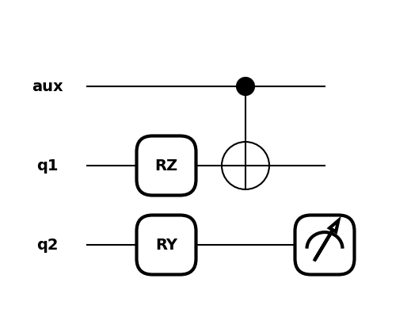

 .. role:: html(raw)
   :format: html

.. _intro_vcircuits:

Quantum circuits
================

.. image:: ../_static/qnode.png
    :align: right
    :width: 180px
    :target: javascript:void(0);

In PennyLane, quantum computations, which involve the execution of one or more quantum circuits,
are represented as *quantum node* objects. A quantum node is used to
declare the quantum circuit, and also ties the computation to a specific device that executes it.

QNodes can interface with any of the supported numerical and machine learning libraries---:doc:`NumPy <interfaces/numpy>`,
:doc:`PyTorch <interfaces/torch>`, and
:doc:`JAX <interfaces/jax>`---indicated by providing an optional ``interface`` argument
when creating a QNode. Each interface allows the quantum circuit to integrate seamlessly with
library-specific data structures (e.g., NumPy and JAX arrays or Pytorch tensors) and
:doc:`optimizers <interfaces>`.

By default, QNodes use the NumPy interface. The other PennyLane interfaces are
introduced in more detail in the section on :doc:`interfaces <interfaces>`.

.. _intro_vcirc_qfunc:

Quantum functions
-----------------

A quantum circuit is constructed as a special Python function, a
*quantum circuit function*, or *quantum function* in short.
For example:

.. code-block:: python

    import pennylane as qml

    def my_quantum_function(x, y):
        qml.RZ(x, wires=0)
        qml.CNOT(wires=[0,1])
        qml.RY(y, wires=1)
        return qml.expval(qml.Z(wires=1))

.. note::

    PennyLane uses the term *wires* to refer to a quantum subsystem---for most
    devices, this corresponds to a qubit. For continuous-variable
    devices, a wire corresponds to a quantum mode.

Quantum functions are a restricted subset of Python functions, adhering to the following
constraints:

* The quantum function accepts classical inputs, and consists of
  :doc:`quantum operators <operations>` or sequences of operators called :doc:`templates`.

* The function can contain classical flow control structures such as ``for`` loops or ``if`` statements.

* The quantum function must always return either a single or a tuple of
  *measurement values*, by applying a :doc:`measurement function <measurements>`
  to the qubit register. The most common example is to measure the expectation value of
  a :ref:`qubit observable <intro_ref_ops_qobs>` or
  :ref:`continuous-value observable <intro_ref_ops_cvobs>`.

.. note::

    Quantum functions are evaluated on a device from within a QNode.

.. _intro_vcirc_device:

Defining a device
-----------------

To run---and later optimize---a quantum circuit, one needs to first specify a *computational device*.

The device is an instance of the :class:`~.pennylane.devices.Device`
class, and can represent either a simulator or hardware device. They can be
instantiated using the :func:`device <pennylane.device>` loader.

.. code-block:: python

    dev = qml.device('default.qubit', wires=2)

PennyLane offers some basic devices such as the ``'default.qubit'``, ``'default.mixed'``, ``lightning.qubit``,
``'default.gaussian'``, ``'default.clifford'``, and ``'default.tensor'`` simulators; additional devices can be installed as plugins
(see `available plugins <https://pennylane.ai/plugins>`_ for more details). Note that the
choice of a device significantly determines the speed of your computation, as well as
the available options that can be passed to the device loader.

.. note::

    For example, check out the ``'lightning.gpu'``
    `plugin <https://docs.pennylane.ai/projects/lightning-gpu/en/latest/index.html>`_,
    which is a fast state-vector simulator offloading to the NVIDIA cuQuantum SDK for GPU accelerated circuit simulation.

.. note::

    For details on saving device configurations, please visit the
    :doc:`configurations page</introduction/configuration>`.

Device options
^^^^^^^^^^^^^^

When loading a device, the name of the device must always be specified.
Further options can then be passed as keyword arguments, and can differ based
on the device. For a plugin device, refer to the plugin documentation for available device options.

Wires
*****

The wires argument can be an integer that defines the *number of wires*
that you can address by consecutive integer labels ``0, 1, 2, ...``.

.. code-block:: python

    dev = qml.device('default.qubit', wires=3)

Alternatively, you can use custom labels by passing an iterable that contains unique labels for the subsystems:

.. code-block:: python

    dev_unique_wires = qml.device('default.qubit', wires=['aux', 'q1', 'q2'])

In the quantum function you can now use your own labels to address wires:

.. code-block:: python

    def my_quantum_function(x, y):
        qml.RZ(x, wires='q1')
        qml.CNOT(wires=['aux' ,'q1'])
        qml.RY(y, wires='q2')
        return qml.expval(qml.PauliZ('q2'))

Allowed wire labels can be of any type that is hashable, which allows two wires to be uniquely distinguished.

.. note::

    Some devices, such as hardware chips, may have a fixed number of wires.
    The iterable of labels passed to the device's ``wires``
    argument must match this expected number of wires.

.. warning::

    In order to support wire labels of any hashable type, integers and 0-d arrays are considered different.
    For example, running ``qml.RX(1.1, qml.numpy.array(0))`` on a device initialized with ``wires=[0]``
    will fail because ``qml.numpy.array(0)`` does not exist in the device's wire map.

.. _intro_vcirc_qnode:

Creating a quantum node
-----------------------

Together, a quantum function and a device are used to create a *quantum node* or
:class:`~.pennylane.QNode` object, which wraps the quantum function and binds it to the device.

A QNode can be explicitly created as follows:

.. code-block:: python

    import numpy as np

    circuit = qml.QNode(my_quantum_function, dev_unique_wires)

The QNode can be used to compute the result of a quantum circuit as if it was a standard Python
function. It takes the same arguments as the original quantum function:

>>> circuit(np.pi/4, 0.7)
tensor(0.764, requires_grad=True)

To view the quantum circuit given specific parameter values, we can use the :func:`~.pennylane.draw`
transform,

>>> print(qml.draw(circuit)(np.pi/4, 0.7))
aux: ───────────╭●─┤
 q1: ──RZ(0.79)─╰X─┤
 q2: ──RY(0.70)────┤  <Z>

or the :func:`~.pennylane.draw_mpl` transform:

>>> import matplotlib.pyplot as plt
>>> qml.drawer.use_style("black_white")
>>> fig, ax = qml.draw_mpl(circuit)(np.pi/4, 0.7)
>>> plt.show()

.. _intro_vcirc_decorator:

Re-configuring QNode settings
^^^^^^^^^^^^^^^^^^^^^^^^^^^^^

There is often a need to modify an existing QNode setup to test a new configuration. This includes,
but is not limited to, executing on a different quantum device, using a new differentiation method or 
machine learning interface, etc. The :meth:`~.pennylane.QNode.update` method provides a convenient
way to make these adjustments. To update one or more QNode settings, simply give a new value to the 
QNode keyword argument you want to change (e.g., `mcm_method=...`, `diff_method=...`, etc.). Only arguments
used to instantiate a :class:`~.pennylane.QNode` can be updated, objects like the compile pipeline cannot be updated 
using this method.

For instance, to use a different quantum device, the configuration can be updated with,

>>> new_dev = qml.device('lightning.qubit', wires=dev_unique_wires.wires)
>>> new_circuit = circuit.update(device = new_dev)
>>> print(new_circuit.device.name)
lightning.qubit
>>> print(qml.draw(new_circuit)(np.pi/4, 0.7))
aux: ───────────╭●─┤     
 q1: ──RZ(0.79)─╰X─┤     
 q2: ──RY(0.70)────┤  <Z>

The QNode decorator
-------------------

A more convenient---and in fact the recommended---way for creating QNodes is the provided
``qnode`` decorator. This decorator converts a Python function containing PennyLane quantum
operations to a :class:`~.pennylane.QNode` circuit that will run on a quantum device.

.. note::
    The decorator completely replaces the Python-based quantum function with
    a :class:`~.pennylane.QNode` of the same name---as such, the original
    function is no longer accessible.

For example:

.. code-block:: python

    dev = qml.device('default.qubit', wires=2)

    @qml.qnode(dev)
    def circuit(x):
        qml.RZ(x, wires=0)
        qml.CNOT(wires=[0,1])
        qml.RY(x, wires=1)
        return qml.expval(qml.PauliZ(1))

    result = circuit(0.543)

Shots
-----

The shots is an integer that defines how many times the circuit should be evaluated (or "sampled")
to estimate statistical quantities. On some supported simulator devices, ``shots=None`` computes
measurement statistics *exactly*.

The shots can be configured for a QNode using the :func:`~pennylane.set_shots` transform:

.. code-block:: python

    dev = qml.device('default.qubit', wires=2)

    @qml.set_shots(shots=10)
    def circuit(x):
        qml.RX(x, wires=0)
        qml.CNOT([0, 1])
        return qml.sample(qml.Z(1))

    result = circuit(0.5)

This transform can also be used to transform an existing QNode:

>>> new_qnode = qml.set_shots(circuit, shots=100)
>>> new_qnode(0.5)

It is sometimes useful to retrieve the result of a computation for different shot numbers without evaluating a
QNode several times ("shot batching"). Batches of shots can be specified by passing a list of integers,
allowing measurement statistics to be course-grained with a single QNode evaluation.

Consider

.. code-block:: python

    @qml.set_shots(shots=[5, 10, 1000])
    @qml.qnode(dev)
    def circuit(x):
        qml.RX(x, wires=0)
        qml.CNOT(wires=[0, 1])
        return qml.expval(qml.PauliZ(0) @ qml.PauliX(1)), qml.expval(qml.PauliZ(0))

When this circuit is executed, a single execution of 1015 shots will be submitted.
However, three sets of measurement statistics will be returned; using the first 5 shots,
second set of 10 shots, and final 1000 shots, separately. Therefore, we will get an output
of shape ``(3, 2)``:

>>> results = circuit(0.5)
>>> results
((array(0.6), array(1.)),
 (array(-0.4), array(1.)),
 (array(0.048), array(0.902)))

We can index into this tuple and retrieve the results computed with only 5 shots:

>>> results[0]
(array(0.6), array(1.))

Parameter Broadcasting in QNodes
--------------------------------

Depending on the quantum operations used, a :class:`~.pennylane.QNode` may support execution at multiple parameters simultaneously:

>>> x = np.array([0.543, 1.234])
>>> result = circuit(x)
>>> result
tensor([0.85616242, 0.33046511], requires_grad=True)

Note that we are passing in a 1-dimensional array of parameters to the `circuit()`
QNode defined above, which takes a single parameter and returns a single expectation
value. As the input is now an array, the output is also an array, with each
element the expectation value of the corresponding input element.

This is called *parameter broadcasting* (as for, say, NumPy functions executed along an axis)
or *parameter batching* (as in the application of a function to a *batch* of parameters in
machine learning).

In addition to a more flexible execution syntax, broadcasting can yield performance boosts
compared to the separate execution of the QNode for each parameter setting. Whether or not this is
the case depends on quite a few details, but in particular for (at most) moderately sized circuits
(:math:`\lesssim 20` wires) with a moderate number of parameters (:math:`\lesssim 200`) executed
on a classical simulator, one can expect to benefit from broadcasting.
See the :class:`~.pennylane.QNode` documentation for usage details.

Many standard quantum operators support broadcasting; see the corresponding attribute
:obj:`~.pennylane.ops.qubit.attributes.supports_broadcasting` for a list. The
:class:`~.pennylane.operation.Operator` documentation contains implementation details
and a guide to make custom operators compatible with broadcasting.
Broadcasting can be used with any device, but will usually only yield performance upgrades for
devices like ``"default.qubit"`` that indicate that they support it:

>>> cap = dev.capabilities()
>>> cap["supports_broadcasting"]
True

Other devices separate the parameters and execute the QNode sequentially.

Importing circuits from other frameworks
----------------------------------------

PennyLane supports creating customized PennyLane templates imported from other
frameworks. By loading your existing quantum code as a PennyLane template, you
add the ability to perform analytic differentiation, and interface with machine
learning libraries such as PyTorch or JAX. Currently, ``QuantumCircuit``
objects from Qiskit, OpenQASM files, pyQuil ``programs``, and Quil files can
be loaded by using the following functions:

:html:`
`

.. autosummary::
    :nosignatures:

    ~pennylane.from_qiskit
    ~pennylane.from_qasm
    ~pennylane.from_pyquil
    ~pennylane.from_quil
    ~pennylane.from_quil_file

:html:`
`

.. note::

    To use these conversion functions, the latest version of the PennyLane-Qiskit
    and PennyLane-Rigetti plugins need to be installed.

Objects for quantum circuits can be loaded outside or directly inside of a
:class:`~.pennylane.QNode`. Circuits that contain unbound parameters are also
supported. Parameter binding may happen by passing a dictionary containing the
parameter-value pairs.

Once a PennyLane template has been created from such a quantum circuit, it can
be used similarly to other :doc:`templates <templates>` in PennyLane. One important thing to note
is that custom templates must always be executed
within a :class:`~.pennylane.QNode` (similar to pre-defined templates).

.. note::
    Certain instructions that are specific to the external frameworks might be
    ignored when loading an external quantum circuit. Warning messages will
    be emitted for ignored instructions.

The following is an example of loading and calling a parametrized Qiskit ``QuantumCircuit`` object
while using the :class:`~.pennylane.QNode` decorator:

.. code-block:: python

    from qiskit import QuantumCircuit
    from qiskit.circuit import Parameter
    import numpy as np

    dev = qml.device('default.qubit', wires=2)

    theta = Parameter('θ')

    qc = QuantumCircuit(2)
    qc.rz(theta, [0])
    qc.rx(theta, [0])
    qc.cx(0, 1)

    @qml.qnode(dev)
    def quantum_circuit_with_loaded_subcircuit(x):
        qml.from_qiskit(qc)({theta: x})
        return qml.expval(qml.PauliZ(0))

    angle = np.pi/2
    result = quantum_circuit_with_loaded_subcircuit(angle)

Furthermore, loaded templates can be used with any supported device, any number of times.
For instance, in the following example a template is loaded from a QASM string,
and then used multiple times on the ``forest.qpu`` device provided by PennyLane-Rigetti:

.. code-block:: python

    import pennylane as qml

    dev = qml.device('forest.qpu', wires=2)

    hadamard_qasm = 'OPENQASM 2.0;' \
                    'include "qelib1.inc";' \
                    'qreg q[1];' \
                    'h q[0];'

    apply_hadamard = qml.from_qasm(hadamard_qasm)

    @qml.qnode(dev)
    def circuit_with_hadamards():
        apply_hadamard(wires=[0])
        apply_hadamard(wires=[1])
        qml.Hadamard(wires=[1])
        return qml.expval(qml.PauliX(0)), qml.expval(qml.PauliX(1))

    result = circuit_with_hadamards()
