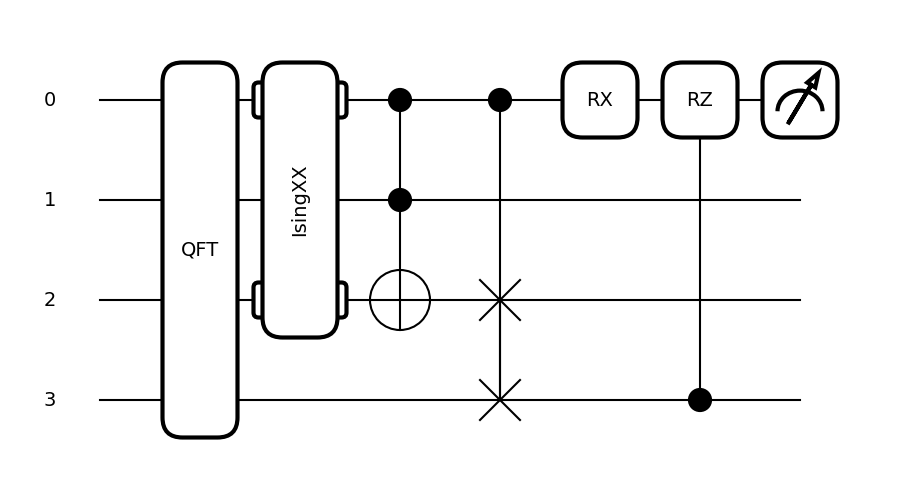
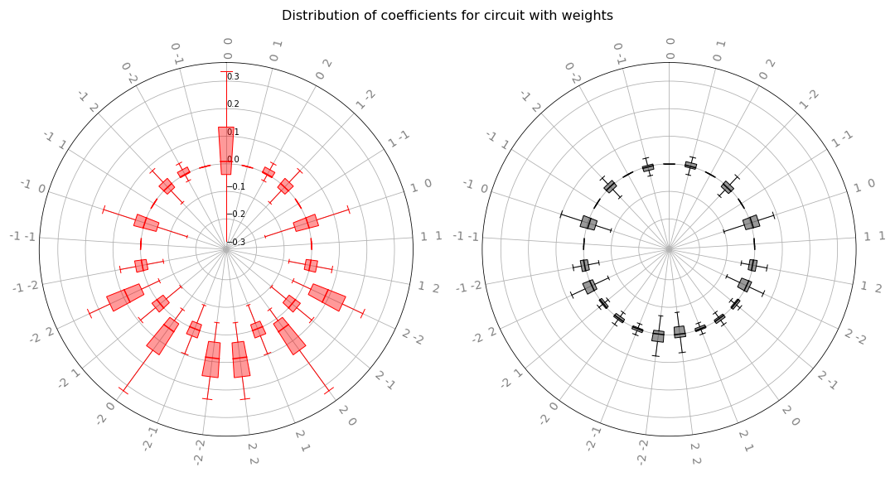

 .. role:: html(raw)
   :format: html

.. _intro_inspecting_circuits:

Inspecting circuits
===================

PennyLane offers functionality to inspect, visualize or analyze quantum circuits.

.. _intro_qtransforms:

Most of these tools are implemented as **transforms**.  Transforms take a :class:`~pennylane.QNode` instance and return a function:

>>> @qml.qnode(dev, diff_method='parameter-shift')
... def my_qnode(x, a=True):
...     # ...
>>> new_func = my_transform(qnode)

This new function accepts the same arguments as the QNode and returns the desired outcome,
such as a dictionary of the QNode's properties, a matplotlib figure drawing the circuit,
or a DAG representing its connectivity structure.

>>> new_func(0.1, a=False)

More information on the concept of transforms can be found in
`Di Matteo et al. (2022) <https://arxiv.org/abs/2202.13414>`_.

Extracting properties of a circuit
----------------------------------

The :func:`~pennylane.specs` transform takes a
QNode and creates a function that returns 
details about the QNode, including depth, number of gates, and number of
gradient executions required.

For example:

.. code-block:: python

    dev = qml.device('default.qubit', wires=4)

    @qml.qnode(dev, diff_method='parameter-shift')
    def circuit(x, y):
      qml.RX(x[0], wires=0)
      qml.Toffoli(wires=(0, 1, 2))
      qml.CRY(x[1], wires=(0, 1))
      qml.Rot(x[2], x[3], y, wires=0)
      return qml.expval(qml.PauliZ(0)), qml.expval(qml.PauliX(1))

We can now use the :func:`~pennylane.specs` transform to generate a function that returns
details and resource information:

>>> x = np.array([0.05, 0.1, 0.2, 0.3], requires_grad=True)
>>> y = np.array(0.4, requires_grad=False)
>>> specs_func = qml.specs(circuit)
>>> specs_func(x, y)
{'gate_sizes': defaultdict(<class 'int'>, {1: 2, 3: 1, 2: 1}),
'gate_types': defaultdict(<class 'int'>, {'RX': 1, 'Toffoli': 1, 'CRY': 1, 'Rot': 1}),
'num_operations': 4,
'num_observables': 2,
'num_diagonalizing_gates': 1,
'num_used_wires': 3, 'depth': 4,
'num_trainable_params': 4,
'num_device_wires': 4,
'device_name': 'default.qubit',
'expansion_strategy': 'gradient',
'gradient_options': {},
'interface': 'autograd',
'diff_method': 'parameter-shift',
'gradient_fn': 'pennylane.gradients.parameter_shift.param_shift',
'num_gradient_executions': 10}

Circuit drawing
---------------

PennyLane has two built-in circuit drawers, :func:`~pennylane.draw` and
:func:`~pennylane.draw_mpl`.

For example:

.. code-block:: python

    dev = qml.device('lightning.qubit', wires=(0,1,2,3))

    @qml.qnode(dev)
    def circuit(x, z):
        qml.QFT(wires=(0,1,2,3))
        qml.IsingXX(1.234, wires=(0,2))
        qml.Toffoli(wires=(0,1,2))
        qml.CSWAP(wires=(0,2,3))
        qml.RX(x, wires=0)
        qml.CRZ(z, wires=(3,0))
        return qml.expval(qml.PauliZ(0))

    fig, ax = qml.draw_mpl(circuit)(1.2345,1.2345)
    fig.show()

>>> print(qml.draw(circuit)(1.2345,1.2345))
0: ─╭QFT─╭IsingXX(1.23)─╭●─╭●─────RX(1.23)─╭RZ(1.23)─┤  <Z>
1: ─├QFT─│──────────────├●─│───────────────│─────────┤     
2: ─├QFT─╰IsingXX(1.23)─╰X─├SWAP───────────│─────────┤     
3: ─╰QFT───────────────────╰SWAP───────────╰●────────┤     

More information, including various fine-tuning options, can be found in
the :doc:`drawing module <../code/qml_drawer>`.

Debugging with mid-circuit snapshots
------------------------------------

When debugging quantum circuits run on simulators, we may want to inspect the current quantum state between gates.

:class:`~pennylane.Snapshot` is an operator like a gate, but it saves the device state at its location in the circuit instead of manipulating the quantum state.

Currently supported devices include:

* ``default.qubit``: each snapshot saves the quantum state vector
* ``default.mixed``: each snapshot saves the density matrix
* ``default.gaussian``: each snapshot saves the covariance matrix and vector of means

During normal execution, the snapshots are ignored:

.. code-block:: python

    dev = qml.device("default.qubit", wires=2)

    @qml.qnode(dev, interface=None)
    def circuit():
        qml.Snapshot()
        qml.Hadamard(wires=0)
        qml.Snapshot("very_important_state")
        qml.CNOT(wires=[0, 1])
        qml.Snapshot()
        return qml.expval(qml.PauliX(0))

However, when using the :func:`~pennylane.snapshots`
transform, intermediate device states will be stored and returned alongside the
results.

>>> qml.snapshots(circuit)()
{0: array([1.+0.j, 0.+0.j, 0.+0.j, 0.+0.j]),
'very_important_state': array([0.707+0.j, 0.+0.j, 0.707+0.j, 0.+0.j]),
2: array([0.707+0.j, 0.+0.j, 0.+0.j, 0.707+0.j]),
'execution_results': array(0.)}

Graph representation
--------------------

PennyLane makes use of several ways to represent a quantum circuit as a Directed Acyclic Graph (DAG).

DAG of causal relations between ops
~~~~~~~~~~~~~~~~~~~~~~~~~~~~~~~~~~~

A DAG can be used to represent which operator in a circuit is causally related to another. There are two
options to construct such a DAG:

The :class:`~pennylane.CircuitGraph` class takes a list of gates or channels and hermitian observables
as well as a set of wire labels and constructs a DAG in which the :class:`~.Operator`
instances are the nodes, and each directed edge corresponds to a wire
(or a group of wires) on which the "nodes" act subsequently.

For example, thiscan be used to compute the effective depth of a circuit,
or to check whether two gates causally influence each other.

.. code-block:: python

    import pennylane as qml
    from pennylane import CircuitGraph

    dev = qml.device('lightning.qubit', wires=(0,1,2,3))

    @qml.qnode(dev)
    def circuit():
        qml.Hadamard(0)
        qml.CNOT([1, 2])
        qml.CNOT([2, 3])
        qml.CNOT([3, 1])
        return qml.expval(qml.PauliZ(0))

    circuit()
    tape = circuit.qtape
    ops = tape.operations
    obs = tape.observables
    g = CircuitGraph(ops, obs, tape.wires)

Internally, the :class:`~pennylane.CircuitGraph` class constructs a ``rustworkx`` graph object.

>>> type(g.graph)
<class 'rustworkx.PyDiGraph'>

There is no edge between the ``Hadamard`` and the first ``CNOT``, but between consecutive ``CNOT`` gates:

>>> g.has_path(ops[0], ops[1])
False
>>> g.has_path(ops[1], ops[3])
True

The Hadamard is connected to the observable, while the ``CNOT`` operators are not. The observable
does not follow the Hadamard.

>>> g.has_path(ops[0], obs[0])
True
>>> g.has_path(ops[1], obs[0])
False
>>> g.has_path(obs[0], ops[0])
False

Anther way to construct the "causal" DAG of a circuit is to use the
:func:`~pennylane.transforms.qcut.tape_to_graph` function used by the qcut module. This
function takes a quantum tape and creates a ``MultiDiGraph`` instance from the ``networkx`` python package.

Using the above example, we get:

>>> g2 = qml.transforms.qcut.tape_to_graph(tape)
>>> type(g2)
<class 'networkx.classes.multidigraph.MultiDiGraph'>
>>> for k, v in g2.adjacency():
...    print(k, v)
Hadamard(wires=[0]) {expval(PauliZ(wires=[0])): {0: {'wire': 0}}}
CNOT(wires=[1, 2]) {CNOT(wires=[2, 3]): {0: {'wire': 2}}, CNOT(wires=[3, 1]): {0: {'wire': 1}}}
CNOT(wires=[2, 3]) {CNOT(wires=[3, 1]): {0: {'wire': 3}}}
CNOT(wires=[3, 1]) {}
expval(PauliZ(wires=[0])) {}

DAG of non-commuting ops
~~~~~~~~~~~~~~~~~~~~~~~~

The :func:`~pennylane.commutation_dag` transform can be used to produce an instance of the ``CommutationDAG`` class.
In a commutation DAG, each node represents a quantum operation, and edges represent non-commutation
between two operations.

This transform takes into account that not all operations can be moved next to each other by
pairwise commutation:

>>> def circuit(x, y, z):
...     qml.RX(x, wires=0)
...     qml.RX(y, wires=0)
...     qml.CNOT(wires=[1, 2])
...     qml.RY(y, wires=1)
...     qml.Hadamard(wires=2)
...     qml.CRZ(z, wires=[2, 0])
...     qml.RY(-y, wires=1)
...     return qml.expval(qml.PauliZ(0))
>>> dag_fn = qml.commutation_dag(circuit)
>>> dag = dag_fn(np.pi / 4, np.pi / 3, np.pi / 2)

Nodes in the commutation DAG can be accessed via the ``get_nodes()`` method, returning a list of
the  form ``(ID, CommutationDAGNode)``:

>>> nodes = dag.get_nodes()
>>> nodes
NodeDataView({0: <pennylane.transforms.commutation_dag.CommutationDAGNode object at 0x7f461c4bb580>, ...}, data='node')

Specific nodes in the commutation DAG can be accessed via the ``get_node()`` method:

>>> second_node = dag.get_node(2)
>>> second_node
<pennylane.transforms.commutation_dag.CommutationDAGNode object at 0x136f8c4c0>
>>> second_node.op
CNOT(wires=[1, 2])
>>> second_node.successors
[3, 4, 5, 6]
>>> second_node.predecessors
[]

Fourier representation
----------------------

Parametrized quantum circuits often compute functions in the parameters that
can be represented by Fourier series of a low degree.

The :doc:`../code/qml_fourier` module contains functionality to compute and visualize
properties of such Fourier series.

