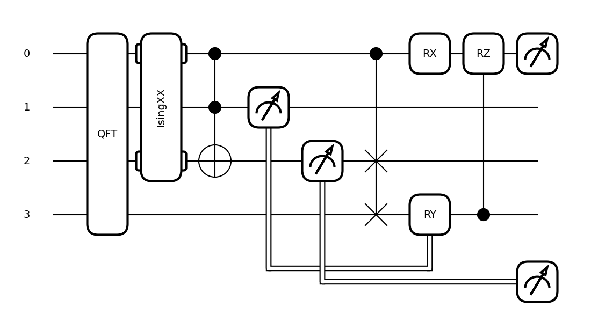
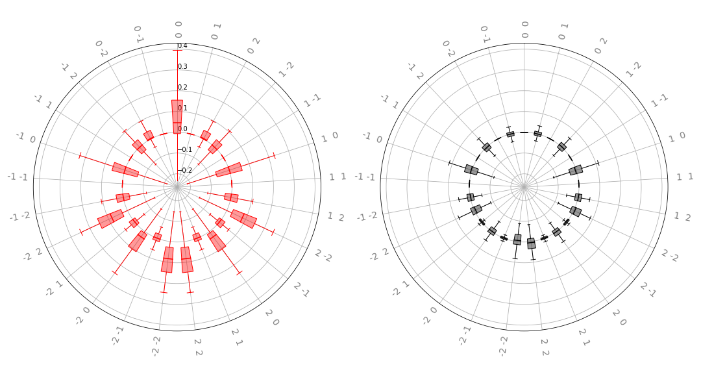

 .. role:: html(raw)
   :format: html

.. _intro_inspecting_circuits:

Inspecting circuits
===================

PennyLane offers functionality to inspect, visualize or analyze quantum circuits.

.. _intro_qtransforms:

Most of these tools are implemented as *transforms*
which take a :class:`~pennylane.QNode` instance and return a function:

>>> @qml.qnode(dev, diff_method='parameter-shift')
... def my_qnode(x, a=True):
...     # ...
>>> new_func = my_transform(qnode)

This new function can
be called with the same arguments as the QNode and returns the desired outcome,
such as a dictionary of the QNode's properties, a matplotlib figure drawing the circuit,
or a DAG representing its connectivity structure.

>>> new_func(0.1, a=False)

More information on the concept of transforms can be found in
`Di Matteo et al. (2022) <https://arxiv.org/abs/2202.13414>`_.

Extracting properties of a circuit
----------------------------------

The :func:`~pennylane.specs` transform takes a
QNode and creates a function that returns specifications or
details about the QNode, including depth, number of gates, and number of
gradient executions required.

For example:

.. code-block:: python

    dev = qml.device('default.qubit', wires=4)

    @qml.qnode(dev, diff_method='parameter-shift')
    def circuit(x, y):
      qml.RX(x[0], wires=0)
      qml.Toffoli(wires=(0, 1, 2))
      qml.CRY(x[1], wires=(0, 1))
      qml.Rot(x[2], x[3], y, wires=0)
      return qml.expval(qml.PauliZ(0)), qml.expval(qml.PauliX(1))

We can now use the :func:`~pennylane.specs` transform to generate a function that returns
details and resource information:

>>> x = np.array([0.05, 0.1, 0.2, 0.3], requires_grad=True)
>>> y = np.array(0.4, requires_grad=False)
>>> specs_func = qml.specs(circuit)
>>> specs_func(x, y)
{'gate_sizes': defaultdict(<class 'int'>, {1: 2, 3: 1, 2: 1}),
'gate_types': defaultdict(<class 'int'>, {'RX': 1, 'Toffoli': 1, 'CRY': 1, 'Rot': 1}),
'num_operations': 4,
'num_observables': 2,
'num_diagonalizing_gates': 1,
'num_used_wires': 3, 'depth': 4,
'num_trainable_params': 4,
'num_device_wires': 4,
'device_name': 'default.qubit',
'expansion_strategy': 'gradient',
'gradient_options': {},
'interface': 'autograd',
'diff_method': 'parameter-shift',
'gradient_fn': 'pennylane.gradients.parameter_shift.param_shift',
'num_gradient_executions': 10}

Circuit drawing
---------------

PennyLane has two built-in circuit drawers, :func:`~pennylane.draw` and
:func:`~pennylane.draw_mpl`.

For example:

.. code-block:: python

    dev = qml.device('lightning.qubit', wires=(0,1,2,3))

    @qml.qnode(dev)
    def circuit(x, z):
        qml.QFT(wires=(0,1,2,3))
        qml.IsingXX(1.234, wires=(0,2))
        qml.Toffoli(wires=(0,1,2))
        qml.CSWAP(wires=(0,2,3))
        qml.RX(x, wires=0)
        qml.CRZ(z, wires=(3,0))
        return qml.expval(qml.PauliZ(0))

    fig, ax = qml.draw_mpl(circuit)(1.2345,1.2345)
    fig.show()

More information, including various fine-tuning options, can be found in
the :doc:`drawing module <../code/qml_drawer>`.

Resource estimation
-------------------

DAG representation
------------------

The representation of a quantum circuit as a Directed Acyclic Graph (DAG) can be computed
using the :func:`~pennylane.commutation_dag` transform. In the DAG, each node represents
a quantum operation, and edges represent non-commutation
between two operations.

This transform takes into account that not all operations can be moved next to each other by
pairwise commutation:

>>> def circuit(x, y, z):
...     qml.RX(x, wires=0)
...     qml.RX(y, wires=0)
...     qml.CNOT(wires=[1, 2])
...     qml.RY(y, wires=1)
...     qml.Hadamard(wires=2)
...     qml.CRZ(z, wires=[2, 0])
...     qml.RY(-y, wires=1)
...     return qml.expval(qml.PauliZ(0))
>>> dag_fn = qml.commutation_dag(circuit)
>>> dag = dag_fn(np.pi / 4, np.pi / 3, np.pi / 2)

Nodes in the commutation DAG can be accessed via the ``get_nodes()`` method, returning a list of
the  form ``(ID, CommutationDAGNode)``:

>>> nodes = dag.get_nodes()
>>> nodes
NodeDataView({0: <pennylane.transforms.commutation_dag.CommutationDAGNode object at 0x7f461c4bb580>, ...}, data='node')

Specific nodes in the commutation DAG can be accessed via the ``get_node()`` method:

>>> second_node = dag.get_node(2)
>>> second_node
<pennylane.transforms.commutation_dag.CommutationDAGNode object at 0x136f8c4c0>
>>> second_node.op
CNOT(wires=[1, 2])
>>> second_node.successors
[3, 4, 5, 6]
>>> second_node.predecessors
[]

Fourier representation
----------------------

Parametrized quantum circuits often compute functions in the parameters that
can be represented by Fourier series of a low degree.

The :doc:`../code/qml_fourier` module contains functionality to compute and visualize
properties of such Fourier series.

