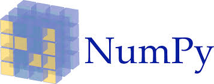
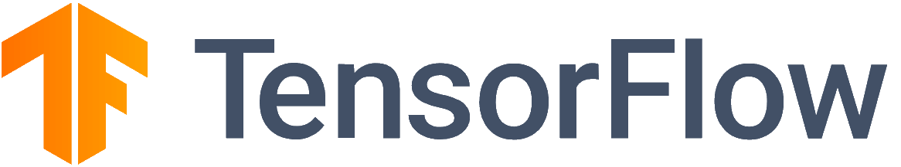

.. role:: html(raw)
   :format: html

.. _intro_interfaces:

Interfaces
==========

PennyLane integrates quantum nodes made up of variational circuits with other programming
and machine learning frameworks.
Such frameworks are called *interfaces*. The default interface, implicitly used in the previous section on
how to program :ref:`variational circuits <intro_vcircuits>`, is NumPy.

Currently, there is support for the following three interfaces:

.. rst-class:: gallery-table

+-----------+-----------+---------+
| |numpy|   | |torch|   |   |tf|  |
+-----------+-----------+---------+

.. toctree::
    :hidden:

    interfaces/numpy
    interfaces/torch
    interfaces/tf

