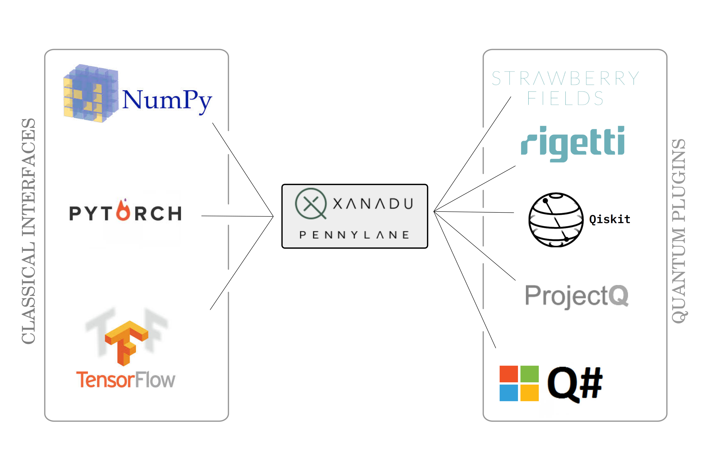

 .. role:: html(raw)
   :format: html

.. _pl_intro:

Introduction
============

PennyLane integrates classical and quantum computations to
optimize variable parameters that the computations depend on. Prominent examples are
*variational quantum eigensolvers* or *quantum machine learning models*.

Bridging the classical and quantum world
----------------------------------------

The classical computations, as well as the overall optimization,
are executed by a **classical interface** . PennyLane's standard interface is `NumPy <https://numpy.org/>`_,
but there is also support for powerful machine learning interfaces like `PyTorch <https://pytorch.org/>`_
and `Tensorflow <https://www.tensorflow.org/>`_.

The quantum computations are sent to a **device** for execution. A device can be a classical
simulator or real quantum hardware. PennyLane comes with default simulator devices, but it can also use external
software and hardware to run quantum circuits - such as Xanadu's *StrawberryFields*,
Rigetti's *Forest*, IBM's *Quiskit*, *ProjectQ* or Microsoft's *Q#*.
The communication between PennyLane and external devices is coordinated by a **plugin**.

The main job of PennyLane is to manage the computation or estimation of gradients
of parametrized quantum circuits (so called *variational circuits*) on quantum devices,
and to make them accessible to the classical interface.
The classical interface uses the gradient information to automatically differentiate
through the computation - an essential process in optimization and machine learning.

Learn more
----------

In the following sections you can learn more about the key features of PennyLane:

1. :doc:`circuits` shows how PennyLane unifies and simplifies
the process of programming quantum circuits with trainable parameters.

2. :doc:`interfaces` introduces how PennyLane is used with different
machine learning libraries to optimize quantum circuits or hybrid computations.

3. :doc:`operations` outlines the various quantum circuit building blocks
provided in PennyLane.

4. :doc:`measurements` presents the different options available to measure
the output of quantum circuits.

5. :doc:`templates` gives an overview of different larger-scale composable
layers for building quantum algorithms.

6. :doc:`optimizers` details the built-in tools for optimizing and training
quantum computing and quantum machine learning circuits.

7. :doc:`configuration` provides details about how to customize
PennyLane and provide credentials for quantum hardware access.
