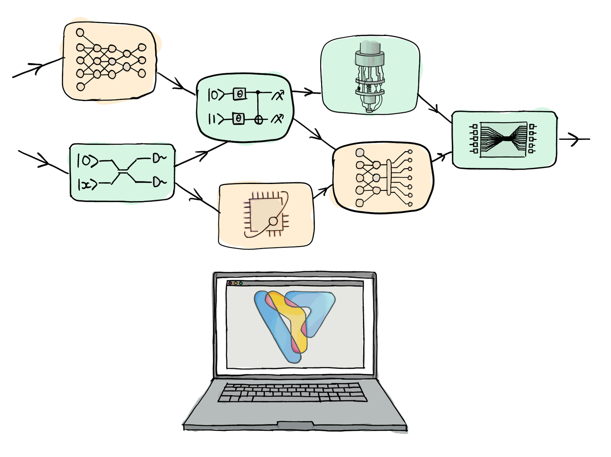

 .. role:: html(raw)
   :format: html

.. _pl_intro:

What is PennyLane?
==================

.. figure:: ../_static/code.png
    :align: left
    :figwidth: 350px
    :width: 300px
    :target: javascript:void(0);

|

PennyLane is a cross-platform Python library for programming quantum computers. Built by researchers, for research, it provides a hardware-agnostic toolkit and a complete ecosystem to help you accelerate breakthroughs in quantum algorithms, quantum chemistry, and quantum machine learning.

It manages the execution of quantum computations, including the evaluation of circuits and the computation of their gradients. This information is forwarded to the classical framework, creating seamless quantum-classical pipelines for applications.

PennyLane's design principle states that
circuits can be run on various kinds of simulators or hardware devices without making any changes---
the complex job of optimising communication with the devices and compiling circuits to suit the backend 
is taken care of.

The library comes with default simulator devices, but is well-integrated with
`external software and hardware <https://pennylane.ai/plugins>`__ to run quantum
circuits---such as IBM's Qiskit, or Google's Cirq, Rigetti's Forest, or Xanadu's Strawberry Fields.
