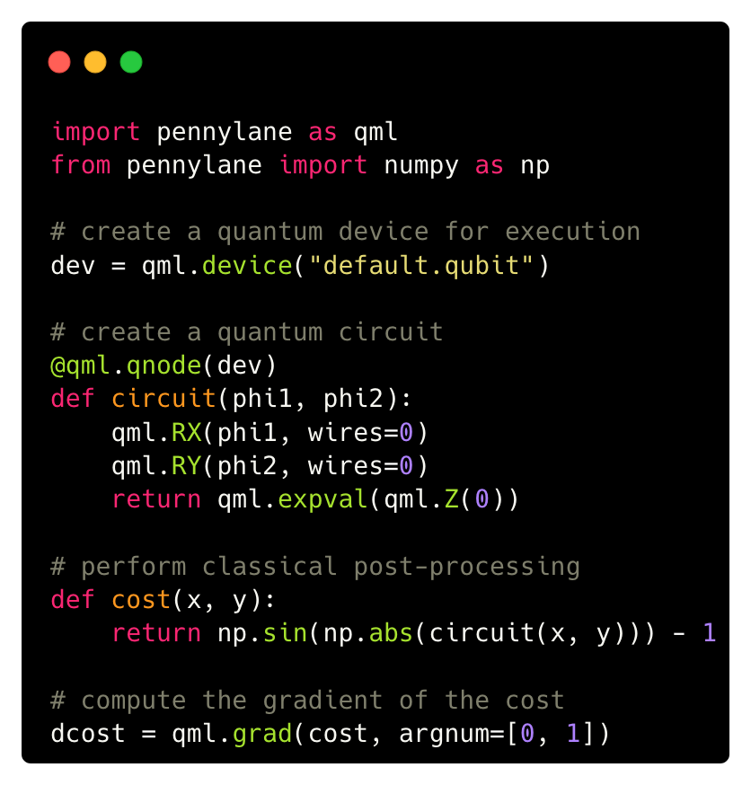

 .. role:: html(raw)
   :format: html

.. _pl_intro:

Introduction
============

PennyLane provides a bridge between classical and quantum computations, making it
easy to build and optimize hybrid computations. Prominent examples are
*variational quantum eigensolvers* and *quantum machine learning models*.

Bridging the classical and quantum world
----------------------------------------

Classical computations, as well as optimization or training of models, are executed using
one of the standard scientific computing or machine learning libraries. PennyLane provides an
**interface** to these libraries, making them quantum-aware.

PennyLane's standard interface is `NumPy <https://numpy.org/>`_,
but interfaces to powerful machine learning libraries like `PyTorch <https://pytorch.org/>`_
and `Tensorflow <https://www.tensorflow.org/>`_ are also available.

The quantum computations are sent to a **device** for execution. A device can be real quantum
hardware or a classical simulator. PennyLane comes with default simulator devices,
but is well-integrated with external software and hardware to run quantum
circuits---such as Xanadu's Strawberry Fields, Rigetti's Forest, IBM's Qiskit, or Google's Cirq.

Communication between the classical computing library and quantum devices is coordinated in
PennyLane via a suite of **plugins**:

.. image:: ../_static/jigsaw.png
    :align: center
    :width: 90%
    :target: javascript:void(0);

|

The main job of PennyLane is to manage the evaluation of parametrized quantum circuits
(so-called *variational circuits*) on quantum devices,
and to make them accessible to the machine learning libraries.
PennyLane also provides access to gradients of quantum circuits, which the machine
learning library can use to perform backpropagation, including through quantum
circuits---an essential process for optimization and machine learning.

More details
------------

In the following sections you can learn more about the key features of PennyLane:

1. :doc:`circuits` shows how PennyLane unifies and simplifies
   the process of programming quantum circuits with trainable parameters.

..

2. :doc:`interfaces` introduces how PennyLane is used with different
   optimization libraries to optimize quantum circuits or hybrid computations.

..

3. :doc:`operations` outlines the various quantum circuit building blocks
   provided in PennyLane.

..

4. :doc:`measurements` presents the different options available to measure
   the output of quantum circuits.

..

5. :doc:`templates` gives an overview of different larger-scale composable
   layers for building quantum algorithms.

..

6. :doc:`optimizers` details the built-in tools for optimizing and training
   quantum computing and quantum machine learning circuits.

..

7. :doc:`configuration` provides details about how to customize
   PennyLane and provide credentials for quantum hardware access.
