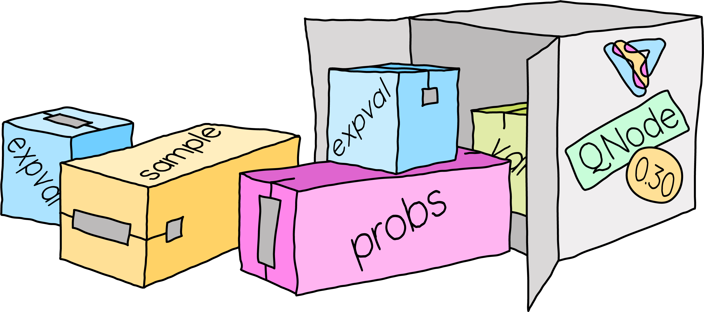

.. _returns:

QNode returns
=============

Version 0.30.0 of PennyLane updated the return type of a :class:`~.pennylane.QNode`. This page
provides additional details about the update and can be used to troubleshoot issues.

.. note::

    If you are looking for a quick fix, jump to the :ref:`Troubleshooting` section!

    After visiting the :ref:`Troubleshooting` section, if you are still stuck then you can:

    - Post on the PennyLane `discussion forum <https://discuss.pennylane.ai>`_.

    - If you suspect that your issue is due to a bug in PennyLane itself, please open a
      `bug report <https://github.com/PennyLaneAI/pennylane/issues/new?labels=bug+%3Abug%3A&template=bug_report.yml&title=[BUG]>`_
      on the PennyLane GitHub page.

Summary of the update
---------------------

.. rst-class:: admonition tip

    PennyLane QNodes now return exactly what you tell them to! 🎉

Consider the following circuit:

.. _return-type-example-issue:

.. code-block:: python

    import pennylane as qml

    dev = qml.device("default.qubit", wires=1)

    @qml.qnode(dev)
    def circuit(x):
        qml.RX(x, wires=0)
        return qml.expval(qml.PauliZ(0)), qml.probs(0)

In version 0.29 and earlier of PennyLane, ``circuit()`` would return a single length-3 array:

.. code-block:: pycon

    >>> circuit(0.5)
    tensor([0.87758256, 0.93879128, 0.06120872], requires_grad=True)

In versions 0.30 and above, ``circuit()`` returns a length-2 tuple containing the expectation value
and probabilities separately:

.. code-block:: pycon

    >>> circuit(0.5)
    (tensor(0.87758256, requires_grad=True),
     tensor([0.93879128, 0.06120872], requires_grad=True))

For a detailed explanation of this change, along with code examples, check out the
:func:`~.enable_return` function documentation.

Motivation
----------

PennyLane has historically adopted the approach of combining the returned
:ref:`measurements <intro_ref_meas>` of a QNode into a single array. However, this has presented
some challenges:

* The return of a QNode could be different from what is expected, as shown in the
  :ref:`example <return-type-example-issue>` above.
* For measurements of different shapes, ragged arrays were generated internally and then squeezed
  into a single output array. This is incompatible with NumPy's
  `NEP 34 <https://numpy.org/neps/nep-0034-infer-dtype-is-object.html>`_ and constrains the
  `version of NumPy <https://github.com/PennyLaneAI/pennylane/blob/v0.29.1/setup.py#L21>`_ that
  PennyLane is compatible with.
* Use of stacking and squeezing presents performance bottlenecks.

The changes made in version 0.30 of PennyLane address the challenges above. However, existing users
may experience breaking changes or issues when upgrading their PennyLane version.

.. _Troubleshooting:

Troubleshooting
---------------

You may experience issues with PennyLane's updated QNode return system in version 0.30 and above
if you have existing code that works with an earlier version of PennyLane. To help identify a fix,
select the option below that describes your situation.

.. details::
    :title: I am using a QNode that returns more than one quantity
    :href: qnode-multiple-returns

    Your issue may be because:

    * You are calculating the Jacobian of the QNode using the :ref:`NumPy <numpy_interf>` or
      :ref:`TensorFlow <tf_interf>` interface. For example, the following will now raise an error:

      .. code-block:: python

          from pennylane import numpy as np

          dev = qml.device("default.qubit", wires=1)

          @qml.qnode(dev)
          def circuit(x):
              qml.RX(x, wires=0)
              return qml.expval(qml.PauliY(0)), qml.expval(qml.PauliZ(0))

          x = np.array(0.5, requires_grad=True)
          qml.jacobian(circuit)(x)

      Follow the instructions :ref:`here <return-autograd-tf-gotcha>` to fix this issue, which
      arises because NumPy and TensorFlow do not support differentiating tuples.
      Alternatively, consider porting your code to use the :ref:`JAX <jax_interf>` or
      :ref:`Torch <torch_interf>` interface, which could unlock additional features and performance
      benefits!

    * You are returning differently-shaped quantities together, such as
      :func:`expval() <pennylane.expval>` and :func:`probs() <pennylane.probs>`. For example, the
      following code is compatible with version 0.29 of PennyLane but will raise an error in version
      0.30 and above:

      .. code-block:: python

          dev = qml.device("default.qubit", wires=1)

          @qml.qnode(dev)
          def circuit(x):
              qml.RX(x, wires=0)
              return qml.expval(qml.PauliZ(0)), qml.probs(0)

          def result(x):
              expval, p0, p1 = circuit(x)
              return expval + p0 - p1

          x = np.array(0.5, requires_grad=True)
          result(x)

      Such issues can be addressed by updating how the return of a QNode is processed, being aware
      of unpacking, slicing, and indexing. The example above would be fixed simply by updating
      ``result()`` to:

      .. code-block:: python

          def result(x):
              expval, (p0, p1) = circuit(x)
              return expval + p0 - p1

.. details::
    :title: I am a device developer
    :href: device-developer

    If you are a :ref:`device developer <plugin_overview>`, your issue may be because:

    * Your device inherits from :class:`~.QubitDevice` and you have overriden or interact with the
      :meth:`~.QubitDevice.execute`, :meth:`~.QubitDevice.batch_execute`, or
      :meth:`~.QubitDevice.statistics` methods. Your device will need to be updated to accommodate
      for the new return behaviour. An example can be found
      `here <https://github.com/PennyLaneAI/pennylane-qiskit/pull/281>`_ for the
      `Qiskit plugin <https://docs.pennylane.ai/projects/qiskit/en/latest/>`_.

    * Your device inherits directly from :class:`Device <pennylane.Device>`, in which case you may
      need to rewrite the :meth:`execute() <pennylane.Device.execute>` and
      :meth:`batch_execute() <pennylane.Device.batch_execute>` methods.

    In either case, please `reach out to us <https://discuss.pennylane.ai>`_ for guidance!

.. details::
    :title: I am unsure what to do
    :href: unsure

    Please carefully read through the options above. If you are still stuck, you can:

    - Post on the PennyLane `discussion forum <https://discuss.pennylane.ai>`_. Please include
      a complete block of code demonstrating your issue so that we can quickly troubleshoot.

    - If you suspect that your issue is due to a bug in PennyLane itself, please open a
      `bug report <https://github.com/PennyLaneAI/pennylane/issues/new?labels=bug+%3Abug%3A&template=bug_report.yml&title=[BUG]>`_
      on the PennyLane GitHub page.
