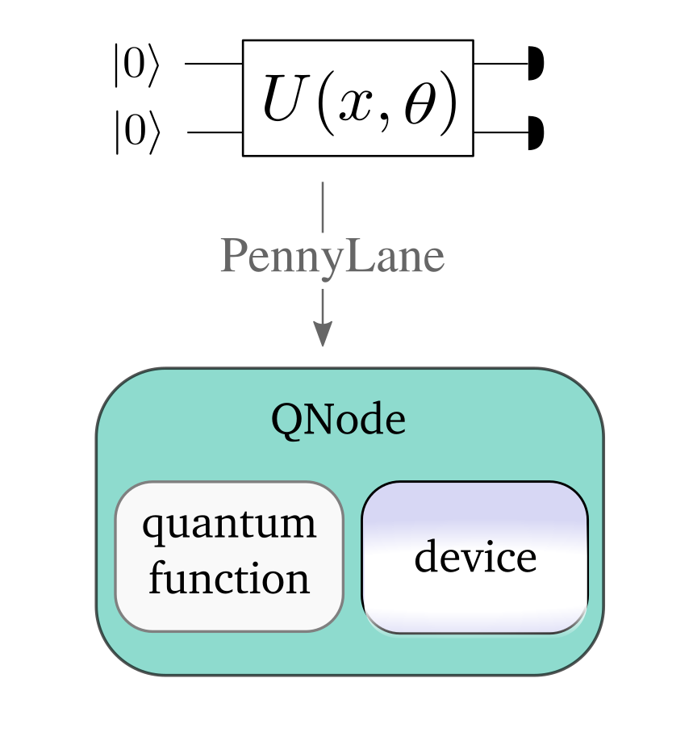

 .. role:: html(raw)
   :format: html

.. _intro_vcircuits:

Variational Circuits
====================

In the following we will see how the concept of a :ref:`variational quantum circuit <varcirc>`, the
heart piece of hybrid quantum-classical optimization, is implemented in PennyLane by
*quantum node* objects.
We give an overview of quantum :ref:`operations <intro_vcirc_ops>` and :ref:`measurements <intro_vcirc_measure>`
that can be used in circuits, and show how a growing library of
:ref:`templates <intro_vcirc_templates>` allows
for easy use of common types of variational subroutines known as an *ansatz*.

.. _intro_vcirc_qnodes:

Creating quantum nodes
----------------------

In PennyLane, variational circuits are represented as quantum nodes. A quantum node
is a combination of a :ref:`quantum function <intro_vcirc_qfunc>` that composes the circuit,
and a :ref:`device <intro_vcirc_device>` that runs the computation. One can conveniently create quantum nodes using
the quantum node :ref:`decorator <intro_vcirc_decorator>`.

Each classical :ref:`interface <intro_interfaces>` uses a different version of a quantum node,
and we will introduce the standard QNode to use with the NumPy interface here.
NumPy-interfacing quantum nodes take NumPy datastructures,
such as floats and arrays, and return Numpy data structures.
They can be optimized using NumPy-based :ref:`optimization methods <intro_optimizers>`.
Quantum nodes for other PennyLane interfaces like :ref:`PyTorch <torch_interf>` and
:ref:`TensorFlow's Eager mode <tf_interf>` are introduced in the section on :ref:`interfaces <intro_interfaces>`.

.. _intro_vcirc_qfunc:

Quantum functions
^^^^^^^^^^^^^^^^^

A quantum circuit is constructed as a special Python function, a *quantum circuit function*, or *quantum function* in short.
For example:

.. code-block:: python

    import pennylane as qml

    def my_quantum_function(x, y):
        qml.RZ(x, wires=0)
        qml.CNOT(wires=[0,1])
        qml.RY(y, wires=1)
        return qml.expval(qml.PauliZ(1))

Quantum functions are a restricted subset of Python functions, adhering to the following
constraints:

* The body of the function must consist of only supported PennyLane
  :ref:`operations <intro_vcirc_ops>` or sequences of operations called :ref:`templates <intro_vcirc_templates>`,
  using one instruction per line.

* The function must always return either a single or a tuple of
  *measured observable values*, by applying a :ref:`measurement function <intro_vcirc_measure>`
  to a :ref:`qubit <intro_vcirc_ops_qobs>` or :ref:`continuous-value observable <intro_vcirc_ops_cvobs>`.

* Classical processing of function arguments, either by arithmetic operations
  or external functions, is not allowed. One current exception is simple scalar
  multiplication.

.. note::

    The quantum operations cannot be used outside of a quantum circuit function, as all
    :class:`Operations <pennylane.operation.Operation>` require a QNode in order to perform queuing on initialization.

.. note::

    Measured observables **must** come after all other operations at the end
    of the circuit function as part of the return statement, and cannot appear in the middle.

.. _intro_vcirc_device:

Defining a device
^^^^^^^^^^^^^^^^^

To run - and later optimize - a quantum circuit, one needs to first specify a *computational device*.

The device is an instance of the :class:`~_device.Device`
class, and can represent either a simulator or hardware device. They can be
instantiated using the :func:`device <pennylane.device>` loader.

.. code-block:: python

    dev = qml.device('default.qubit', wires=2)

PennyLane offers some basic devices such as the ``'default.qubit'`` simulator; additional devices can be installed
as plugins (see :ref:`plugins <plugins>` for more details). Note that the choice of a device significantly
determines the speed of your computation.

.. _intro_vcirc_qnode:

Creating a quantum node
^^^^^^^^^^^^^^^^^^^^^^^

Together, a quantum function and a device are used to create a *quantum node* or
:class:`QNode <pennylane.qnode.QNode>` object, which wraps the quantum function and binds it to the device.

A `QNode` can be explicitly created as follows:

.. code-block:: python

    qnode = qml.QNode(my_quantum_function, dev)

The `QNode` can be used to compute the result of a quantum circuit as if it was a standard Python
function. It takes the same arguments as the original quantum function:

>>> qnode(np.pi/4, 0.7)
0.7648421872844883

.. _intro_vcirc_decorator:

The QNode decorator
^^^^^^^^^^^^^^^^^^^

A more convenient - and in fact the recommended - way for creating `QNodes` is the provided
quantum node decorator. This decorator converts a quantum function containing PennyLane quantum
operations to a :class:`QNode <pennylane.qnode.QNode>` that will run on a quantum device.

.. note::
    The decorator completely replaces the Python-based quantum function with
    a :mod:`QNode <pennylane.qnode.QNode>` of the same name - as such, the original
    function is no longer accessible (but is accessible via the ``func`` attribute).

For example:

.. code-block:: python

    dev = qml.device('default.qubit', wires=2)

    @qml.qnode(dev)
    def qfunc(x):
        qml.RZ(x, wires=0)
        qml.CNOT(wires=[0,1])
        qml.RY(x, wires=1)
        return qml.expval(qml.PauliZ(0))

    result = qfunc(0.543)

.. _intro_vcirc_ops:

Quantum operations
------------------

.. currentmodule:: pennylane.ops

PennyLane supports a wide variety of quantum operations - such as gates, state preparations and measurement
observables. These operations can be used exclusively in quantum functions. Revisiting the
first example from above, we find the :class:`RZ <pennylane.ops.qubit.RZ>`, :class:`CNOT <pennylane.ops.qubit.CNOT>`,
:class:`RY <pennylane.ops.qubit.RY>` :ref:`gates <intro_vcirc_ops_qgates>` and the
:class:`PauliZ <pennylane.ops.qubit.PauliZ>` :ref:`observable <intro_vcirc_ops_qobs>`:

.. code-block:: python

    import pennylane as qml

    def my_quantum_function(x, y):
        qml.RZ(x, wires=0)
        qml.CNOT(wires=[0,1])
        qml.RY(y, wires=1)
        return qml.expval(qml.PauliZ(1))

You find a list of all quantum operations here, as well as in the :ref:`user documentation <docs_pennylane>`.

.. _intro_vcirc_ops_qubit:

Qubit operations
^^^^^^^^^^^^^^^^

.. currentmodule:: pennylane.ops.qubit

.. _intro_vcirc_ops_qgates:

Qubit gates
***********

.. autosummary::

    CNOT
    CRot
    CRX
    CRY
    CRZ
    CSWAP
    CZ
    Hadamard
    PauliX
    PauliY
    PauliZ
    PhaseShift
    QubitUnitary
    Rot
    RX
    RY
    RZ
    SWAP

Qubit state preparation
***********************

.. autosummary::
    BasisState
    QubitStateVector

.. _intro_vcirc_ops_qobs:

Qubit observables
*****************

.. autosummary::
    Hadamard
    Hermitian
    PauliX
    PauliY
    PauliZ

.. _intro_vcirc_ops_cv:

Continuous-variable (CV) operations
^^^^^^^^^^^^^^^^^^^^^^^^^^^^^^^^^^^

.. currentmodule:: pennylane.ops.cv

.. _intro_vcirc_ops_cvgates:

CV Gates
********

.. autosummary::
    Beamsplitter
    ControlledAddition
    ControlledPhase
    CrossKerr
    CubicPhase
    Displacement
    Interferometer
    Kerr
    QuadraticPhase
    Rotation
    Squeezing
    TwoModeSqueezing

CV state preparation
********************

.. autosummary::
    CatState
    CoherentState
    DisplacedSqueezedState
    FockDensityMatrix
    FockState
    FockStateVector
    GaussianState
    SqueezedState
    ThermalState

.. _intro_vcirc_ops_cvobs:

CV observables
**************

.. autosummary::
    FockStateProjector
    NumberOperator
    P
    PolyXP
    QuadOperator
    X

Shared operations
^^^^^^^^^^^^^^^^^

.. currentmodule:: pennylane.ops

The only operation shared by both qubit and continouous-variable architectures is the Identity.

.. autosummary::
    Identity

.. _intro_vcirc_measure:

Quantum measurements
--------------------

.. currentmodule:: pennylane.measure

PennyLane can extract different types of measurement results: The expectation of an observable
over multiple measurements, its variance, or a sample of a single measurement.

The quantum function from above, for example, used the :func:`expval <pennylane.measure.expval>` measurement:

.. code-block:: python

    import pennylane as qml

    def my_quantum_function(x, y):
        qml.RZ(x, wires=0)
        qml.CNOT(wires=[0,1])
        qml.RY(y, wires=1)
        return qml.expval(qml.PauliZ(1))

The signature of the three measurement functions are found here:

.. autosummary::
    expval
    var
    sample

.. _intro_vcirc_templates:

Templates
---------

PennyLane provides a growing library of pre-coded templates of common variational circuit architectures
that can be used to easily build, evaluate, and train more complex models. In the
literature, such architectures are commonly known as an *ansatz*.

.. note::

    Templates are constructed out of **structured combinations** of the :mod:`quantum operations <intro_vcirc_ops>`
    provided by PennyLane. This means that **template functions can only be used within a
    valid** :mod:`pennylane.qnode.QNode`.

PennyLane conceptually distinguishes two types of templates, :ref:`layer architectures <intro_vcirc_temp_layer>`
and :ref:`input embeddings <intro_vcirc_temp_emb>`.
Most templates are complemented by functions that provide an array of
random :ref:`initial parameters <intro_vcirc_temp_params>` .

An example of how to use templates is the following:

.. code-block:: python

    import pennylane as qml
    from pennylane.templates.embeddings import AngleEmbedding
    from pennylane.templates.layers import StronglyEntanglingLayers
    from pennylane.init import strong_ent_layer_uniform

    dev = qml.device('default.qubit', wires=2)

    @qml.qnode(dev)
    def circuit(weights, x=None):
        AngleEmbedding(x, [0,1])
        StronglyEntanglingLayers(weights=weights, wires=[0,1])
        return qml.expval(qml.PauliZ(0))

    init_weights = strong_ent_layer_uniform(n_wires=2)
    print(circuit(init_weights, x=[1., 2.]))

Here, we used the embedding template :class:`AngleEmbedding <pennylane.templates.embeddings.AngleEmbedding>`
together with the layer template
:class:`StronglyEntanglingLayers <pennylane.templates.layers.StronglyEntanglingLayers>`,
and the uniform parameter initialization strategy
:func:`strong_ent_layer_uniform <pennylane.init.strong_ent_layer_uniform>`.

.. _intro_vcirc_temp_layer:

Layer templates
^^^^^^^^^^^^^^^

.. currentmodule:: pennylane.templates.layers

Layer architectures, found in the :ref:`templates.layers <docs_templates_layers>` module,
define sequences of gates that are repeated like the layers in a neural network.
They usually contain only trainable parameters.

The following layer templates are available:

.. autosummary::
    CVNeuralNetLayer
    CVNeuralNetLayers
    Interferometer
    RandomLayer
    RandomLayers
    StronglyEntanglingLayer
    StronglyEntanglingLayers

.. _intro_vcirc_temp_emb:

Embedding templates
^^^^^^^^^^^^^^^^^^^

.. currentmodule:: pennylane.templates.embeddings

Embeddings, found in the :ref:`templates.embeddings <docs_templates_embeddings>` module,
encode input features into the quantum state of the circuit.
Hence, they take a feature vector as an argument. These embeddings can also depend on
trainable parameters, in which case the embedding is learnable.

The following embedding templates are available:

.. autosummary::
    AmplitudeEmbedding
    BasisEmbedding
    AngleEmbedding
    SqueezingEmbedding
    DisplacementEmbedding

.. _intro_vcirc_temp_params:

Parameter initializations
^^^^^^^^^^^^^^^^^^^^^^^^^

.. currentmodule:: pennylane.init

Each trainable template has a dedicated function in the :ref:`init <docs_init>` module, which generates a list of
randomly initialized arrays for the trainable parameters.

Strongly entangling circuit
***************************
.. autosummary::
    strong_ent_layers_uniform
    strong_ent_layers_normal
    strong_ent_layer_uniform
    strong_ent_layer_normal

Random circuit
**************
.. autosummary::
    random_layers_uniform
    random_layers_normal
    random_layer_uniform
    random_layer_normal

Continuous-variable quantum neural network
******************************************
.. autosummary::
    cvqnn_layers_uniform
    cvqnn_layers_normal
    cvqnn_layer_uniform
    cvqnn_layer_normal

Interferometer
**************
.. autosummary::
    interferometer_uniform
    interferometer_normal

