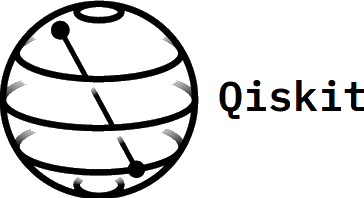

.. role:: html(raw)
   :format: html

.. _plugins:

Plugins and ecosystem
=====================

PennyLane provides a framework for the construction and optimization of hybrid quantum-classical computational models. While classical processing is performed using the wrapped version of NumPy provided by PennyLane, quantum nodes are evaluated on 'devices' - corresponding to a quantum simulator or quantum hardware device.

PennyLane comes with built-in support for two simple quantum devices:

.. rst-class:: docstable

+---------------------------+------------------------------------------------------------------------------------------+
|        Device name        |                                       Description                                        |
+===========================+==========================================================================================+
| :mod:`~.default_qubit`    | A simple pure state simulation of a qubit-based quantum circuit architecture             |
+---------------------------+------------------------------------------------------------------------------------------+
| :mod:`~.default_gaussian` | A simple simulation of a Gaussian-based continuous-variable quantum optical architecture |
+---------------------------+------------------------------------------------------------------------------------------+

PennyLane is designed from the ground up to be hardware and device agnostic, allowing quantum functions to be easily re-used on different quantum devices, as long as all contained quantum operations are supported.

List of available plugins
-------------------------

PennyLane has also been designed to be easily extensible, supporting external quantum devices and custom quantum operations via the built-in plugin API. These plugins are installed separately, providing a rich ecosystem integrating popular quantum software development libraries with the hybrid optimization capabilities of PennyLane.

Below, we maintain a list of the installable plugins available for PennyLane.

:html:` `

.. _(PennyLane-SF): https://github.com/XanaduAI/pennylane-sf

.. _(PennyLane-PQ): https://github.com/XanaduAI/pennylane-pq

.. _(PennyLane-qiskit): https://github.com/carstenblank/pennylane-qiskit

.. _(PennyLane-Forest): https://github.com/rigetti/pennylane-forest

.. _(PennyLane-Q#): https://github.com/XanaduAI/pennylane-qsharp
.. |qsharp| image:: _static/microsoft.png
   :width: 180px
   :align: middle
   :target: https://github.com/XanaduAI/pennylane-qsharp

.. rst-class:: docstable

+------------------------+--------------------------------------------+-------------------------------------------------------------------------------------+
|       Plugin           |  Supported PennyLane Operations            |                                    Description                                      |
+========================+============================================+=====================================================================================+
|                        |                                            | * `Strawberry Fields <https://strawberryfields.readthedocs.io>`_ is a               |
|                        |                                            |   Python library for simulating continuous variable quantum optical circuits.       |
| |sf|                   | * :ref:`CV operations <cv_ops>`            | * Combines Strawberry Fields' polished simulator suite                              |
| :html:`  `     | * :ref:`CV expectations <cv_expval>`       |   with PennyLane's automatic differentiation and optimization.                      |
| `(PennyLane-SF)`_      |                                            | * Provides two devices to be used with PennyLane:                                   |
|                        |                                            |   ``strawberryfields.fock`` and ``strawberryfields.gaussian``.                      |
+------------------------+--------------------------------------------+-------------------------------------------------------------------------------------+
| |forest|               | * :ref:`Qubit operations <qubit_ops>`      | * `pyQuil <https://pyquil.readthedocs.io>`_ and the                                 |
| :html:`  `     | * :ref:`Qubit expectations <qubit_expval>` |   `Forest SDK <https://rigetti.com/forest>`_ are an open-source quantum software    |
| `(PennyLane-forest)`_  |                                            |   framework designed by Rigetti.                                                    |
|                        |                                            | * Supported hardware backends include the Rigetti Aspen-1 QPU.                      |
|                        |                                            | * Provides three devices to be used with PennyLane:                                 |
|                        |                                            |   ``forest.wavefunction`` and ``forest.qvm`` simulators, and the                    |
|                        |                                            |   ``forest.qpu`` hardware backend.                                                  |
+------------------------+--------------------------------------------+-------------------------------------------------------------------------------------+
| |qiskit|               | * :ref:`Qubit operations <qubit_ops>`      | * `Qiskit-Terra <https://qiskit.org/terra>`_                                        |
| :html:`  `     | * :ref:`Qubit expectations <qubit_expval>` |   is an open-source quantum software framework designed by IBM.                     |
| `(PennyLane-qiskit)`_  |                                            | * Supported hardware backends include the IBM Quantum Experience.                   |
|                        |                                            | * Provides two devices to be used with PennyLane:                                   |
|                        |                                            |   ``qiskit.aer`` simulator and ``qiskit.ibm`` hardware backend                      |
+------------------------+--------------------------------------------+-------------------------------------------------------------------------------------+
| |pq|                   | * :ref:`Qubit operations <qubit_ops>`      | * `ProjectQ <https://github.com/ProjectQ-Framework/ProjectQ>`_                      |
| :html:`  `     | * :ref:`Qubit expectations <qubit_expval>` |   is an open-source quantum compilation framework.                                  |
| `(PennyLane-PQ)`_      |                                            | * Supported ProjectQ hardware backends include the IBM Quantum Experience.          |
|                        |                                            | * Provides three devices to be used with PennyLane:                                 |
|                        |                                            |   ``projectq.simulator``, ``projectq.ibm``, and ``projectq.classical``.             |
+------------------------+--------------------------------------------+-------------------------------------------------------------------------------------+
| |qsharp|               | * :ref:`Qubit operations <qubit_ops>`      | * `Microsoft QDK <https://www.microsoft.com/en-us/quantum/development-kit>`_        |
| :html:`  `     | * :ref:`Qubit expectations <qubit_expval>` |   is a library for quantum programming using the .NET Q# quantum programming        |
| `(PennyLane-Q#)`_      |                                            |   language.                                                                         |
|                        |                                            | * Provides access to the QDK full state simulator ``microsoft.QuantumSimulator``    |
|                        |                                            |   to be used with PennyLane.                                                        |
+------------------------+--------------------------------------------+-------------------------------------------------------------------------------------+

For an introductory tutorial on using plugin devices in PennyLane, see :ref:`plugins_hybrid`. For more details on any of the external plugins, including the
devices they provide, device-specific options, and supported quantum operations and expectation values, please
see the plugin documentation.

If you have written a PennyLane-compatible plugin and would like it to be listed in the table above, please send us an email at support@xanadu.ai.

Developing a plugin
-------------------

To write your own PennyLane-compatible plugin, the best place to start is our :ref:`overview of the developer API <developer_overview>`, as well as exploring
the source code of the provided reference plugin modules :mod:`pennylane.plugins.default_qubit` and :mod:`pennylane.plugins.default_gaussian`
(providing the ``default.qubit`` and ``default.gaussian`` devices respectively).

