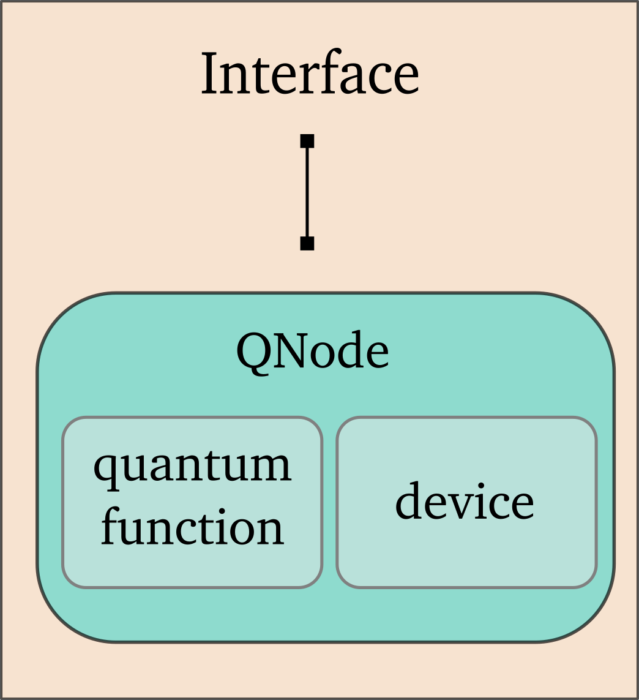

 .. role:: html(raw)
   :format: html

.. _pl_intro:

Introduction
============

This section is an introduction to how the concept of a :ref:`variational quantum circuit <varcirc>`
is implemented in PennyLane.

It shows new PennyLane users how to:

- Construct quantum circuits via **quantum functions**
- Define **computational devices**
- Combine quantum functions and devices to **quantum nodes**
- Conveniently create quantum nodes using the quantum node **decorator**
- Find out more about **interfaces** to use with quantum nodes

More information about PennyLane's code base can be found in the
:ref:`Code Documentation <library_overview>`.
An introduction of how to use and optimize quantum nodes in larger hybrid computations
is given in the section on :ref:`Interfaces <intro_interfaces>`, and tutorials for different levels of users
are provided in the :ref:`Tutorials <intro_tutorials>` section.

Quantum functions
-----------------

A quantum circuit is constructed as a special Python function, a *quantum circuit function*, or *quantum function* in short.
For example:

.. code-block:: python

    import pennylane as qml

    def my_quantum_function(x, y):
        qml.RZ(x, wires=0)
        qml.CNOT(wires=[0,1])
        qml.RY(y, wires=1)
        return qml.expval(qml.PauliZ(1))

Quantum functions are a restricted subset of Python functions, adhering to the following
constraints:

* The body of the function must consist of only supported PennyLane
  :mod:`operations <pennylane.ops>` or sequences of operations called :mod:`templates <pennylane.templates>`, using one instruction per line.

* The function must always return either a single or a tuple of
  *measured observable values*, by applying a :mod:`measurement function <pennylane.measure>`
  to an :mod:`observable <pennylane.ops>`.

* Classical processing of function arguments, either by arithmetic operations
  or external functions, is not allowed. One current exception is simple scalar
  multiplication.

.. note::

    The quantum operations cannot be used outside of a quantum circuit function, as all
    :class:`Operations <pennylane.operation.Operation>` require a QNode in order to perform queuing on initialization.

.. note::

    Measured observables **must** come after all other operations at the end
    of the circuit function as part of the return statement, and cannot appear in the middle.

Defining a device
-----------------

To run - and later optimize - a quantum circuit, one needs to first specify a *computational device*.

The device is an instance of the :class:`~_device.Device`
class, and can represent either a simulator or hardware device. They can be
instantiated using the :func:`~device` loader. 

.. code-block:: python

    dev = qml.device('default.qubit', wires=2)

PennyLane offers some basic devices such as
some basic devices such as the ``'default.qubit'`` simulator; additional devices can be installed
as plugins (see :ref:`plugins` for more details). Note that the choice of a device significantly
determines the speed of your computation.

Quantum nodes
-------------

Together, a quantum function and a device are used to create a *quantum node* or
:class:`QNode` object, which wraps the quantum function and binds it to the device.

A `QNode` can be explicitly created as follows:

.. code-block:: python

    qnode = qml.QNode(my_quantum_function, dev)

The `QNode` can be used to compute the result of a quantum circuit as if it was a standard Python
function. It takes the same arguments as the original quantum function:

>>> qnode(np.pi/4, 0.7)
0.7648421872844883

The QNode decorator
-------------------

A more convenient - and in fact the recommended - way for creating `QNodes` is the provided
quantum node decorator. This decorator converts a quantum function containing PennyLane quantum
operations to a :mod:`QNode <pennylane.qnode>` that will run on a quantum device.

.. note::
    The decorator completely replaces the Python-defined function with
    a :mod:`QNode <pennylane.qnode>` of the same name - as such, the original
    function is no longer accessible (but is accessible via the :attr:`~.QNode.func` attribute).

For example:

.. code-block:: python

    dev = qml.device('default.qubit', wires=2)

    @qml.qnode(dev)
    def qfunc(x):
        qml.RZ(x, wires=0)
        qml.CNOT(wires=[0,1])
        qml.RY(x, wires=1)
        return qml.expval(qml.PauliZ(0))

    result = qfunc(0.543)

Using QNodes
------------

Quantum nodes are typically used in :ref:`hybrid computations <hybrid_computation>`. That means
that results of `QNodes` are further processed in classical functions, and that results from
classical functions are fed into `QNodes`. The framework in which the `classical parts` of the
hybrid computation are written is the *interface* with which PennyLane is used.

In the above introduction to quantum nodes, we implicitly already used the default interface
- the :ref:`NumPy interface <numpy_interface>`.
NumPy-interfacing quantum nodes take NumPy datastructures, such as floats and arrays, and return
similar data structures. They can be optimized using NumPy-based :ref:`optimization methods <optimize>`.
Other PennyLane interfaces are :ref:`PyTorch <torch_interf>` and :ref:`TensorFlow's Eager
mode <tf_interf>`.

