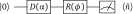

.. role:: html(raw)
   :format: html

.. _photon_redirection:

Basic tutorial: Gaussian transformation
=======================================

This tutorial demonstrates the basic working principles of PennyLane for continuous-variable (CV) photonic devices. For more details about photonic quantum computing, the `Strawberry Fields documentation <https://strawberryfields.readthedocs.io/en/latest/>`_
is a great starting point.

The quantum circuit
-------------------

For this basic tutorial, we will consider a special subset of CV operations: the *Gaussian transformations*. We work with the following simple Gaussian circuit: 

:html:` `

:html:` `

What is this circuit doing?

1. **We begin with one wire (qumode) in the vacuum state**. Note that we use the same notation :math:`|0\rangle` for the initial state as the previous qubit tutorial. In a photonic CV system, this state is the *vacuum state*, i.e., the state with no photons in the wire. 

2. **We displace the qumode**. The displacement gate linearly shifts the state of the qumode in phase space. The vacuum state is centered at the origin in phase space, while the displaced state will be centered at the point :math:`\alpha`. 

3. **We rotate the qumode**. This is another linear transformation in phase space, albeit a rotation (by angle :math:`\phi`) instead of a displacement.

4. **Finally, we measure the mean photon number** :math:`\langle\hat{n}\rangle = \langle\ad\a\rangle`. This quantity, which tells us the average amount of photons in the final state, is proportional to the energy of the photonic system. 

The aim of this tutorial is to optimize the circuit parameters :math:`(\alpha, \phi)` such that the mean photon number is equal to one. The rotation gate is actually a *passive transformation*, meaning that it does not change the energy of the system. The displacement gate is an *active transformation*, which modifies the energy of the photonic system.

Constructing the QNode
----------------------

As before, we import PennyLane, as well as the wrapped version of NumPy provided by PennyLane:

.. code-block:: python

    import pennylane as qml
    from pennylane import numpy as np

Next, we instantiate a device which will be used to evaluate the circuit. Because our circuit contains only Gaussian operations, we can make use of the built-in ``default.gaussian`` device.

.. code:: python

    dev_gaussian = qml.device('default.gaussian', wires=1)

After initializing the device, we can construct our quantum node. As before, we use the
:mod:`qnode decorator <pennylane.decorator>` to convert our quantum function (encoded by the circuit above) into a quantum node running on the ``default.gaussian`` device.

.. code-block:: python

    @qml.qnode(dev_gaussian)
    def mean_photon_gaussian(mag_alpha, phase_alpha, phi):
        qml.Displacement(mag_alpha, phase_alpha, wires=0)
        qml.Rotation(phi, wires=0)
        return qml.expval.MeanPhoton(0)
        
Notice that we have broken up the complex number :math:`\alpha` into two real numbers ``mag_alpha`` and ``phase_alpha``, which form a polar representation of :math:`\alpha`. This is so that the notion of a gradient is clear and well-defined. 

Optimization
------------

As in the :ref:`qubit rotation <qubit_rotation>` tutorial, let's now use one of the built-in PennyLane optimizers in order to optimize the quantum circuit towards the desired output. We want the mean photon number to be exactly one, so we will use a squared-difference cost function:

.. code-block:: python

    def cost(params):
        return (mean_photon_gaussian(params[0], params[1], params[2]) - 1.) ** 2

At the beginning of the optimization, we choose arbitrary small initial parameters:

>>> init_params = [0.015, 0.02, 0.005]
>>> cost(init_params)
0.9995500506249999

When the gate parameters are near to zero, the gates are close to the identity transformation, which leaves the initial state largely unchanged. Since the initial state contains no photons, the mean photon number of the circuit output is approximately zero, and the cost is close to one. 

.. note:: We avoided initial parameters which are exactly zero because that corresponds to a critical point with zero gradient.

Now, let's use the :class:`~.GradientDescentOptimizer`, and update the circuit parameters over 100 optimization steps.

.. code-block:: python

    # initialise the optimizer
    op = qml.GradientDescentOptimizer(stepsize=0.1)

    # set the number of steps
    steps = 20
    # set the initial parameter values
    params = init_params

    for i in range(steps):
        # update the circuit parameters
        params = op.step(cost, params)

        print('Cost after step {:5d}: {:8f}'.format(i+1, cost(params)) )

    print('Optimized mag_alpha:{:8f}'.format(params[0]))
    print('Optimized phase_alpha:{:8f}'.format(params[1]))
    print('Optimized phi:{:8f}'.format(params[2]))

Try this yourself — the optimization should converge after about 20 steps to a cost function value of zero, corresponding to the following final values for the parameters:

.. code-block:: python

    Optimized mag_alpha: 0.999994
    Optimized phase_alpha: 0.020000
    Optimized phi: 0.00500000

We observe that the two angular parameters ``phase_alpha`` and ``phi`` do not change during the optimization. Only the magnitude of the complex displacement :math:`|\alpha|` affects the mean photon number of the circuit. 

