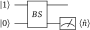

.. role:: html(raw)
   :format: html

.. _photon_redirection_tutorial:

Photon redirection and hybrid computation
=========================================

This tutorial demonstrates the basic working principles of OpenQML for
continuous-variable (CV) devices, introduces plugins, and finishes with a combined qubit-CV-classical hybrid computation. Be sure to read through the introductory :ref:`qubit rotation <qubit_rotation>` tutorial before attempting this tutorial.

.. note::

    This tutorial requires the `OpenQML-SF plugin <https://github.com/XanaduAI/openqml-sf>`_, in order to access the `Strawberry Fields <https://github.com/XanaduAI/strawberryfields>`_ Fock backend using OpenQML. It can be installed via pip:

    .. code-block:: bash

        pip install openqml-sf

The quantum circuit
-------------------

In photon redirection, we have the following simple quantum circuit:

:html:` `

:html:` `

Breaking this down, step-by-step:

1. **We start the computation with two subsystems or qumodes**. In OpenQML, we use the shorthand 'wires' to refer to subsystems, whether they are qumodes, qubits, or any other form of quantum register.

2. **Prepare the state** :math:`\ket{1,0}`. That is, the first wire (wire 0) is prepared in a single photon state, while the second wire (wire 1) is prepared in the vacuum state.

3. **Both wires are then incident on a beamsplitter**, with trainable parameters :math:`\theta` and :math:`\phi`.

   Here, we use the convention that the beamsplitter transmission amplitude is :math:`t=\cos\theta`, and the reflection amplitude is :math:`r=e^{i\phi}\sin\theta`. See :ref:`operations` for a full list of operation conventions.

4. **Finally, we measure the photon number expectation value** :math:`\braket{\hat{n}}` of the second wire, where

   .. math:: \hat{n} = \frac{\x^2+\p^2}{2\hbar} - \frac{1}{2}, ~~ \hat{n}\ket{n} = n\ket{n}

   is the number operator.

The aim of this tutorial is to optimize the beamsplitter parameters :math:`(\theta, \phi)` such that the expected photon number of the second wire is **maximized**. Since the beamsplitter is a passive optical element that preserves the total photon number, this corresponds to the output state :math:`\ket{0,1}` - the incident photon from the first wire has been 'redirected' to the second wire.

.. _photon_redirection_calc:

Exact calculation
~~~~~~~~~~~~~~~~~

We can also consider what happens quantitatively. The initial state of the circuit is :math:`\ket{\psi_0}=\ket{1,0}`, and the output state of the system is of the form :math:`\ket{\psi} = a\ket{1, 0} + b\ket{0,1}`, where :math:`|a|^2+|b|^2=1`. We may thus write the output state as a vector in this computational basis, :math:`\ket{\psi} = \begin{bmatrix}a & b\end{bmatrix}^T`.

The beamsplitter acts on this two-dimensional subspace as follows:

.. math::
    \ket{\psi} = B(\theta, \phi)\ket{1, 0} = \begin{bmatrix}
        \cos\theta & -e^{-i\phi}\sin\theta\\
        e^{i\phi}\sin\theta & \cos\theta
    \end{bmatrix}\begin{bmatrix} 1\\ 0\end{bmatrix} = \begin{bmatrix}
        \cos\theta\\
        e^{i\phi} \sin\theta
    \end{bmatrix}

Furthermore, the number operator acting on the second wire in this computational basis is given by :math:`\hat{n}_1=\ket{0,1}\bra{0,1}`. As a result, the mean photon number of the second wire is

.. math::
    \braket{\hat{n}_1} = \braketT{\psi}{\hat{n}_1}{\psi} = |e^{i\phi} \sin\theta|^2 \braketT{0,1}{\hat{n}_1}{0,1} = \sin^2 \theta.

Therefore, we can see that:

1. :math:`0\leq \braket{\hat{n}_1}\leq 1`: the output of the quantum circuit is bound between 0 and 1;

2. :math:`\frac{\partial}{\partial \phi} \braket{\hat{n}_1}=0`: the output of the quantum circuit is independent of the beamsplitter phase :math:`\phi`;

3. The output of the quantum circuit above is maximised when :math:`\theta=(2m+1)\pi/2` for :math:`m\in\mathbb{Z}_0`.

Loading the plugin device
-------------------------

While OpenQML provides a basic qubit simulator (``'default.qubit'``) and a basic CV Gaussian simulator (``'default.gaussian'``), the true power of OpenQML comes from its :ref:`plugin ecosystem <plugins>`, allowing it to access and run on an array of quantum simulators and hardware.

In this tutorial, we will be using the ``'strawberryfields.fock'`` device to construct a QNode; allowing the underlying quantum computation to be performed using the `Strawberry Fields <https://github.com/XanaduAI/strawberryfields>`_ Fock backend.

As before, we import OpenQML, as well as the wrapped version of NumPy provided by OpenQML:

.. code-block:: python

    import openqml as qm
    from openqml import numpy as np

Next, we create a device to run the quantum node. This is easy in OpenQML; as soon as the OpenQML-SF plugin is installed, the ``'strawberryfields.fock'`` device can be loaded - no additional commands or library imports required.

.. code:: python

    dev_fock = qm.device('strawberryfields.fock', wires=2, cutoff_dim=10)

Compared to the default devices provided with OpenQML, the ``'strawberryfields.fock'`` device requires the additional keyword argument:

* ``cutoff_dim``: the Fock space truncation used to perform the quantum simulation.

.. note::

    Devices provided by external plugins may require additional arguments and keyword arguments - consult the plugin documentation for more details.

Constructing the QNode
----------------------

Now that we have initialized our device, we can construct our quantum node. As before, we use the :mod:`qnode decorator <openqml.decorator>` to convert our quantum function (representing the circuit above) into a quantum node running on Strawberry Fields.

.. code-block:: python

    @qm.qnode(dev_fock)
    def photon_redirection(params):
        qm.FockState(1, wires=0)
        qm.Beamsplitter(params[0], params[1], wires=[0, 1])
        return qm.expval.PhotonNumber(1)

The ``'strawberryfields.fock'`` device supports all CV operations provided by OpenQML; see the following pages for a full list of :ref:`CV operations <cv_ops>` and :ref:`CV expectations <cv_expval>` in OpenQML.

Optimization
------------

As in the :ref:`qubit rotation <qubit_rotation>` tutorial, let's now use one of the built in OpenQML optimizers in order to achieve photon redirection. Since we wish to maximize the mean photon number of the second wire, we can define our cost function to minimize the *negative* of the circuit output.

.. code-block:: python

    def cost(params):
        return -photon_redirection(params)

To begin our optimization, let's choose the following initial values of :math:`\theta` and :math:`\phi`:

>>> init_params = np.array([0.01, 0.01])
>>> cost(init_params)
-9.999666671111085e-05

Here, we choose the values of :math:`\theta` and :math:`\phi` to be very close to zero; this results in :math:`B(\theta,\phi)\approx I`, and the output of the quantum circuit will be very close to :math:`\ket{1, 0}` - i.e., the circuit leaves the photon in the first mode.

.. note::

    Why don't we choose :math:`\theta=0` and :math:`\phi=0`?

    At this point in the parameter space, :math:`\braket{\hat{n}_1} = 0`, and :math:`\frac{d}{d\theta}\braket{\hat{n}_1}|_{\theta=0}=2\sin\theta\cos\theta|_{\theta=0}=0`. Since the gradient is zero at our initial parameter values, our optimization algorithm will never descent from the maximum!

    This can also be verified directly using OpenQML:

    >>> dcircuit = qm.grad(circuit)
    >>> dphoton_redirection([0., 0.])
    [0.0, 0.0]

Now, let's again choose the simple :class:`~.GradientDescentOptimizer`, and update the circuit parameters over 100 optimization steps.

.. code-block:: python3

    # initialise the optimizer
    op = qm.GradientDescentOptimizer(stepsize=0.4)

    # set the number of steps
    steps = 100
    # set the initial parameter values
    params = init_params

    for i in range(steps):
        # update the circuit parameters
        params = op.step(cost, params)

        if (i+1) % 5 == 0:
            print('Cost after step {:5d}: {: .7f}'.format(i+1, cost(params)) )

    print('\nOptimized rotation angles: {}'.format(params))

Have a go running this yourself - the optimization should converge quickly, giving the following optimum values of :math:`\theta` and :math:`\phi`:

.. code-block:: python

    Optimized rotation angles: [ 1.57079633  0.01      ]

Comparing this to the :ref:`exact calculation <photon_redirection_calc>` above, this is close to the exact optimum value of :math:`\theta=\pi/2`, while the value of :math:`\phi` has not changed - consistent with the knowledge that :math:`\braket{\hat{n}_1}` is independent of :math:`\phi`.

Hybrid computation
------------------

To really highlight the capabilities of OpenQML, let's now combine the qubit-rotation QNode from the :ref:`qubit rotation tutorial <qubit_rotation>` with the CV photon-redirection QNode from above, as well as some classical processing, to produce a truly hybrid computational model.

First, let's define our three nodes of the computation; two quantum nodes (the qubit rotation and photon redirection circuits, running on the ``'default.qubit'`` and ``'strawberryfields.fock'`` devices respectively), along with a classical node, that simply returns the absolute value squared of two inputs using NumPy:

.. code-block:: python

    # create the devices
    dev_qubit = qm.device('default.qubit', wires=1)
    dev_fock = qm.device('strawberryfields.fock', wires=2, cutoff_dim=10)

    @qm.qnode(dev_qubit)
    def qubit_rotation(phi1, phi2):
        """Qubit rotation QNode"""
        qm.RX(phi1, wires=0)
        qm.RY(phi2, wires=0)
        return qm.expval.PauliZ(0)

    @qm.qnode(dev_fock)
    def photon_redirection(params):
        """The photon redirection QNode"""
        qm.FockState(1, wires=0)
        qm.Beamsplitter(params[0], params[1], wires=[0, 1])
        return qm.expval.PhotonNumber(1)

    def absolute_difference(x, y):
        """Classical node to compute the absolute
        difference squared between two inputs"""
        return np.abs(x-y)**2

Now, we can define the cost function associated with the optimization, linking together our three nodes. Here, we wish to perform the following hybrid quantum-classical optimization:

1. Qubit rotation will be performed with some fixed rotation angles :math:`\phi_1` and :math:`\phi_2`.

2. Photon redirection will be performed with two trainable circuit parameters, the beamsplitter angles :math:`\theta` and :math:`\phi`.

3. The outputs of both QNodes will then be fed into the classical node, returning the absolute difference squared of the two quantum functions.

4. Finally, the optimizer will calculate the gradient of the hybrid computational graph with respect to the trainable parameters :math:`\theta` and :math:`\phi`, and perform a single optimization step, updating the values of :math:`\theta` and :math:`\phi`.

In essence, we are optimizing the photon redirection quantum function to return the *same expectation value* as the qubit rotation circuit, for our fixed values of :math:`\phi_1` and :math:`\phi_2`.

We can translate this computational graph to the following cost function, which combines the three nodes in the computation as described above. Below, we choose default values :math:`\phi_1=0.5`, :math:`\phi_2=0.1`:

.. code-block:: python

    def cost(params, phi1=0.5, phi2=0.1):
        """Returns the absolute difference squared between
        the photon redirection and qubit rotation QNodes, for
        fixed values of the qubit rotation angles phi1 and phi2"""
        qubit_result = qubit_rotation(phi1, phi2)
        photon_result = photon_redirection(params)
        return absolute_difference(qubit_result, photon_result)

Now, we simply use the built in :class:`~.GradientDescentOptimizer` to perform the optimization for 100 steps. As before, we choose initial beamsplitter parameters of :math:`\theta=0.01`, :math:`\phi=0.01`.

.. code-block:: python

    # initialise the optimizer
    op = qm.GradientDescentOptimizer(stepsize=0.4)

    # set the number of steps
    steps = 100
    # set the initial parameter values
    params = np.array([0.01, 0.01])

    for i in range(steps):
        # update the circuit parameters
        params = op.step(cost, params)

        if (i+1) % 5 == 0:
            print('Cost after step {:5d}: {: .7f}'.format(i+1, cost(params)) )

    print('\nOptimized rotation angles: {}'.format(params))

Running the above returns the following result:

.. code-block:: python

    Optimized rotation angles: [ 1.20671364  0.01      ]

Indeed, substituting this into the photon redirection QNode shows that it now produces the same output as the qubit rotation QNode:

>>> result = [1.20671364, 0.01]
>>> photon_redirection(result)
0.8731983021146449
>>> qubit_rotation(0.5, 0.1)
0.8731983044562817
