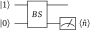
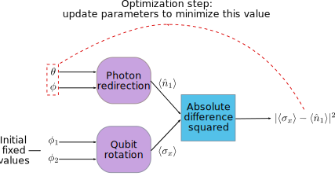

.. role:: html(raw)
   :format: html

.. _plugins_hybrid:

Plugins and Hybrid computation
==============================

This tutorial introduces the notion of hybrid computation by combining several PennyLane plugins. We first introduce PennyLane's `Strawberry Fields plugin <https://github.com/XanaduAI/pennylane-sf>`_ and use it to explore a non-Gaussian photonic circuit. We then combine this photonic circuit with a qubit circuit — along with some classical processing — to create and optimize a fully hybrid computation.
Be sure to read through the introductory :ref:`qubit rotation <qubit_rotation>` and :ref:`Gaussian transformation <gaussian_transformation>` tutorials before attempting this tutorial.

.. note::

    To follow along with this tutorial on your own computer, you will require the `PennyLane-SF plugin <https://github.com/XanaduAI/pennylane-sf>`_, in order to access the
    `Strawberry Fields <https://github.com/XanaduAI/strawberryfields>`_ Fock backend using PennyLane. It can be installed via pip:

    .. code-block:: bash

        pip install pennylane-sf

A non-Gaussian circuit
----------------------

We first consider a photonic circuit which is similar in spirit to the :ref:`qubit rotation <qubit_rotation>` circuit:

:html:` `

:html:` `

Breaking this down, step-by-step:

1. **We start the computation with two qumode subsystems**. In PennyLane, we use the shorthand 'wires' to refer to quantum subsystems, whether they are qumodes, qubits, or any other kind of quantum register.

2. **Prepare the state** :math:`\ket{1,0}`. That is, the first wire (wire 0) is prepared in a single-photon state, while the second
   wire (wire 1) is prepared in the vacuum state. The former state is non-Gaussian, necessitating the use of the ``strawberryfields.fock`` backend device.

3. **Both wires are then incident on a beamsplitter**, with free parameters :math:`\theta` and :math:`\phi`.
   Here, we have the convention that the beamsplitter transmission amplitude is :math:`t=\cos\theta`, and the reflection amplitude is
   :math:`r=e^{i\phi}\sin\theta`. See :ref:`operations` for a full list of operation conventions.

4. **Finally, we measure the mean photon number** :math:`\braket{\hat{n}}` of the second wire, where

   .. math:: \hat{n} = \ad\a

   is the number operator, acting on the Fock basis number states, such that :math:`\hat{n}\ket{n} = n\ket{n}`.

The aim of this tutorial is to optimize the beamsplitter parameters :math:`(\theta, \phi)` such that the expected photon number of
the second wire is **maximized**. Since the beamsplitter is a passive optical element that preserves the total photon number, this
corresponds to the output state :math:`\ket{0,1}` — i.e., when the incident photon from the first wire has been 'redirected' to the second wire.

.. _photon_redirection_calc:

Exact calculation
~~~~~~~~~~~~~~~~~

To compare with later numerical results, we can first consider what happens analytically. The initial state of the circuit is
:math:`\ket{\psi_0}=\ket{1,0}`, and the output state of the system is of the form :math:`\ket{\psi} = a\ket{1, 0} + b\ket{0,1}`,
where :math:`|a|^2+|b|^2=1`. We may thus write the output state as a vector in this computational basis,
:math:`\ket{\psi} = \begin{bmatrix}a & b\end{bmatrix}^T`.

The beamsplitter acts on this two-dimensional subspace as follows:

.. math::
    \ket{\psi} = B(\theta, \phi)\ket{1, 0} = \begin{bmatrix}
        \cos\theta & -e^{-i\phi}\sin\theta\\
        e^{i\phi}\sin\theta & \cos\theta
    \end{bmatrix}\begin{bmatrix} 1\\ 0\end{bmatrix} = \begin{bmatrix}
        \cos\theta\\
        e^{i\phi} \sin\theta
    \end{bmatrix}

Furthermore, the mean photon number of the second wire is

.. math::
    \braket{\hat{n}_1} = \braketT{\psi}{\hat{n}_1}{\psi} = |e^{i\phi} \sin\theta|^2 \braketT{0,1}{\hat{n}_1}{0,1} = \sin^2 \theta.

Therefore, we can see that:

1. :math:`0\leq \braket{\hat{n}_1}\leq 1`: the output of the quantum circuit is bound between 0 and 1;

2. :math:`\frac{\partial}{\partial \phi} \braket{\hat{n}_1}=0`: the output of the quantum circuit is independent of the beamsplitter
   phase :math:`\phi`;

3. The output of the quantum circuit above is maximised when :math:`\theta=(2m+1)\pi/2` for :math:`m\in\mathbb{Z}_0`.

Loading the plugin device
-------------------------

While PennyLane provides a basic qubit simulator (``'default.qubit'``) and a basic CV Gaussian simulator (``'default.gaussian'``),
the true power of PennyLane comes from its :ref:`plugin ecosystem <plugins>`, allowing quantum computations to be run on a variety
of quantum simulator and hardware devices.

For this circuit, we will be using the ``'strawberryfields.fock'`` device to construct a QNode. This allows the underlying quantum
computation to be performed using the `Strawberry Fields <https://github.com/XanaduAI/strawberryfields>`_ Fock backend.

As usual, we begin by importing PennyLane and the wrapped version of NumPy provided by PennyLane:

.. code-block:: python

    import pennylane as qml
    from pennylane import numpy as np

Next, we create a device to run the quantum node. This is easy in PennyLane; as soon as the PennyLane-SF plugin is installed, the
``'strawberryfields.fock'`` device can be loaded — no additional commands or library imports required.

.. code:: python

    dev_fock = qml.device('strawberryfields.fock', wires=2, cutoff_dim=2)

Compared to the default devices provided with PennyLane, the ``'strawberryfields.fock'`` device requires the additional keyword argument:

* ``cutoff_dim``: the Fock space truncation used to perform the quantum simulation

.. note::

    Devices provided by external plugins may require additional arguments and keyword arguments — consult the plugin
    documentation for more details.

Constructing the QNode
----------------------

Now that we have initialized the device, we can construct our quantum node. Like the other tutorials, we use the 
:mod:`qnode decorator <pennylane.decorator>` to convert our quantum function (encoded by the circuit above) into a quantum node
running on Strawberry Fields.

.. code-block:: python

    @qml.qnode(dev_fock)
    def photon_redirection(params):
        qml.FockState(1, wires=0)
        qml.Beamsplitter(params[0], params[1], wires=[0, 1])
        return qml.expval.MeanPhoton(1)

The ``'strawberryfields.fock'`` device supports all CV objects provided by PennyLane; see :ref:`CV operations <cv_ops>`
and :ref:`CV expectations <cv_expval>`.

Optimization
------------

Let's now use one of the built-in PennyLane optimizers in order to
carry out photon redirection. Since we wish to maximize the mean photon number of the second wire, we can define our cost function
to minimize the *negative* of the circuit output.

.. code-block:: python

    def cost(params):
        return -photon_redirection(params)

To begin our optimization, let's choose the following small initial values of :math:`\theta` and :math:`\phi`:

>>> init_params = np.array([0.01, 0.01])
>>> cost(init_params)
-9.999666671111085e-05

Here, we choose the values of :math:`\theta` and :math:`\phi` to be very close to zero; this results in :math:`B(\theta,\phi)\approx I`,
and the output of the quantum circuit will be very close to :math:`\ket{1, 0}` — i.e., the circuit leaves the photon in the first mode.

.. note::

    Why don't we choose :math:`\theta=0` and :math:`\phi=0`?

    At this point in the parameter space, :math:`\braket{\hat{n}_1} = 0`, and
    :math:`\frac{d}{d\theta}\braket{\hat{n}_1}|_{\theta=0}=2\sin\theta\cos\theta|_{\theta=0}=0`.
    Since the gradient is zero at those initial parameter values, the optimization algorithm would never descend from the maximum.

    This can also be verified directly using PennyLane:

    >>> dphoton_redirection = qml.grad(photon_redirection, argnum=0)
    >>> dphoton_redirection([0., 0.])
    [0.0, 0.0]

Now, let's use the :class:`~.GradientDescentOptimizer`, and update the circuit parameters over 100 optimization steps.

.. code-block:: python

    # initialise the optimizer
    op = qml.GradientDescentOptimizer(stepsize=0.4)

    # set the number of steps
    steps = 100
    # set the initial parameter values
    params = init_params

    for i in range(steps):
        # update the circuit parameters
        params = op.step(cost, params)

        if (i+1) % 5 == 0:
            print('Cost after step {:5d}: {: .7f}'.format(i+1, cost(params)) )

    print('Optimized rotation angles: {}'.format(params))

Try this yourself — the optimization should converge quickly, giving the following values of
:math:`\theta` and :math:`\phi`:

.. code-block:: python

    Optimized rotation angles: [ 1.57079633  0.01      ]

Comparing this to the :ref:`exact calculation <photon_redirection_calc>` above, this is close to the exact optimum value
of :math:`\theta=\pi/2`, while the value of :math:`\phi` has not changed — consistent with the fact that :math:`\braket{\hat{n}_1}`
is independent of :math:`\phi`.

.. _hybrid_computation_example:

Hybrid computation
------------------

To really highlight the capabilities of PennyLane, let's now combine the qubit-rotation QNode from the
:ref:`qubit rotation tutorial <qubit_rotation>` with the CV photon-redirection QNode from above, as well as some classical processing,
to produce a truly hybrid computational model.

First, we define a computation consisting of three steps: two quantum nodes (the qubit rotation and photon redirection circuits,
running on the ``'default.qubit'`` and ``'strawberryfields.fock'`` devices, respectively), along with a classical function, that simply
returns the squared difference of its two inputs using NumPy:

.. code-block:: python

    # create the devices
    dev_qubit = qml.device('default.qubit', wires=1)
    dev_fock = qml.device('strawberryfields.fock', wires=2, cutoff_dim=10)

    @qml.qnode(dev_qubit)
    def qubit_rotation(phi1, phi2):
        """Qubit rotation QNode"""
        qml.RX(phi1, wires=0)
        qml.RY(phi2, wires=0)
        return qml.expval.PauliZ(0)

    @qml.qnode(dev_fock)
    def photon_redirection(params):
        """The photon redirection QNode"""
        qml.FockState(1, wires=0)
        qml.Beamsplitter(params[0], params[1], wires=[0, 1])
        return qml.expval.MeanPhoton(1)

    def squared_difference(x, y):
        """Classical node to compute the squared
        difference between two inputs"""
        return np.abs(x-y)**2

Now, we can define an objective function associated with the optimization, linking together our three subcomponents. Here, we wish to
perform the following hybrid quantum-classical optimization:

:html:` `

:html:` `

1. The qubit-rotation circuit will contain fixed rotation angles :math:`\phi_1` and :math:`\phi_2`.

2. The photon-redirection circuit will contain two free parameters, the beamsplitter angles :math:`\theta` and :math:`\phi`,
   which are to be optimized.

3. The outputs of both QNodes will then be fed into the classical node, returning the squared difference of the two
   quantum functions.

4. Finally, the optimizer will calculate the gradient of the entire computation with respect to the free parameters
   :math:`\theta` and :math:`\phi`, and update their values.

In essence, we are optimizing the photon-redirection circuit to return the **same expectation value** as the qubit-rotation
circuit, even though they are two completely independent quantum systems.

We can translate this computational graph to the following function, which combines the three nodes into a single hybrid computation.
Below, we choose default values :math:`\phi_1=0.5`, :math:`\phi_2=0.1`:

.. code-block:: python

    def cost(params, phi1=0.5, phi2=0.1):
        """Returns the squared difference between
        the photon-redirection and qubit-rotation QNodes, for
        fixed values of the qubit rotation angles phi1 and phi2"""
        qubit_result = qubit_rotation(phi1, phi2)
        photon_result = photon_redirection(params)
        return squared_difference(qubit_result, photon_result)

Now, we use the built-in :class:`~.GradientDescentOptimizer` to perform the optimization for 100 steps. As before, we choose
initial beamsplitter parameters of :math:`\theta=0.01`, :math:`\phi=0.01`.

.. code-block:: python

    # initialise the optimizer
    op = qml.GradientDescentOptimizer(stepsize=0.4)

    # set the number of steps
    steps = 100
    # set the initial parameter values
    params = np.array([0.01, 0.01])

    for i in range(steps):
        # update the circuit parameters
        params = op.step(cost, params)

        if (i+1) % 5 == 0:
            print('Cost after step {:5d}: {: .7f}'.format(i+1, cost(params)))

    print('Optimized rotation angles: {}'.format(params))

Running the code above returns the following result:

.. code-block:: python

    Optimized rotation angles: [ 1.20671364  0.01      ]

Indeed, substituting this into the photon redirection QNode shows that it now produces the same output as the qubit rotation QNode:

>>> result = [1.20671364, 0.01]
>>> photon_redirection(result)
0.8731983021146449
>>> qubit_rotation(0.5, 0.1)
0.8731983044562817

This is just a simple example of the kind of hybrid computation that can be carried out in PennyLane. Quantum nodes (bound to different devices) and classical functions can be combined in many different and interesting ways. 
