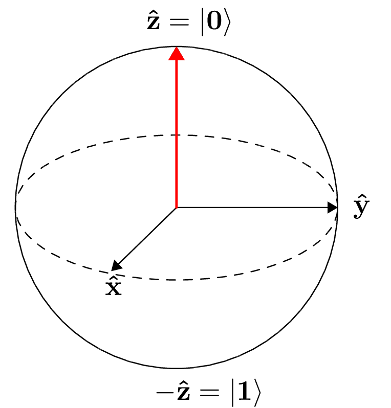
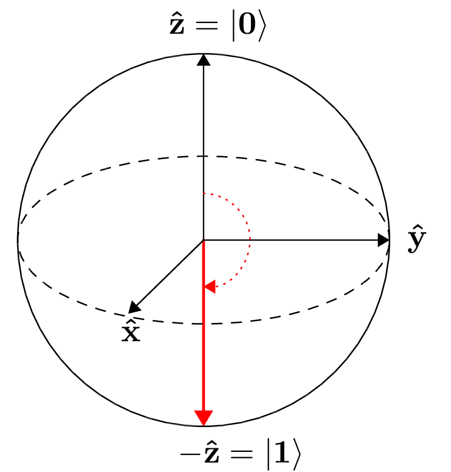

Qubit rotation
==============

This tutorial demonstrates PennyLane's "hello-world" example for
qubit-based architectures with the projectq backend.

The task is to optimize two rotation gates in order to flip a single
qubit from state :math:`\ket{0}` to state :math:`\ket{1}`.

Imports
-------

First we need to import openqml, as well as openqml's version of numpy.
This allows us to automatically compute gradients for functions that
manipulate numpy arrays, including quantum functions. We also want to
compare two optimizers, basic gradient descent and adagrad.

.. code-block:: python

    import openqml as qm
    from openqml import numpy as np
    from openqml.optimize import GradientDescentOptimizer, AdagradOptimizer

Next, create a projecq simulator as a "device" to run the quantum node.
We only need a single quantum wire.

.. code-block:: python

    dev = qm.device('projectq.simulator', wires=1)

Quantum node
------------

We define a quantum node called "circuit". The decorator
``qm.qfunc(dev1)`` that saves us to create a quantum node via
``circuit = qm.qnode.QNode(circuit, dev)``.

.. code-block:: python

    @qm.qnode(dev)
    def circuit(vars):

        qm.RX(vars[0], [0])
        qm.RY(vars[1], [0])

        return qm.expval.PauliZ(0)

This function uses openqml to run the following quantum circuit:

.. raw:: html

     

.. figure:: figures/rotation_circuit.png
    :align: center
    :width: 100%
    :target: javascript:void(0);

.. raw:: html

     

Starting with a qubit in the ground state,

.. math::  |0\rangle = \begin{pmatrix}1 \\ 0 \end{pmatrix},

we first rotate the qubit around the x-axis by

.. math::

   R_x(v_1) = e^{-iv_1 X /2} =
   \begin{pmatrix} \cos \frac{v_1}{2} &  -i \sin \frac{v_1}{2} \\
                   -i \sin \frac{v_1}{2} &  \cos \frac{v_1}{2}
   \end{pmatrix},

and then around the y-axis by

.. math::

    R_y(v_2) = e^{-i v_2 Y/2} =
   \begin{pmatrix} \cos \frac{v_2}{2} &  - \sin \frac{v_2}{2} \\
                   \sin \frac{v_2}{2} &  \cos \frac{v_2}{2}
   \end{pmatrix}.

After these operations the qubit is in the state

.. math::  | \psi \rangle = R_y(v_1) R_x(v_2) | 0 \rangle

Finally, we measure the expectation :math:`\langle \psi \mid Z \mid \psi \rangle` of the Pauli-Z operator

.. math::

   Z =
   \begin{pmatrix} 1 &  0 \\
                   0 & -1
   \end{pmatrix}.

Depending on the circuit parameters :math:`v_1` and :math:`v_2`, the
output expectation lies between :math:`1` (if :math:`\ket{\psi} = \ket{0}`)
and :math:`-1` (if :math:`\ket{\psi} = \ket{1}`).

Objective
---------

Next, we define a cost. Here, the cost is directly the expectation of
the PauliZ measurement, so that the cost is trivially the output of the
circuit.

.. code-block:: python

    def objective(vars):
        return circuit(vars)

With this objective, the optimization procedure is supposed to find the
weights that rotate the qubit from the ground state

.. raw:: html

     

.. raw:: html

     

to the excited state

.. raw:: html

     

.. raw:: html

     

The rotation gates give the optimization landscape a trigonometric shape
with four global minima and five global maxima.

*Note: To run the following cell you need the matplotlib library.*

.. code-block:: python

    import matplotlib.pyplot as plt
    from mpl_toolkits.mplot3d import Axes3D
    from matplotlib import cm
    from matplotlib.ticker import MaxNLocator

    fig = plt.figure(figsize = (6, 4))
    ax = fig.gca(projection='3d')

    X = np.arange(-3.1, 3.1, 0.2)
    Y = np.arange(-3.1, 3.1, 0.2)
    length = len(X)
    xx, yy = np.meshgrid(X, Y)
    Z = np.array([[objective([x, y]) for x in X] for y in Y]).reshape(length, length)
    surf = ax.plot_surface(xx, yy, Z, cmap=cm.coolwarm, antialiased=False)

    ax.set_xlabel("v1")
    ax.set_ylabel("v2")
    ax.zaxis.set_major_locator(MaxNLocator(nbins = 5, prune = 'lower'))

    plt.show()

.. parsed-literal::

    <Figure size 600x400 with 1 Axes>

Optimization
------------

The initial values of the x- and y-rotation parameters :math:`v_1, v_2`
are set to near-zero. This corresponds to identity gates, in other
words, the circuit leaves the qubit in the ground state.

.. code-block:: python

    vars_init = np.array([0.011, 0.012])

The value of the objective at the initial point is close to :math:`1`.

.. code-block:: python

    objective(vars_init)

.. parsed-literal::

    0.9997395193760918

We choose a simple Gradient Descent Optimizer and update the weights for
10 steps. The final parameters correspond to a :math:`Z` expectation of
nearly :math:`-1`, which means that the qubit is flipped.

.. code-block:: python

    gd = GradientDescentOptimizer(0.4)

    vars = vars_init
    vars_gd = [vars]

    for it in range(100):
        vars = gd.step(objective, vars)

        if (it+1) % 5 == 0:
            vars_gd.append(vars)
            print('Objective after step {:5d}: {: .7f}'.format(it+1, objective(vars)) )

    print('\nOptimized rotation angles: {}'.format(vars))

.. parsed-literal::

    Objective after step     5:  0.9993246
    Objective after step    10:  0.9982497
    Objective after step    15:  0.9954699
    Objective after step    20:  0.9883159
    Objective after step    25:  0.9701280
    Objective after step    30:  0.9252888
    Objective after step    35:  0.8226045
    Objective after step    40:  0.6218840
    Objective after step    45:  0.3218872
    Objective after step    50: -0.0149679
    Objective after step    55: -0.3477552
    Objective after step    60: -0.6440175
    Objective after step    65: -0.8420738
    Objective after step    70: -0.9388981
    Objective after step    75: -0.9778339
    Objective after step    80: -0.9921600
    Objective after step    85: -0.9972525
    Objective after step    90: -0.9990403
    Objective after step    95: -0.9996652
    Objective after step   100: -0.9998832

    Optimized rotation angles: [0.00780327 3.12845269]

Starting at a different offset, we train another optimizer called
Adagrad, which improves on gradient descent.

*Note: Adagrad, a many other optimizers, has internal hyperparameters
that are stored in the optimizer instance (here: ``ada``). To reset
these hyperparameters, use ``ada.reset()``.*

.. code-block:: python

    ada = AdagradOptimizer(0.4)

    vars = np.array([-0.011, 0.012])
    vars_ada = [vars]

    for it in range(100):
        vars = ada.step(objective, vars)

        if (it+1) % 5 == 0:
            vars_ada.append(vars)
            print('Objective after step {:5d}: {: .7f}'.format(it+1, objective(vars)) )

    print('\nOptimized rotation angles: {}'.format(vars))

.. parsed-literal::

    Objective after step     5:  0.0121498
    Objective after step    10: -0.0010478
    Objective after step    15: -0.0628869
    Objective after step    20: -0.7333553
    Objective after step    25: -0.9874048
    Objective after step    30: -0.9995463
    Objective after step    35: -0.9999838
    Objective after step    40: -0.9999994
    Objective after step    45: -1.0000000
    Objective after step    50: -1.0000000
    Objective after step    55: -1.0000000
    Objective after step    60: -1.0000000
    Objective after step    65: -1.0000000
    Objective after step    70: -1.0000000
    Objective after step    75: -1.0000000
    Objective after step    80: -1.0000000
    Objective after step    85: -1.0000000
    Objective after step    90: -1.0000000
    Objective after step    95: -1.0000000
    Objective after step   100: -1.0000000

    Optimized rotation angles: [-9.98753488e-13  3.14159265e+00]

Adagrad and gradient descent find the same minimum, and, since neither
has information on second order derivatives, both take a detour through
a saddle point. However, Adagrad takes considerably fewer steps.

.. code-block:: python

    fig = plt.figure(figsize = (6, 4))
    ax = fig.gca(projection='3d')

    X = np.linspace(-3, 1.57, 50)
    Y = np.linspace(-3, 3, 50)
    xx, yy = np.meshgrid(X, Y)
    Z = np.array([[objective([x, y]) for x in X] for y in Y]).reshape(len(Y), len(X))
    surf = ax.plot_surface(xx, yy, Z, cmap=cm.coolwarm, antialiased=False)

    path_z = [objective(vars)+1e-8 for vars in vars_gd]
    path_x = [v[0] for v in vars_gd]
    path_y = [v[1] for v in vars_gd]
    ax.plot(path_x, path_y, path_z, c='green', marker='.', label="graddesc")

    path_z = [objective(vars)+1e-8 for vars in vars_ada]
    path_x = [v[0] for v in vars_ada]
    path_y = [v[1] for v in vars_ada]
    ax.plot(path_x, path_y, path_z, c='purple', marker='.', label="adagrad")

    ax.set_xlabel("v1")
    ax.set_ylabel("v2")
    ax.zaxis.set_major_locator(MaxNLocator(nbins = 5, prune = 'lower'))

    plt.legend()
    plt.show()

.. raw:: html

     

.. figure:: figures/qubit_rotation.png
    :align: center
    :target: javascript:void(0);

Choosing initial variables
~~~~~~~~~~~~~~~~~~~~~~~~~~

The variables are best randomly initialized with near-zero values. To
show why constant initializations can go wrong, consider starting at
exactly zero.

.. code-block:: python

    vars = np.array([0., 0.])

    for it in range(100):
        vars = gd.step(objective, vars)
        if (it+1) % 5 == 0:
            print('Objective after step {:5d}: {: .7f}'.format(it+1, objective(vars)) )

.. parsed-literal::

    Objective after step     5:  1.0000000
    Objective after step    10:  1.0000000
    Objective after step    15:  1.0000000
    Objective after step    20:  1.0000000
    Objective after step    25:  1.0000000
    Objective after step    30:  1.0000000
    Objective after step    35:  1.0000000
    Objective after step    40:  1.0000000
    Objective after step    45:  1.0000000
    Objective after step    50:  1.0000000
    Objective after step    55:  1.0000000
    Objective after step    60:  1.0000000
    Objective after step    65:  1.0000000
    Objective after step    70:  1.0000000
    Objective after step    75:  1.0000000
    Objective after step    80:  1.0000000
    Objective after step    85:  1.0000000
    Objective after step    90:  1.0000000
    Objective after step    95:  1.0000000
    Objective after step   100:  1.0000000

The model is "stuck" in the maximum of the cost function where the
gradient vanishes.

Also, symmetric initalizations can go wrong:

.. code-block:: python

    vars = np.array([0.1, 0.1])

    for it in range(100):
        vars = gd.step(objective, vars)
        if (it+1) % 5 == 0:
            print('Objective after step {:5d}: {: .7f} | qnode gradient: {}'.format(it+1, objective(vars),  qm.grad(circuit)(vars)) )

.. parsed-literal::

    Objective after step     5:  0.9745180 | qnode gradient: [-0.15758378 -0.15758378]
    Objective after step    10:  0.9362718 | qnode gradient: [-0.24426814 -0.24426814]
    Objective after step    15:  0.8488165 | qnode gradient: [-0.35822769 -0.35822769]
    Objective after step    20:  0.6796313 | qnode gradient: [-0.46661825 -0.46661825]
    Objective after step    25:  0.4400459 | qnode gradient: [-0.49639249 -0.49639249]
    Objective after step    30:  0.2212797 | qnode gradient: [-0.41510838 -0.41510838]
    Objective after step    35:  0.0915694 | qnode gradient: [-0.28841715 -0.28841715]
    Objective after step    40:  0.0341801 | qnode gradient: [-0.18169151 -0.18169151]
    Objective after step    45:  0.0122198 | qnode gradient: [-0.10986574 -0.10986574]
    Objective after step    50:  0.0042988 | qnode gradient: [-0.06542436 -0.06542436]
    Objective after step    55:  0.0015036 | qnode gradient: [-0.03874702 -0.03874702]
    Objective after step    60:  0.0005248 | qnode gradient: [-0.02290343 -0.02290343]
    Objective after step    65:  0.0001831 | qnode gradient: [-0.01352913 -0.01352913]
    Objective after step    70:  0.0000638 | qnode gradient: [-0.00798982 -0.00798982]
    Objective after step    75:  0.0000223 | qnode gradient: [-0.00471812 -0.00471812]
    Objective after step    80:  0.0000078 | qnode gradient: [-0.00278604 -0.00278604]
    Objective after step    85:  0.0000027 | qnode gradient: [-0.00164514 -0.00164514]
    Objective after step    90:  0.0000009 | qnode gradient: [-0.00097144 -0.00097144]
    Objective after step    95:  0.0000003 | qnode gradient: [-0.00057363 -0.00057363]
    Objective after step   100:  0.0000001 | qnode gradient: [-0.00033872 -0.00033872]

Here, gradient descent gets stuck in a saddle point. As we can see from
the output, the gradient of the quantum node stays symmetric. *Note:
This does not happen with the ``default.qubit`` backend*
