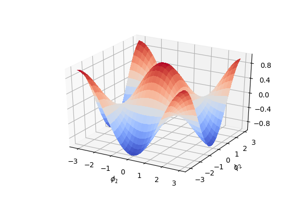
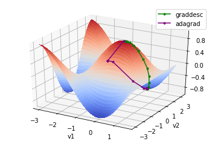

Qubit rotation
==============

To see how OpenQML allows the easy construction and optimization of quantum functions, let's
consider the simple case of **qubit rotation** - the OpenQML version of the 'Hello, world!'
example.

The task at hand is to optimize two rotation gates in order to flip a single
qubit from state :math:`\ket{0}` to state :math:`\ket{1}`.

The qubit rotation circuit
--------------------------

Here, we are first applying rotation around the :math:`x` axis on the first qubit, followed by rotation around the :math:`y` axis on the first qubit - equivalent to the following quantum circuit:

.. raw:: html

     

.. raw:: html

     

Breaking this down, step-by-step, we first start with a qubit in the ground state :math:`|0\rangle = \begin{bmatrix}1 & 0 \end{bmatrix}^T`, and rotate the qubit around the x-axis by

.. math::
    R_x(\phi_1) = e^{-i \phi_1 \sigma_x /2} =
    \begin{bmatrix} \cos \frac{\phi_1}{2} &  -i \sin \frac{\phi_1}{2} \\
                   -i \sin \frac{\phi_1}{2} &  \cos \frac{\phi_1}{2}
    \end{bmatrix},

and then around the y-axis by

.. math::
    R_y(\phi_2) = e^{-i \phi_2 \sigma_y/2} =
   \begin{bmatrix} \cos \frac{\phi_2}{2} &  - \sin \frac{\phi_2}{2} \\
                   \sin \frac{\phi_2}{2} &  \cos \frac{\phi_2}{2}
   \end{bmatrix}.

After these operations the qubit is now in the state

.. math::  | \psi \rangle = R_y(\phi_2) R_x(\phi_1) | 0 \rangle.

Finally, we measure the expectation :math:`\langle \psi \mid Z \mid \psi \rangle` of the Pauli-Z operator:

.. math::
   \sigma_z =
   \begin{bmatrix} 1 &  0 \\
                   0 & -1
   \end{bmatrix}.

Using the above to calculate the exact expectation value, we find that

.. math::
    \braketT{\psi}{Z}{\psi} = \braketT{0}{R_x(\phi_1)^\dagger R_y(\phi_2)^\dagger \sigma_z  R_y(\phi_2) R_x(\phi_1)}{0} = \cos(\phi_1)\cos(\phi_2).

Depending on the circuit parameters :math:`\phi_1` and :math:`\phi_2`, the
output expectation lies between :math:`1` (if :math:`\ket{\psi} = \ket{0}`)
and :math:`-1` (if :math:`\ket{\psi} = \ket{1}`).

Now, let's see how we can easily implement and optimize this circuit using OpenQML.

Importing OpenQML and NumPy
---------------------------

The first thing we need to import OpenQML, as well as the wrapped version
of NumPy provided by OpenQML.

.. code-block:: python

    import openqml as qm
    from openqml import numpy as np

.. important::

    When constructing a hybrid quantum/classical computational model with OpenQML,
    it is important to **always import NumPy from OpenQML**, not the standard NumPy!

    By importing the wrapped version of NumPy provided by OpenQML, you can continue
    to use the same NumPy functions and arrays you love, but with the added ability
    to combine quantum functions (as quantum nodes) and classical functions (provided by NumPy)
    and allow OpenQML to automatically calculate the gradients.

Creating a device
-----------------

Before we can construct our quantum node, we need to initialize a **device**. In OpenQML, a device is any computational object that can apply quantum operations, and return an expectation value - this could be a hardware device (such as the IBM QX4, via the OpenQML-PQ plugin), or a software simulator (such as Strawberry Fields, via the OpenQML-SF plugin).

Furthermore, OpenQML supports both devices using the qubit model of quantum computation, and devices using the CV model of quantum computation. In fact, even a hyrbid computation containing both qubit and CV quantum nodes is possible; see (here) for more details.

For this tutorial, we are using the qubit model, so let's initialize a ``'default.qubit'`` device provided by OpenQML - a simple, pure state, qubit simulator.

.. code-block:: python

    dev1 = qm.device('default.qubit', wires=1)

For all devices, :func:`~.openqml.device` accepts the following arguments:

* ``name``: the name of the device to be loaded.
* ``wires``: the number of subsystems to initialize the device with.

Here, as we only require a single qubit for this example, we set ``wires=1``.

Constructing the quantum node
-----------------------------

Now that we have initialized our device, we can begin to construct our quantum node (or :class:`~.QNode`). QNodes are an abstract encapsulation of both (a) a quantum device, and (b) a quantum function that is executed by this device. Now that we have a device ``dev1`` that we can use, we need to define the quantum function in order to construct the QNode.

We do this as follows:

.. code-block:: python

    def circuit(vars):
        qm.RX(vars[0], wires=0)
        qm.RY(vars[1], wires=0)
        return qm.expval.PauliZ(0)

This is a simple circuit, that contain two qubit rotations (:class:`~.RX` and :class:`~.RY`) and returns the expectation value in the Pauli-Z basis (:class:`~.expval.qubit.PauliZ`), as per the circuit diagram above. Notice that the quantum function ``circuit()`` is constructed as if it were any other Python function, with some restrictions:

* **It must only contain quantum operations, one operation per line, in the order in which they are to be applied.** In addition, we must always specify the subsystem the operation applies to, by passing the ``wires`` keyword argument; this may be a list or an integer, depending on how many wires the operation acts on.

  For a full list of quantum operations, see :mod:`supported operations <openqml.ops>`.

* **It must return either a single or a tuple of expectation values**. As a result, the quantum function always returns a classical quantity, allowing the QNode to interface with both other quantum and classical ndoes.
  For a full list of quantum expectation values, see :mod:`supported expectations <openqml.expval>`.

* **It must not contain any classical processing of circuit parameters.**

.. note:: Certain devices may only support a subset of the available OpenQML operations/expectations, or may even provide additional operations/expectations. Please consult the documentation for the plugin or the device for more details.

Once we have written the quantum function, we convert it into a :class:`~.QNode` running on device ``dev1`` by applying the :mod:`qnode decorator <openqml.decorator>` directly above the function definition:

.. code-block:: python

    @qm.qnode(dev1)
    def circuit(vars):
        qm.RX(vars[0], wires=0)
        qm.RY(vars[1], wires=0)
        return qm.expval.PauliZ(0)

Thus, our ``circuit()`` quantum function is now a ``QNode``, which will run on device ``dev1`` every time it is evaluated.

In fact, we can see this in action straight away. We simply call the QNode with numerical values, exactly as we defined the original quantum function:

>>> circuit([0.54, 0.12])
0.8515405859048368

We can also differentiate with respect to the first argument by using the :func:`~.openqml.grad` function:

>>> dcircuit = qm.grad(circuit)
>>> dcircuit([0.54, 0.12])
[-0.510438652516502, -0.10267819945693203]

Note that :func:`~.openqml.grad` returns a **function** representing the derivative of the QNode with respect to each parameter contained in the first function argument. We then call this function at the particular point in the parameter space we would like to know the derivatives.

Optimization
------------

Next, let's make use of OpenQML's built in optimizers to optimize the two circuit parameters :math:`\phi_1` and :math:`\phi_2` such that the qubit - originally in state :math:`\ket{0}` - is rotated to be in state :math:`\ket{1}`. This is equivalent to measuring a Pauli-Z expectation of :math:`-1`, since the state :math:`\ket{1}` is an eigenvector of the Pauli-Z matrix with eigenvalue :math:`\lambda=-1`.

In other words, the optimization procedure will find the weights :math:`\phi_1` and :math:`\phi_2` that result in the following rotation in the Bloch sphere:

.. raw:: html

     

.. figure:: figures/bloch.png
    :align: center
    :width: 70%
    :target: javascript:void(0);

.. raw:: html

     

To do so, we need to define a **cost** function. By *minimizing* the cost function, the optimizer will determine the values of the circuit parameters that produces the desired outcome. In this case, our desired outcome is a Pauli-Z expectation value of :math:`-1`; additionally, since we know that the Pauli-Z expectation is bound between :math:`[-1, 1]`, we can define a cost that is trivially the output of the QNode:

.. code-block:: python

    def cost(vars):
        return circuit(vars)

The rotation gates give the optimization landscape a trigonometric shape
with four global minima and five global maxima.

.. raw:: html

     

The initial values of the x- and y-rotation parameters :math:`\phi_1, \phi_2`
are set to near-zero. This corresponds to identity gates, in other
words, the circuit leaves the qubit in the ground state.

.. code-block:: python

    vars_init = np.array([0.011, 0.012])

The value of the objective at the initial point is close to :math:`1`.

.. code-block:: python

    objective(vars_init)

.. parsed-literal::

    0.9997395193760918

We choose a simple Gradient Descent Optimizer and update the weights for
10 steps. The final parameters correspond to a :math:`Z` expectation of
nearly :math:`-1`, which means that the qubit is flipped.

.. code-block:: python

    gd = GradientDescentOptimizer(0.4)

    vars = vars_init
    vars_gd = [vars]

    for it in range(100):
        vars = gd.step(objective, vars)

        if (it+1) % 5 == 0:
            vars_gd.append(vars)
            print('Objective after step {:5d}: {: .7f}'.format(it+1, objective(vars)) )

    print('\nOptimized rotation angles: {}'.format(vars))

.. parsed-literal::

    Objective after step     5:  0.9993246
    Objective after step    10:  0.9982497
    Objective after step    15:  0.9954699
    Objective after step    20:  0.9883159
    Objective after step    25:  0.9701280
    Objective after step    30:  0.9252888
    Objective after step    35:  0.8226045
    Objective after step    40:  0.6218840
    Objective after step    45:  0.3218872
    Objective after step    50: -0.0149679
    Objective after step    55: -0.3477552
    Objective after step    60: -0.6440175
    Objective after step    65: -0.8420738
    Objective after step    70: -0.9388981
    Objective after step    75: -0.9778339
    Objective after step    80: -0.9921600
    Objective after step    85: -0.9972525
    Objective after step    90: -0.9990403
    Objective after step    95: -0.9996652
    Objective after step   100: -0.9998832

    Optimized rotation angles: [0.00780327 3.12845269]

Starting at a different offset, we train another optimizer called
Adagrad, which improves on gradient descent.

*Note: Adagrad, a many other optimizers, has internal hyperparameters
that are stored in the optimizer instance (here: ``ada``). To reset
these hyperparameters, use ``ada.reset()``.*

.. code-block:: python

    ada = AdagradOptimizer(0.4)

    vars = np.array([-0.011, 0.012])
    vars_ada = [vars]

    for it in range(100):
        vars = ada.step(objective, vars)

        if (it+1) % 5 == 0:
            vars_ada.append(vars)
            print('Objective after step {:5d}: {: .7f}'.format(it+1, objective(vars)) )

    print('\nOptimized rotation angles: {}'.format(vars))

.. parsed-literal::

    Objective after step     5:  0.0121498
    Objective after step    10: -0.0010478
    Objective after step    15: -0.0628869
    Objective after step    20: -0.7333553
    Objective after step    25: -0.9874048
    Objective after step    30: -0.9995463
    Objective after step    35: -0.9999838
    Objective after step    40: -0.9999994
    Objective after step    45: -1.0000000
    Objective after step    50: -1.0000000
    Objective after step    55: -1.0000000
    Objective after step    60: -1.0000000
    Objective after step    65: -1.0000000
    Objective after step    70: -1.0000000
    Objective after step    75: -1.0000000
    Objective after step    80: -1.0000000
    Objective after step    85: -1.0000000
    Objective after step    90: -1.0000000
    Objective after step    95: -1.0000000
    Objective after step   100: -1.0000000

    Optimized rotation angles: [-9.98753488e-13  3.14159265e+00]

Adagrad and gradient descent find the same minimum, and, since neither
has information on second order derivatives, both take a detour through
a saddle point. However, Adagrad takes considerably fewer steps.

.. code-block:: python

    fig = plt.figure(figsize = (6, 4))
    ax = fig.gca(projection='3d')

    X = np.linspace(-3, 1.57, 50)
    Y = np.linspace(-3, 3, 50)
    xx, yy = np.meshgrid(X, Y)
    Z = np.array([[objective([x, y]) for x in X] for y in Y]).reshape(len(Y), len(X))
    surf = ax.plot_surface(xx, yy, Z, cmap=cm.coolwarm, antialiased=False)

    path_z = [objective(vars)+1e-8 for vars in vars_gd]
    path_x = [v[0] for v in vars_gd]
    path_y = [v[1] for v in vars_gd]
    ax.plot(path_x, path_y, path_z, c='green', marker='.', label="graddesc")

    path_z = [objective(vars)+1e-8 for vars in vars_ada]
    path_x = [v[0] for v in vars_ada]
    path_y = [v[1] for v in vars_ada]
    ax.plot(path_x, path_y, path_z, c='purple', marker='.', label="adagrad")

    ax.set_xlabel("v1")
    ax.set_ylabel("v2")
    ax.zaxis.set_major_locator(MaxNLocator(nbins = 5, prune = 'lower'))

    plt.legend()
    plt.show()

.. raw:: html

     

Choosing initial variables
~~~~~~~~~~~~~~~~~~~~~~~~~~

The variables are best randomly initialized with near-zero values. To
show why constant initializations can go wrong, consider starting at
exactly zero.

.. code-block:: python

    vars = np.array([0., 0.])

    for it in range(100):
        vars = gd.step(objective, vars)
        if (it+1) % 5 == 0:
            print('Objective after step {:5d}: {: .7f}'.format(it+1, objective(vars)) )

.. parsed-literal::

    Objective after step     5:  1.0000000
    Objective after step    10:  1.0000000
    Objective after step    15:  1.0000000
    Objective after step    20:  1.0000000
    Objective after step    25:  1.0000000
    Objective after step    30:  1.0000000
    Objective after step    35:  1.0000000
    Objective after step    40:  1.0000000
    Objective after step    45:  1.0000000
    Objective after step    50:  1.0000000
    Objective after step    55:  1.0000000
    Objective after step    60:  1.0000000
    Objective after step    65:  1.0000000
    Objective after step    70:  1.0000000
    Objective after step    75:  1.0000000
    Objective after step    80:  1.0000000
    Objective after step    85:  1.0000000
    Objective after step    90:  1.0000000
    Objective after step    95:  1.0000000
    Objective after step   100:  1.0000000

The model is "stuck" in the maximum of the cost function where the
gradient vanishes.

Also, symmetric initalizations can go wrong:

.. code-block:: python

    vars = np.array([0.1, 0.1])

    for it in range(100):
        vars = gd.step(objective, vars)
        if (it+1) % 5 == 0:
            print('Objective after step {:5d}: {: .7f} | qnode gradient: {}'.format(it+1, objective(vars),  qm.grad(circuit)(vars)) )

.. parsed-literal::

    Objective after step     5:  0.9745180 | qnode gradient: [-0.15758378 -0.15758378]
    Objective after step    10:  0.9362718 | qnode gradient: [-0.24426814 -0.24426814]
    Objective after step    15:  0.8488165 | qnode gradient: [-0.35822769 -0.35822769]
    Objective after step    20:  0.6796313 | qnode gradient: [-0.46661825 -0.46661825]
    Objective after step    25:  0.4400459 | qnode gradient: [-0.49639249 -0.49639249]
    Objective after step    30:  0.2212797 | qnode gradient: [-0.41510838 -0.41510838]
    Objective after step    35:  0.0915694 | qnode gradient: [-0.28841715 -0.28841715]
    Objective after step    40:  0.0341801 | qnode gradient: [-0.18169151 -0.18169151]
    Objective after step    45:  0.0122198 | qnode gradient: [-0.10986574 -0.10986574]
    Objective after step    50:  0.0042988 | qnode gradient: [-0.06542436 -0.06542436]
    Objective after step    55:  0.0015036 | qnode gradient: [-0.03874702 -0.03874702]
    Objective after step    60:  0.0005248 | qnode gradient: [-0.02290343 -0.02290343]
    Objective after step    65:  0.0001831 | qnode gradient: [-0.01352913 -0.01352913]
    Objective after step    70:  0.0000638 | qnode gradient: [-0.00798982 -0.00798982]
    Objective after step    75:  0.0000223 | qnode gradient: [-0.00471812 -0.00471812]
    Objective after step    80:  0.0000078 | qnode gradient: [-0.00278604 -0.00278604]
    Objective after step    85:  0.0000027 | qnode gradient: [-0.00164514 -0.00164514]
    Objective after step    90:  0.0000009 | qnode gradient: [-0.00097144 -0.00097144]
    Objective after step    95:  0.0000003 | qnode gradient: [-0.00057363 -0.00057363]
    Objective after step   100:  0.0000001 | qnode gradient: [-0.00033872 -0.00033872]

Here, gradient descent gets stuck in a saddle point. As we can see from
the output, the gradient of the quantum node stays symmetric. *Note:
This does not happen with the ``default.qubit`` backend*
