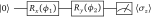
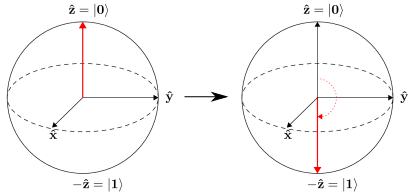

.. role:: html(raw)
   :format: html

.. _qubit_rotation:

Basic tutorial: qubit rotation
==============================

To see how PennyLane allows the easy construction and optimization of quantum functions, let's
consider the simple case of **qubit rotation** — the PennyLane version of the 'Hello, world!'
example.

The task at hand is to optimize two rotation gates in order to flip a single
qubit from state :math:`\ket{0}` to state :math:`\ket{1}`.

The quantum circuit
-------------------

In the qubit rotation example, we wish to implement the following quantum circuit:

:html:` `

:html:` `

Breaking this down step-by-step, we first start with a qubit in the ground state
:math:`|0\rangle = \begin{bmatrix}1 & 0 \end{bmatrix}^T`,
and rotate the qubit around the x-axis by applying the gate

.. math::
    R_x(\phi_1) = e^{-i \phi_1 \sigma_x /2} =
    \begin{bmatrix} \cos \frac{\phi_1}{2} &  -i \sin \frac{\phi_1}{2} \\
                   -i \sin \frac{\phi_1}{2} &  \cos \frac{\phi_1}{2}
    \end{bmatrix},

and then around the y-axis via the gate

.. math::
    R_y(\phi_2) = e^{-i \phi_2 \sigma_y/2} =
   \begin{bmatrix} \cos \frac{\phi_2}{2} &  - \sin \frac{\phi_2}{2} \\
                   \sin \frac{\phi_2}{2} &  \cos \frac{\phi_2}{2}
   \end{bmatrix}.

After these operations the qubit is now in the state

.. math::  | \psi \rangle = R_y(\phi_2) R_x(\phi_1) | 0 \rangle.

Finally, we measure the expectation value :math:`\langle \psi \mid \sigma_z \mid \psi \rangle` of the
Pauli-Z operator

.. math::
   \sigma_z =
   \begin{bmatrix} 1 &  0 \\
                   0 & -1
   \end{bmatrix}.

Using the above to calculate the exact expectation value, we find that

.. math::
    \braketT{\psi}{\sigma_z}{\psi}
    = \braketT{0}{R_x(\phi_1)^\dagger R_y(\phi_2)^\dagger \sigma_z  R_y(\phi_2) R_x(\phi_1)}{0}
    = \cos(\phi_1)\cos(\phi_2).

Depending on the circuit parameters :math:`\phi_1` and :math:`\phi_2`, the
output expectation lies between :math:`1` (if :math:`\ket{\psi} = \ket{0}`)
and :math:`-1` (if :math:`\ket{\psi} = \ket{1}`).

Let's see how we can easily implement and optimize this circuit using PennyLane.

Importing PennyLane and NumPy
-----------------------------

The first thing we need to do is import PennyLane, as well as the wrapped version
of NumPy provided by PennyLane.

.. code-block:: python

    import pennylane as qml
    from pennylane import numpy as np

.. important::

    When constructing a hybrid quantum/classical computational model with PennyLane,
    it is important to **always import NumPy from PennyLane**, not the standard NumPy!

    By importing the wrapped version of NumPy provided by PennyLane, you can combine
    the power of NumPy with PennyLane:

    * continue to use the classical NumPy functions and arrays you know and love
    * combine quantum functions (evaluated on quantum hardware/simulators) and classical functions (provided by NumPy)
    * allow PennyLane to automatically calculate gradients of both classical and quantum functions

Creating a device
-----------------

Before we can construct our quantum node, we need to initialize a **device**.

.. admonition:: Definition
    :class: defn

    Any computational object that can apply quantum operations, and return an expectation value is called a quantum **device**.

    In PennyLane, a device could be a hardware device (such as the IBM QX4, via the PennyLane-PQ plugin),
    or a software simulator (such as Strawberry Fields, via the PennyLane-SF plugin).

.. tip::

   *Devices are loaded in PennyLane via the function* :func:`pennylane.device`

PennyLane supports devices using both the qubit model of quantum computation and devices using the CV model
of quantum computation.
In fact, even a hybrid computation containing both qubit and CV quantum nodes is possible;
see the :ref:`hybrid computation example <hybrid_computation_example>` in the next tutorial for more details.

For this tutorial, we are using the qubit model, so let's initialize the ``'default.qubit'`` device
provided by PennyLane — a simple pure-state qubit simulator.

.. code-block:: python

    dev1 = qml.device('default.qubit', wires=1)

For all devices, :func:`~.pennylane.device` accepts the following arguments:

* ``name``: the name of the device to be loaded
* ``wires``: the number of subsystems to initialize the device with

Here, as we only require a single qubit for this example, we set ``wires=1``.

Constructing the QNode
----------------------

Now that we have initialized our device, we can begin to construct a **quantum node** (or QNode).

.. admonition:: Definition
    :class: defn

    QNodes are an abstract encapsulation of a quantum function, described by a quantum circuit. QNodes
    are bound to a particular quantum device, which is used to evaluate expectation values of this circuit.

.. tip::

   *QNodes can be constructed via the* :class:`pennylane.QNode <pennylane.qnode.QNode>` *class, or
   by using the provided* :mod:`qnode decorator <pennylane.decorator>`.

First, we need to define the quantum function that will be evaluated in the QNode:

.. code-block:: python

    def circuit(params):
        qml.RX(params[0], wires=0)
        qml.RY(params[1], wires=0)
        return qml.expval.PauliZ(0)

This is a simple circuit, matching the one described above.
Notice that the function ``circuit()`` is constructed as if it were any other Python function;
it accepts a positional argument ``params``, which may be a list, tuple, or array, and uses
the individual elements for gate parameters.

However, quantum functions are a **restricted subset** of Python functions. For a Python function to also
be a valid quantum function, there are some important restrictions:

* **Quantum functions must only contain quantum operations, one operation per line, in the order in which they are to be applied.**

  In addition, we must always specify the subsystem the operation applies to, by passing the ``wires`` argument;
  this may be a list or an integer, depending on how many wires the operation acts on.

  For a full list of quantum operations, see :mod:`supported operations <pennylane.ops>`.

* **Quantum functions must return either a single or a tuple of expectation values**.

  As a result, the quantum function always returns a classical quantity, allowing the QNode to interface
  with other classical functions (and also other QNodes).

  For a full list of quantum expectation values, see :mod:`supported expectations <pennylane.expval>`.

* **Quantum functions must not contain any classical processing of circuit parameters.**

.. note:: Certain devices may only support a subset of the available PennyLane operations/expectations, or may even
          provide additional operations/expectations. Please consult the documentation for the plugin/device
          for more details.

Once we have written the quantum function, we convert it into a :class:`~.QNode` running on device ``dev1`` by
applying the :mod:`qnode decorator <pennylane.decorator>` **directly above** the function definition:

.. code-block:: python

    @qml.qnode(dev1)
    def circuit(params):
        qml.RX(params[0], wires=0)
        qml.RY(params[1], wires=0)
        return qml.expval.PauliZ(0)

Thus, our ``circuit()`` quantum function is now a ``QNode``, which will run on device ``dev1`` every time it is evaluated.
To evaluate, we simply call the function with some appropriate numerical inputs:

>>> circuit([0.54, 0.12])
0.8515405859048368

Calculating quantum gradients
-----------------------------

The gradient of the function ``circuit``, encapsulated within the ``QNode``, can be evaluated by utilizing the same quantum
device (``dev1``) that we used to evaluate the function itself.

PennyLane incorporates both analytic differentiation, as well as numerical methods (such as the method of
finite differences). Both of these are done automatically.

We can differentiate by using the built-in :func:`~.pennylane.grad` function. This returns another function,
representing the gradient (i.e., the vector of partial derivatives) of ``circuit``.
The gradient can be evaluated in the same way as the original function:

>>> dcircuit = qml.grad(circuit, argnum=0)

The function :func:`~.pennylane.grad` itself **returns a function**, representing the derivative of the QNode with respect to the argument specified in ``argnum``. In this case, the function ``circuit`` takes one argument (``params``), so we specify ``argnum=0``. Because the argument has two elements, the returned gradient is two-dimensional.
We can then evaluate this gradient function at any point in the parameter space.

>>> dcircuit([0.54, 0.12])
[-0.510438652516502, -0.10267819945693203]

.. note::

    Quantum functions, being a restricted subset of Python functions, can also make use of multiple positional arguments and
    keyword arguments. For example, we could have defined the above quantum function using two position arguments, instead of
    one array argument:

    .. code-block:: python

        @qml.qnode(dev1)
        def circuit2(phi1, phi2):
            qml.RX(phi1, wires=0)
            qml.RY(phi2, wires=0)
            return qml.expval.PauliZ(0)

    When we calculate the gradient for such a function, the usage of ``argnum`` will be slightly different. In this case, ``argnum=0`` will return the gradient with respect to only the first parameter (``phi1``), and ``argnum=1`` will give the gradient for ``phi2``. To get the gradient with respect to both parameters, we can use ``argnum=[0,1]``:

    >>> dcircuit = qml.grad(circuit2, argnum=[0, 1])
    >>> dcircuit(0.54, 0.12)
    (array(-0.510438652516502), array(-0.10267819945693203))

    Keyword arguments may also be used in your custom quantum function. PennyLane does differentiate QNodes with respect to keyword arguments,
    so they are useful for passing external data to your QNode.

Optimization
------------

.. admonition:: Definition
    :class: defn

    PennyLane provides a collection of optimizers based on gradient descent. These optimizers accept a cost function and initial parameters,
    and utilize PennyLane's automatic differentiation to perform gradient descent.

.. tip::

   *See* :mod:`pennylane.optimize` *for details and documentation of available optimizers*

Next, let's make use of PennyLane's built-in optimizers to optimize the two circuit parameters :math:`\phi_1` and :math:`\phi_2` such
that the qubit, originally in state :math:`\ket{0}`, is rotated to be in state :math:`\ket{1}`. This is equivalent to measuring a
Pauli-Z expectation of :math:`-1`, since the state :math:`\ket{1}` is an eigenvector of the Pauli-Z matrix with eigenvalue
:math:`\lambda=-1`.

In other words, the optimization procedure will find the weights :math:`\phi_1` and :math:`\phi_2` that result in the following
rotation in the Bloch sphere:

:html:` `

:html:` `

To do so, we need to define a **cost** function. By *minimizing* the cost function, the optimizer will determine the values of the
circuit parameters that produce the desired outcome.

In this case, our desired outcome is a Pauli-Z expectation value of :math:`-1`. Since we know that the Pauli-Z expectation is bound
between :math:`[-1, 1]`, we can define our cost directly as the output of the QNode:

.. code-block:: python

    def cost(var):
        return circuit(var)

To begin our optimization, let's choose small initial values of :math:`\phi_1` and :math:`\phi_2`:

>>> init_params = np.array([0.011, 0.012])
>>> cost(init_params)
0.9998675058299387

We can see that, for these initial parameter values, the cost function is close to :math:`1`.

Finally, we use an optimizer to update the circuit parameters for 100 steps. We can use the built-in
:class:`pennylane.optimize.GradientDescentOptimizer` class:

.. code-block:: python

    # initialise the optimizer
    opt = qml.GradientDescentOptimizer(stepsize=0.4)

    # set the number of steps
    steps = 100
    # set the initial parameter values
    params = init_params

    for i in range(steps):
        # update the circuit parameters
        params = opt.step(cost, params)

        if (i+1) % 5 == 0:
            print('Cost after step {:5d}: {: .7f}'.format(i+1, cost(params)))

    print('Optimized rotation angles: {}'.format(params))

Try this yourself — the optimization should converge after approximately 40 steps, giving the following numerically optimum values of
:math:`\phi_1` and :math:`\phi_2`:

.. code-block:: python

    Optimized rotation angles: [  5.76516144e-17   3.14159265e+00]

Substituting this into the theoretical result :math:`\braketT{\psi}{\sigma_z}{\psi} = \cos\phi_1\cos\phi_2`, we can verify that
this is indeed one possible value of the circuit parameters that produces :math:`\braketT{\psi}{\sigma_z}{\psi}=-1`, resulting in
the qubit being rotated to the state :math:`\ket{1}`.

.. note::

    Some optimizers, such as :class:`~.pennylane.optimize.AdagradOptimizer`, have internal hyperparameters that are stored in the
    optimizer instance. These can be reset using the ``reset()`` method.

Continue on to the next tutorial, :ref:`gaussian_transformation`, to see a similar example using  continuous-variable (CV) quantum nodes.