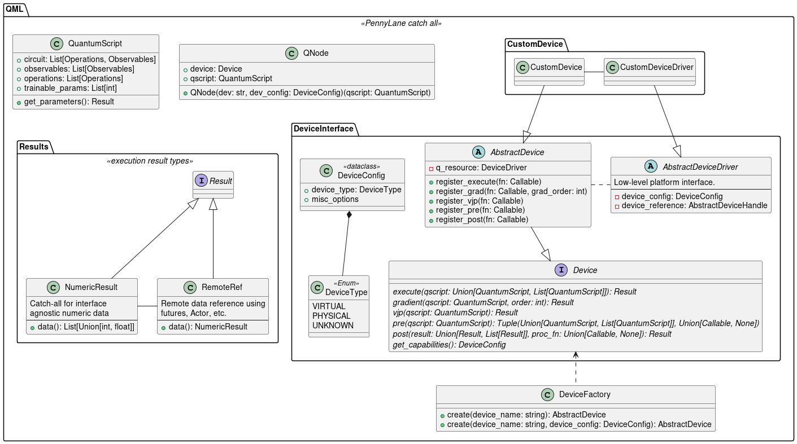

# Device API

This module contains the new device API for PennyLane. The goal is to address several of the following short-comings with the existing device structures:

* Nested inheritence hierarchies for existing devices.
* Inflexible extensions for new features and implementation updates.
* Lack of support for parallel executions on single or multiple devices.

To alleviate such issues, and provide support for future devices more easily, we define a new device API for PennyLane.

## Addressing requirements  from ADR 052-device_api_spec to required functionality

See [ADR](https://github.com/PennyLaneAI/adrs/blob/master/documents/052-device_api_spec.md) for explicit details and discussions of the device API requirements.

The goal of this document is to identify how the proposed API design will address the series of requirements in the above ADR [analysis section](https://github.com/PennyLaneAI/adrs/blob/master/documents/052-device_api_spec.md#analysis). In addition to the above list of required features, we ammend several to a more updated structure inline with the current definitions in PennyLane:

* Devices maintain and can return a configuration data-structure that returns all settings, properties and metadata about the device.
* The purpose of any given device is to consume single or multiple `QuantumScript` objects, and supported classical pre- and post-processing of the results.
* A device supports validation of a given `QuantumScript` against its supported gate-set and features.
* A device supports transpilation of a `QuantumScript` object to its native gate-set. This is failure checked with the previous validation step.
* A device can register classical pre- and post-processing steps for the results of a given `QuantumScript` circuit execution.
* A device can register native, and custom, gradient methods.
* A device can return the result of forward and/or backward execution, given an appropriate `QuantumScript` and inputs.
* If supported, a device can also allow return of the VJP for a given set of inputs.
* A device can return all supported quantum and classical operations.
* Default support should exist for virtual devices with the following functionalities:
    * Computing marginal probabilities.
    * Generating and retuning samples from the quantum state.
    * Return probabilities from given a `QuantumScript`.

Required features from the original ADR are addressed below with the necessary API definitions that support their feature-sets:


1. **It should be possible to extract the configuration from an instantiated device.**
    
    This can easily be achieved through use of a device configuration datastructure/dataclass that holds all standardised operations and supports for each given device. Accessible through an abstract device method:

    ```python
    def get_config(self) -> DeviceConfig:
        return self._device_config
    ```
    Note: `DeviceConfig` requires some consideration for interface and associated data.

2. **Devices can all execute a sequence of tapes, and return a sequence of results.**
    Easily achieved through definition of an `execute` method, which can accept both `tapes`/`QuantumScripts` or lists of both, as:

    ```python
        def execute(self, payload: Union[QuantumScript, List[QuantumScript]]) -> Result:
            ...
    ```
    Note: `Result` also requires some consideration for interface and associated data, as they can be local or remote references.

3. **Devices can register tape transforms and batch transforms to be applied prior to tape execution.**

    This can be handled through explicit addition, or dynamic registration, of preprocessing stages prior to execution as with:

    ```python
        class MyDevice(AbstractDevice):
            "Naive derived class with no provided methods."
            pass

        @MyDevice.register_pre()
        def my_preproc_function(self, qscript: QuantumScript) -> Tuple[Union[QuantumScript, List[QuantumScript]], Callable]:
            "Register a do nothing preprocessing function"
            return tuple(qscript, lambda x: x)
    ```
    Note: This can live inside or outside the device. It is an open question where this will be called --- within `execute` or handled externally, such as by a runtime manager at the `QNode` level.

4. **Devices can be requested to return the forward pass, the Jacobian, or both.**
    Easily handled through the following methods:
    ```python
        def execute(self, payload: Union[QuantumScript, List[QuantumScript]]) -> Union[Result, List[Result]]:
            ...
        
        def grad(self, payload: Union[QuantumScript, List[QuantumScript]], order: int = 1) -> Union[List[Result], List[List[Result]]]:
            ...

        def execute_and_grad(self, payload: Union[QuantumScript, List[QuantumScript]], order: int = 1) -> Union[Tuple[Result, List[Result]], Tuple[List[Result], List[List[Result]]]]:
            ...
    ```
    Note: Due to the supported result orderings, having a separate datastructure for results would be beneficial to aid in avoiding explicit dependence on each specific return type. This would also clean-up the above API significantly, where all options are internal to the class itself.

    For all of the following cases, arguments and return-types will be simplified where they help to improve readability, but will be assumed to be as defined above.

5. **Devices can register multiple methods for derivative calculations.**
    This can be handled through the dynamic device registration functionality, as with:
    ```python
        @MyDevice.register_gradient(order=1)
        def my_gradient_function(self, qscript: QuantumScript):
            return f"Hello from gradient with arg: {qscript}"
    ```
    Note: explicit logic may need to be added to `AbstractDevice` to handle specific selection of a given method, following a certain set of requirements for a workload.

6. **Devices can return the vector-Jacobian product (VJP).**
    The abstract device interface can define a required `vjp` method. All inheriting devices will be required to implement this functionality.

7. **A device must define:**
    1. *Logic for returning results given a circuit input.*

        Handled through the `execute`, `grad` and `execute_and_grad` methods.

    2. *Supported operations and observables.*

        A device can host all such information in a `DeviceConfig` object, which can be queried at run-time. This avoids explicitly holding all such information in sets/lists/dictionaries, as is currently the case.

8. **For state-based simulators, integration with PennyLane should be easily achieved. PennyLane should provide default logic for:**
    1. *Computing marginal probabilities.*

        This can be handled either through appropriate use of PennyLane-defined pre or postprcessing stages surrounding standard execution, or offloaded to non-interface defined functions, and returned as part of `execute` and associated pipelines, in the case of custom logic.

    2. *Generating samples.*

        As above.

    3. *Returning probabilities given a circuit computation.*

        As above.
    
    4. *Returning samples given a circuit computation.*

        As above.

    5. *Public facing API to apply operations to a given state*

        This can be provided with the standard `execute` method, given a set of supported state-preparation operations, followed by the requested operation set.

9. **For sampling devices, integration with PennyLane should be easily achieved. This will require defining:**
    1. *Supported operations and observables*

        This can be handled by `DeviceConfig` and `get_config(self)`.

    2. *Logic for building a circuit, including measurement rotations, and submitting to the device.*

        This logic should be hidden to the user, but capable of being defined by the device provider. All circuits should be consumed by the `execute` and associated pipeline. To map a given `QuantumScript` to a device, an associated preprocessing stage to handle transpilation can be provided, if required prior to execution.

    3. *Logic for accessing either probabilities or counts.*

        Natively handled by both `execute` and pre- or post-processing funtionality.

    4. *Logic for accessing computational basis samples, if available.*

        Handled natively by `execute`.

10. **Logic for generating rotations, as well as sample/probability post-processing, is handled external to the device. This can be provided within the `MeasurementProcess` class.**

    Handled by pre and post processing stages, as well as `exceute` for results.

11. **Devices should be able to provide their own measurement statistics directly, and bypass the automated pipeline. This allows for supporting both of the following workflows:**
    1. *A developer has a device that executes circuits and returns computational basis samples: PennyLane automates the measurement statistics and rotations via point 10.*

        As defined by 10.
    
    2. *A developer has a device that provides optimized logic for computing measurement statistics: The device directly registers methods with PennyLane for all required operations.*

        Regristration of pre and postprocessing operations that support required functionality.

12. **There is native support for devices that accept parametric circuits.**
    Natively supported through `QuantumScript`.

13. **Support exists for tracking of device resource use and execution.**
    Open question: Should this be device external, or even preprocessing of the stages to be applied?

---

## Static class diagram (WIP)



---

## Custom device tests

To adhere to a modular design principle, different aspects of the execution pipeline are maintained in seaprate directories, with an aim to follow the above class diagram as closely as possible to aid rather than hinder progress:

* `device_interface`: All functionality to build a given device plugin that interacts with PennyLane follows from the structures here.
* `runtime_manager`: Functionality to build hybrid computation pipelines (pre-,post- and quantum executions) live here.

As a bare demonstrator of plugin-building with the new functions we have defined several devices, under the `custom_device_x` directories.